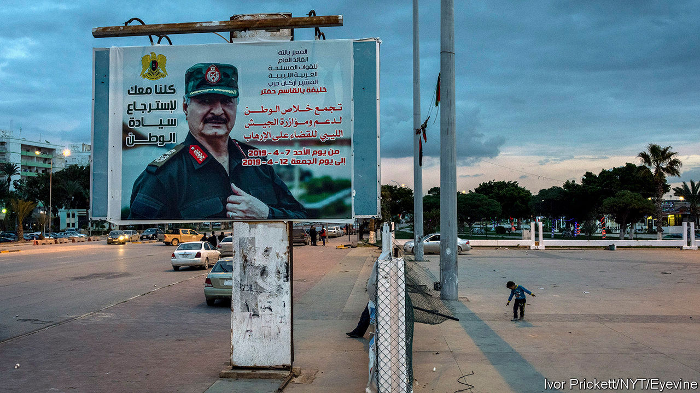
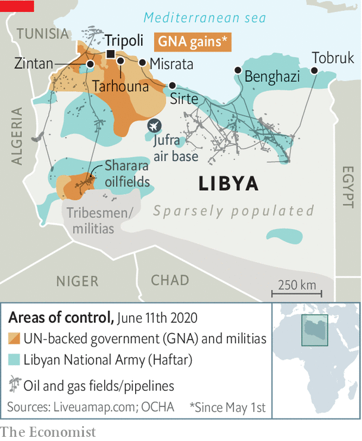

###### A warlord retreats

# Libya’s government regains control of western Libya 

##### Taking the east will be harder 

 

> Jun 13th 2020 

FOR OVER a year the UN-backed Government of National Accord (GNA) in Libya had been under siege by the forces of Khalifa Haftar, a renegade general. Then, all of sudden, it wasn’t. On June 3rd militias aligned with the GNA pushed General Haftar’s self-styled Libyan National Army (LNA) out of Tripoli’s international airport. The next day they took back Tarhouna, a city 90km to the south-east (see map). By June 7th the oilfields in Sharara were back in the GNA’s hands—and pumping for the first time since January. The militias are now fighting the LNA in Sirte, the gateway to General Haftar’s heartland in the east. Fight “for the whole of the homeland”, says Fayez al-Serraj, the GNA’s prime minister.

Mr Serraj, however, is not calling the shots. Drawn by Africa’s largest oil reserves and over 1,700km of Mediterranean coastline, foreign armies have piled into Libya. A surge of support from Turkey beginning in December saved Mr Serraj. It now determines how far the GNA advances. Russia, Egypt and the United Arab Emirates (UAE) have long backed the LNA and are trying to shore up its hold on the east. After six years of civil war, the division of Libya into a Turkish zone of influence in the west and a Russian zone in the east—in other words, de facto partition—looks increasingly likely. “We’re heading towards a frozen conflict,” says a diplomat in Tripoli.

 


Russia and Turkey also back opposing sides in Syria, where they have learnt to co-ordinate their operations in order to avoid a big escalation. The risk is greater in Libya, at least for now. The Turks have frigates off the coast, warplanes and drones in the sky and mercenaries on the ground. Recep Tayyip Erdogan, Turkey’s president, wants the GNA to punch into the oilfields that lie beyond Sirte and take the airbase in Jufra. He believes this would give Mr Serraj a financial boost and a strategic buffer against General Haftar and other eastern predators. But last month Russia moved 14 warplanes to Jufra. Hundreds of mercenaries from the Wagner Group, a private-security firm with connections to the Kremlin, support General Haftar. Egypt has moved a column of tanks to (and, some say, across) its western border. It and the UAE see the war as a struggle against Islamism.

Libyans in the east are uneasy. “We’ve had enough of Turkish colonialism,” says Fawzia al-Furjani, a businesswoman in Benghazi, referring to centuries of Ottoman rule. But a growing number of people also question whether General Haftar, who in April hailed himself Libya’s military ruler, can be their saviour. His defeat in Tripoli, at the cost of hundreds of lives, has revived memories of the disastrous campaign he led against Chad in the 1980s.

Big eastern tribes are keeping their distance from him. Tribal elders in the south have declared for the GNA. Talk of a challenge to General Haftar is rife. Even his foreign supporters seem to be growing tired of his boasting. At the launch of a peace initiative in Cairo on June 6th, General Haftar shared the stage with Aguila Saleh, a less belligerent politician from the east. Last month Mr Saleh declared himself commander-in-chief of the LNA.

Despite the GNA’s victories, the situation in the west is also unstable. Mr Serraj says he wants to “construct a civil, democratic and modern state”, but the militias who fight for him are divided by tribe, city and ideology. The threat of General Haftar (not support for the GNA) was the glue that held them together. The jihadists among them want to push on to Benghazi, their home before General Haftar booted them out in 2017. The militias of Misrata, the strongest force in the west, want to dominate the region. Leaders from other cities, such as Zintan, would prefer to carve out their own fiefs from the land they have captured. Each has a separate line to Turkish commanders on the ground and foreign powers abroad. Mr Serraj may no longer be under siege, but his rule does not extend far beyond his glass office block in Tripoli. ■

