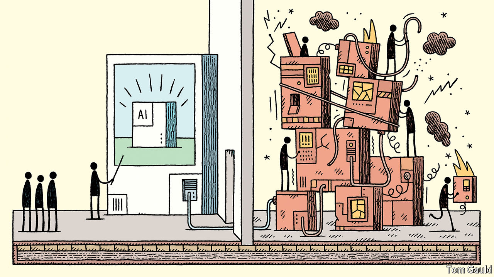
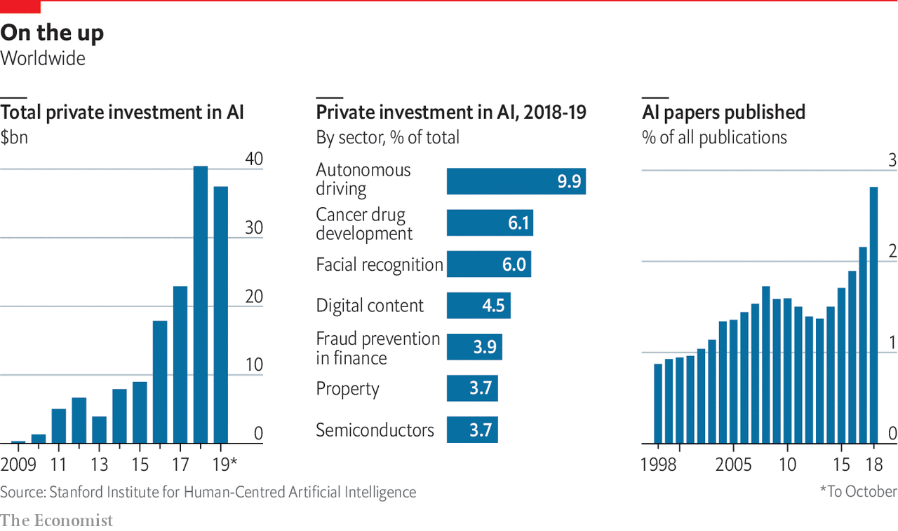

###### Artificial intelligence and its limits

# An understanding of AI’s limitations is starting to sink in 

##### After years of hype, many people feel AI has failed to deliver, says Tim Cross 

 

> Jun 13th 2020 

IT WILL BE as if the world had created a second China, made not of billions of people and millions of factories, but of algorithms and humming computers. PwC, a professional-services firm, predicts that artificial intelligence (AI) will add $16trn to the global economy by 2030. The total of all activity—from banks and biotech to shops and construction—in the world’s second-largest economy was just $13trn in 2018.

PwC’s claim is no outlier. Rival prognosticators at McKinsey put the figure at $13trn. Others go for qualitative drama, rather than quantitative. Sundar Pichai, Google’s boss, has described developments in AI as “more profound than fire or electricity”. Other forecasts see similarly large changes, but less happy ones. Clever computers capable of doing the jobs of radiologists, lorry drivers or warehouse workers might cause a wave of unemployment.


Yet lately doubts have been creeping in about whether today’s AI technology is really as world-changing as it seems. It is running up against limits of one kind or another, and has failed to deliver on some of its proponents’ more grandiose promises.

There is no question that AI—or, to be precise, machine learning, one of its sub-fields—has made much progress. Computers have become dramatically better at many things they previously struggled with. The excitement began to build in academia in the early 2010s, when new machine-learning techniques led to rapid improvements in tasks such as recognising pictures and manipulating language. From there it spread to business, starting with the internet giants. With vast computing resources and oceans of data, they were well placed to adopt the technology. Modern AI techniques now power search engines and voice assistants, suggest email replies, power the facial-recognition systems that unlock smartphones and police national borders, and underpin the algorithms that try to identify unwelcome posts on social media.

Perhaps the highest-profile display of the technology’s potential came in 2016, when a system built by DeepMind, a London-based AI firm owned by Alphabet, Google’s corporate parent, beat one of the world’s best players at Go, an ancient Asian board game. The match was watched by tens of millions; the breakthrough came years, even decades, earlier than AI gurus had expected.

As Mr Pichai’s comparison with electricity and fire suggests, machine learning is a general-purpose technology—one capable of affecting entire economies. It excels at recognising patterns in data, and that is useful everywhere. Ornithologists use it to classify birdsong; astronomers to hunt for planets in glimmers of starlight; banks to assess credit risk and prevent fraud. In the Netherlands, the authorities use it to monitor social-welfare payments. In China AI-powered facial recognition lets customers buy groceries—and helps run the repressive mass-surveillance system the country has built in Xinjiang, a Muslim-majority region.

 


AI’s heralds say further transformations are still to come, for better and for worse. In 2016 Geoffrey Hinton, a computer scientist who has made fundamental contributions to modern AI, remarked that “it’s quite obvious that we should stop training radiologists,” on the grounds that computers will soon be able to do everything they do, only cheaper and faster. Developers of self-driving cars, meanwhile, predict that robotaxis will revolutionise transport. Eric Schmidt, a former chairman of Google (and a former board member of The Economist’s parent company) hopes that AI could accelerate research, helping human scientists keep up with a deluge of papers and data.

In January a group of researchers published a paper in Cell describing an AI system that had predicted antibacterial function from molecular structure. Of 100 candidate molecules selected by the system for further analysis, one proved to be a potent new antibiotic. The covid-19 pandemic has thrust such medical applications firmly into the spotlight. An AI firm called BlueDot claims it spotted signs of a novel virus in reports from Chinese hospitals as early as December. Researchers have been scrambling to try to apply AI to everything from drug discovery to interpreting medical scans and predicting how the virus might evolve.

Dude, where’s my self-driving car?

This is not the first wave of AI-related excitement (see timeline in next ). The field began in the mid-1950s when researchers hoped that building human-level intelligence would take a few years—a couple of decades at most. That early optimism had fizzled by the 1970s. A second wave began in the 1980s. Once again the field’s grandest promises went unmet. As reality replaced the hype, the booms gave way to painful busts known as “AI winters”. Research funding dried up, and the field’s reputation suffered.


Modern AI technology has been far more successful. Billions of people use it every day, mostly without noticing, inside their smartphones and internet services. Yet despite this success, the fact remains that many of the grandest claims made about AI have once again failed to become reality, and confidence is wavering as researchers start to wonder whether the technology has hit a wall. Self-driving cars have become more capable, but remain perpetually on the cusp of being safe enough to deploy on everyday streets. Efforts to incorporate AI into medical diagnosis are, similarly, taking longer than expected: despite Dr Hinton’s prediction, there remains a global shortage of human radiologists.

Surveying the field of medical AI in 2019, Eric Topol, a cardiologist and AI enthusiast, wrote that “the state of AI hype has far exceeded the state of AI science, especially when it pertains to validation and readiness for implementation in patient care”. Despite a plethora of ideas, covid-19 is mostly being fought with old weapons that are already to hand. Contacttracing has been done with shoe leather and telephone calls. Clinical trials focus on existing drugs. Plastic screens and paint on the pavement enforce low-tech distancing advice.

The same consultants who predict that AI will have a world-altering impact also report that real managers in real companies are finding AI hard to implement, and that enthusiasm for it is cooling. Svetlana Sicular of Gartner, a research firm, says that 2020 could be the year AI falls onto the downslope of her firm’s well-publicised “hype cycle”. Investors are beginning to wake up to bandwagon-jumping: a survey of European AI startups by MMC, a venture-capital fund, found that 40% did not seem to be using any AI at all. “I think there’s definitely a strong element of ‘investor marketing’,” says one analyst delicately.

This Technology Quarterly will investigate why enthusiasm is stalling. It will argue that although modern AI techniques are powerful, they are also limited, and they can be troublesome and difficult to deploy. Those hoping to make use of AI’s potential must confront two sets of problems.

The first is practical. The machine-learning revolution has been built on three things: improved algorithms, more powerful computers on which to run them, and—thanks to the gradual digitisation of society—more data from which they can learn. Yet data are not always readily available. It is hard to use AI to monitor covid-19 transmission without a comprehensive database of everyone’s movements, for instance. Even when data do exist, they can contain hidden assumptions that can trip the unwary. The newest AI systems’ demand for computing power can be expensive. Large organisations always take time to integrate new technologies: think of electricity in the 20th century or the cloud in the 21st. None of this necessarily reduces AI’s potential, but it has the effect of slowing its adoption.

The second set of problems runs deeper, and concerns the algorithms themselves. Machine learning uses thousands or millions of examples to train a software model (the structure of which is loosely based on the neural architecture of the brain). The resulting systems can do some tasks, such as recognising images or speech, far more reliably than those programmed the traditional way with hand-crafted rules, but they are not “intelligent” in the way that most people understand the term. They are powerful pattern-recognition tools, but lack many cognitive abilities that biological brains take for granted. They struggle with reasoning, generalising from the rules they discover, and with the general-purpose savoir faire that researchers, for want of a more precise description, dub “common sense”. The result is an artificial idiot savant that can excel at well-bounded tasks, but can get things very wrong if faced with unexpected input.

Without another breakthrough, these drawbacks put fundamental limits on what AI can and cannot do. Self-driving cars, which must navigate an ever-changing world, are already delayed, and may never arrive at all. Systems that deal with language, like chatbots and personal assistants, are built on statistical approaches that generate a shallow appearance of understanding, without the reality. That will limit how useful they can become. Existential worries about clever computers making radiologists or lorry drivers obsolete—let alone, as some doom-mongers suggest, posing a threat to humanity’s survival—seem overblown. Predictions of a Chinese-economy-worth of extra GDP look implausible.

Today’s “AI summer” is different from previous ones. It is brighter and warmer, because the technology has been so widely deployed. Another full-blown winter is unlikely. But an autumnal breeze is picking up. ■

