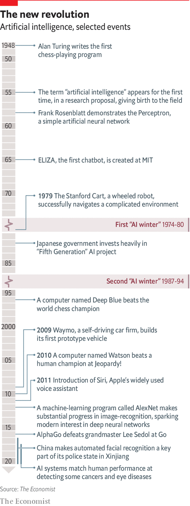
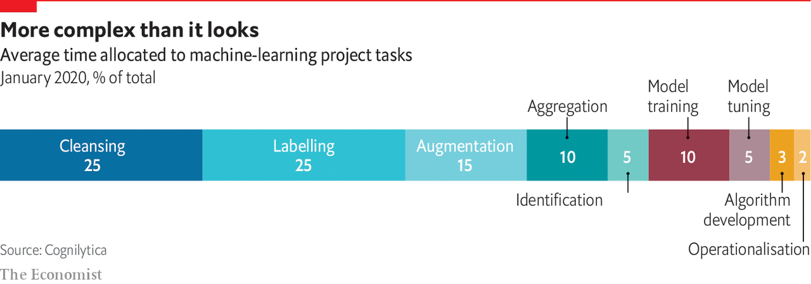

###### Data

# For AI, data are harder to come by than you think 

##### When in doubt, roll your own 

 

> Jun 11th 2020 

AMAZON’S “GO” STORES are impressive places. The cashier-less shops, which first opened in Seattle in 2018, allow app-wielding customers to pick up items and simply walk out with them. The system uses many sensors, but the bulk of the magic is performed by cameras connected to an AI system that tracks items as they are taken from shelves. Once the shoppers leave with their goods, the bill is calculated and they are automatically charged.

Doing that in a crowded shop is not easy. The system must handle crowded stores, in which people disappear from view behind other customers. It must recognise individual customers as well as friends or family groups (if a child puts an item into a family basket, the system must realise that it should charge the parents). And it must do all that in real-time, and to a high degree of accuracy.


Teaching the machines required showing them a lot of “training data” in the form of videos of customers browsing shelves, picking up items, putting them back and the like. For standardised tasks like image recognition, AI developers can use public training datasets, each containing thousands of pictures. But there was no such training set featuring people browsing in shops.

Some data could be generated by Amazon’s own staff, who were allowed into test versions of the shops. But that approach took the firm only so far. There are many ways in which a human might take a product from a shelf and then decide to choose it, put it back immediately or return it later. To work in the real world, the system would have to cover as many of those as possible.

In theory, the world is awash with data, the lifeblood of modern AI. IDC, a market-research firm, reckons the world generated 33 zettabytes of data in 2018, enough to fill seven trillion DVDs. But Kathleen Walch of Cognilytica, an AI-focused consultancy, says that, nevertheless, data issues are one of the most common sticking-points in any AI project. As in Amazon’s case, the required data may not exist at all. Or they might be locked up in the vaults of a competitor. Even when relevant data can be dug up, they might not be suitable for feeding to computers.

Data-wrangling of various sorts takes up about 80% of the time consumed in a typical AI project, says Cognilytica. Training a machine-learning system requires large numbers of carefully labelled examples, and those labels usually have to be applied by humans. Big tech firms often do the work internally. Companies that lack the required resources or expertise can take advantage of a growing outsourcing industry to do it for them. A Chinese firm called MBH, for instance, employees more than 300,000 people to label endless pictures of faces, street scenes or medical scans so that they can be processed by machines. Mechanical Turk, another subdivision of Amazon, connects firms with an army of casual human workers who are paid a piece rate to perform repetitive tasks.

Cognilytica reckons that the third-party “data preparation” market was worth more than $1.5bn in 2019 and could grow to $3.5bn by 2024. The data-labelling business is similar, with firms spending at least $1.7bn in 2019, a number that could reach $4.1bn by 2024. Mastery of a topic is not necessary, says Ron Schmelzer, also of Cognilytica. In medical diagnostics, for instance, amateur data-labellers can be trained to become almost as good as doctors at recognising things like fractures and tumours. But some amount of what AI researchers call “domain expertise” is vital.

The data themselves can contain traps. Machine-learning systems correlate inputs with outputs, but they do it blindly, with no understanding of broader context. In 1968 Donald Knuth, a programming guru, warned that computers “do exactly what they are told, no more and no less”. Machine learning is full of examples of Mr Knuth’s dictum, in which machines have followed the letter of the law precisely, while being oblivious to its spirit.

 


In 2018 researchers at Mount Sinai, a hospital network in New York, found that an AI system trained to spot pneumonia on chest x-rays became markedly less competent when used in hospitals other than those it had been trained in. The researchers discovered that the machine had been able to work out which hospital a scan had come from. (One way was to analyse small metal tokens placed in the corner of scans, which differ between hospitals.)

Since one hospital in its training set had a baseline rate of pneumonia far higher than the others, that information by itself was enough to boost the system’s accuracy substantially. The researchers dubbed that clever wheeze “cheating”, on the grounds that it failed when the system was presented with data from hospitals it did not know.

Different kind of race

Bias is another source of problems. Last year America’s National Institute of Standards and Technology tested nearly 200 facialrecognition algorithms and found that many were significantly less accurate at identifying black faces than white ones. The problem may reflect a preponderance of white faces in their training data. A study from IBM, published last year, found that over 80% of faces in three widely used training sets had light skin.

 


Such deficiencies are, at least in theory, straightforward to fix (IBM offered a more representative dataset for anyone to use). Other sources of bias can be trickier to remove. In 2017 Amazon abandoned a recruitment project designed to hunt through CVs to identify suitable candidates when the system was found to be favouring male applicants. The post mortem revealed a circular, self-reinforcing problem. The system had been trained on the CVs of previous successful applicants to the firm. But since the tech workforce is already mostly male, a system trained on historical data will latch onto maleness as a strong predictor of suitability.

Humans can try to forbid such inferences, says Fabrice Ciais, who runs PwC’s machine-learning team in Britain (and Amazon tried to do exactly that). In many cases they are required to: in most rich countries employers cannot hire on the basis of factors such as sex, age or race. But algorithms can outsmart their human masters by using proxy variables to reconstruct the forbidden information, says Mr Ciais. Everything from hobbies to previous jobs to area codes in telephone numbers could contain hints that an applicant is likely to be female, or young, or from an ethnic minority.

If the difficulties of real-world data are too daunting, one option is to make up some data of your own. That is what Amazon did to fine-tune its Go shops. The company used graphics software to create virtual shoppers. Those ersatz humans were used to train the machines on many hard or unusual situations that had not arisen in the real training data, but might when the system was deployed in the real world.

Amazon is not alone. Self-driving car firms do a lot of training in high-fidelity simulations of reality, where no real damage can be done when something goes wrong. A paper in 2018 from Nvidia, a chipmaker, described a method for quickly creating synthetic training data for self-driving cars, and concluded that the resulting algorithms worked better than those trained on real data alone.

Privacy is another attraction of synthetic data. Firms hoping to use AI in medicine or finance must contend with laws such as America’s Health Insurance Portability and Accountability Act, or the European Union’s General Data Protection Regulation. Properly anonymising data can be difficult, a problem that systems trained on made-up people do not need to bother about.

The trick, says Euan Cameron, one of Mr Ciais’s colleagues, is ensuring simulations are close enough to reality that their lessons carry over. For some well-bounded problems such as fraud detection or credit scoring, that is straightforward. Synthetic data can be created by adding statistical noise to the real kind. Although individual transactions are therefore fictitious, it is possible to guarantee that they will have, collectively, the same statistical characteristics as the real data from which they were derived. But the more complicated a problem becomes, the harder it is to ensure that lessons from virtual data will translate smoothly to the real world.

The hope is that all this data-related faff will be a one-off, and that, once trained, a machine-learning model will repay the effort over millions of automated decisions. Amazon has opened 26 Go stores, and has offered to license the technology to other retailers. But even here there are reasons for caution. Many AI models are subject to “drift”, in which changes in how the world works mean their decisions become less accurate over time, says Svetlana Sicular of Gartner, a research firm. Customer behaviour changes, language evolves, regulators change what companies can do.

Sometimes, drift happens overnight. “Buying one-way airline tickets was a good predictor of fraud [in automated detection models],” says Ms Sicular. “And then with the covid-19 lockdowns, suddenly lots of innocent people were doing it.” Some facial-recognition systems, used to seeing uncovered human faces, are struggling now that masks have become the norm. Automated logistics systems have needed help from humans to deal with the sudden demand for toilet roll, flour and other staples. The world’s changeability means more training, which means providing the machines with yet more data, in a never-ending cycle of re-training. “AI is not an install-and-forget system,” warns Mr Cameron. ■

