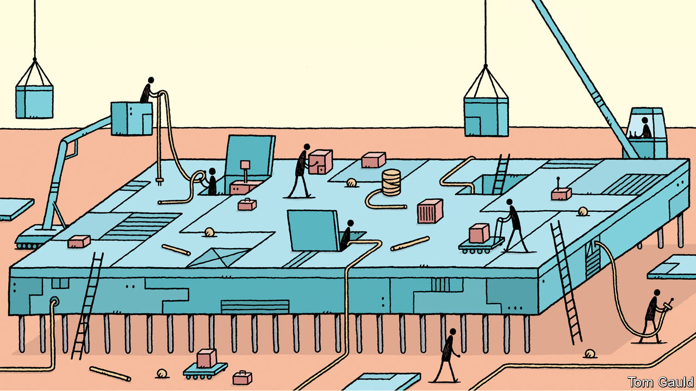
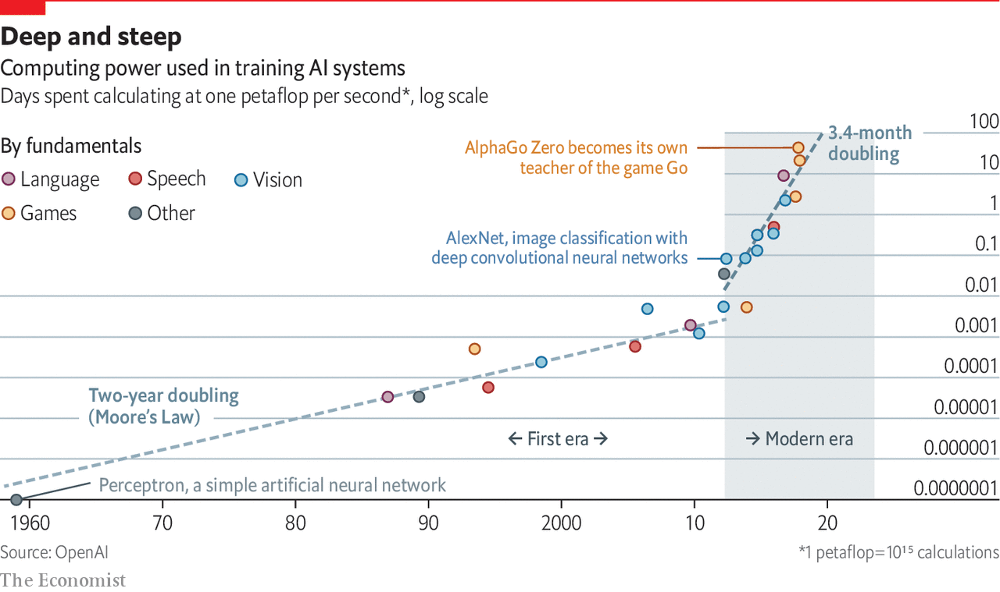

###### Computing hardware

# The cost of training machines is becoming a problem 

##### Increased complexity and competition are part of it 

 

> Jun 11th 2020 

THE FUNDAMENTAL assumption of the computing industry is that number-crunching gets cheaper all the time. Moore’s law, the industry’s master metronome, predicts that the number of components that can be squeezed onto a microchip of a given size—and thus, loosely, the amount of computational power available at a given cost—doubles every two years.

For many comparatively simple AI applications, that means that the cost of training a computer is falling, says Christopher Manning, the director of Stanford University’s AI Lab. But that is not true everywhere. A combination of ballooning complexity and competition means costs at the cutting edge are rising sharply.


Dr Manning gives the example of BERT, an AI language model built by Google in 2018 and used in the firm’s search engine. It had more than 350m internal parameters and a prodigious appetite for data. It was trained using 3.3bn words of text culled mostly from Wikipedia, an online encyclopedia. These days, says Dr Manning, Wikipedia is not such a large data-set. “If you can train a system on 30bn words it’s going to perform better than one trained on 3bn.” And more data means more computing power to crunch it all.

 


OpenAI, a research firm based in California, says demand for processing power took off in 2012, as excitement around machine learning was starting to build. It has accelerated sharply. By 2018, the computer power used to train big models had risen 300,000-fold, and was doubling every three and a half months (see chart). It should know—to train its own “OpenAI Five” system, designed to beat humans at “Defense of the Ancients 2”, a popular video game, it scaled machine learning “to unprecedented levels”, running thousands of chips non-stop for more than ten months.

Exact figures on how much this all costs are scarce. But a paper published in 2019 by researchers at the University of Massachusetts Amherst estimated that training one version of “Transformer”, another big language model, could cost as much as $3m. Jerome Pesenti, Facebook’s head of AI, says that one round of training for the biggest models can cost “millions of dollars” in electricity consumption.

Help from the cloud

Facebook, which turned a profit of $18.5bn in 2019, can afford those bills. Those less flush with cash are feeling the pinch. Andreessen Horowitz, an influential American venture-capital firm, has pointed out that many AI startups rent their processing power from cloud-computing firms like Amazon and Microsoft. The resulting bills—sometimes 25% of revenue or more—are one reason, it says, that AI startups may make for less attractive investments than old-style software companies. In March Dr Manning’s colleagues at Stanford, including Fei-Fei Li, an AI luminary, launched the National Research Cloud, a cloud-computing initiative to help American AI researchers keep up with spiralling bills.

The growing demand for computing power has fuelled a boom in chip design and specialised devices that can perform the calculations used in AI efficiently. The first wave of specialist chips were graphics processing units (GPUs), designed in the 1990s to boost video-game graphics. As luck would have it, GPUs are also fairly well-suited to the sort of mathematics found in AI.

Further specialisation is possible, and companies are piling in to provide it. In December, Intel, a giant chipmaker, bought Habana Labs, an Israeli firm, for $2bn. Graphcore, a British firm founded in 2016, was valued at $2bn in 2019. Incumbents such as Nvidia, the biggest GPU-maker, have reworked their designs to accommodate AI. Google has designed its own “tensor-processing unit” (TPU) chips in-house. Baidu, a Chinese tech giant, has done the same with its own “Kunlun” chips. Alfonso Marone at KPMG reckons the market for specialised AI chips is already worth around $10bn, and could reach $80bn by 2025.

“Computer architectures need to follow the structure of the data they’re processing,” says Nigel Toon, one of Graphcore’s co-founders. The most basic feature of AI workloads is that they are “embarrassingly parallel”, which means they can be cut into thousands of chunks which can all be worked on at the same time. Graphcore’s chips, for instance, have more than 1,200 individual number-crunching “cores”, and can be linked together to provide still more power. Cerebras, a Californian startup, has taken an extreme approach. Chips are usually made in batches, with dozens or hundreds etched onto standard silicon wafers 300mm in diameter. Each of Cerebras’s chips takes up an entire wafer by itself. That lets the firm cram 400,000 cores onto each.

Other optimisations are important, too. Andrew Feldman, one of Cerebras’s founders, points out that AI models spend a lot of their time multiplying numbers by zero. Since those calculations always yield zero, each one is unnecessary, and Cerebras’s chips are designed to avoid performing them. Unlike many tasks, says Mr Toon at Graphcore, ultra-precise calculations are not needed in AI. That means chip designers can save energy by reducing the fidelity of the numbers their creations are juggling. (Exactly how fuzzy the calculations can get remains an open question.)

All that can add up to big gains. Mr Toon reckons that Graphcore’s current chips are anywhere between ten and 50 times more efficient than GPUs. They have already found their way into specialised computers sold by Dell, as well as into Azure, Microsoft’s cloud-computing service. Cerebras has delivered equipment to two big American government laboratories.


Such innovations will be increasingly important, for the AIfuelled explosion in demand for computer power comes just as Moore’s law is running out of steam. Shrinking chips is getting harder, and the benefits of doing so are not what they were. Last year Jensen Huang, Nvidia’s founder, opined bluntly that “Moore’s law isn’t possible any more”.

Quantum solutions and neuromantics

Other researchers are therefore looking at more exotic ideas. One is quantum computing, which uses the counter-intuitive properties of quantum mechanics to provide big speed-ups for some sorts of computation. One way to think about machine learning is as an optimisation problem, in which a computer is trying to make trade-offs between millions of variables to arrive at a solution that minimises as many as possible. A quantum-computing technique called Grover’s algorithm offers big potential speed-ups, says Krysta Svore, who leads the Quantum Architectures and Computation Group at Microsoft Research.

Another idea is to take inspiration from biology, which proves that current brute-force approaches are not the only way. Cerebras’s chips consume around 15kW when running flat-out, enough to power dozens of houses (an equivalent number of GPUs consumes many times more). A human brain, by contrast, uses about 20W of energy—about a thousandth as much—and is in many ways cleverer than its silicon counterpart. Firms such as Intel and IBM are therefore investigating “neuromorphic” chips, which contain components designed to mimic more closely the electrical behaviour of the neurons that make up biological brains.

For now, though, all that is far off. Quantum computers are relatively well-understood in theory, but despite billions of dollars in funding from tech giants such as Google, Microsoft and IBM, actually building them remains an engineering challenge. Neuromorphic chips have been built with existing technologies, but their designers are hamstrung by the fact that neuroscientists still do not understand what exactly brains do, or how they do it.

That means that, for the foreseeable future, AI researchers will have to squeeze every drop of performance from existing computing technologies. Mr Toon is bullish, arguing that there are plenty of gains to be had from more specialised hardware and from tweaking existing software to run faster. To quantify the nascent field’s progress, he offers an analogy with video games: “We’re past Pong,” he says. “We’re maybe at Pac-Man by now.” All those without millions to spend will be hoping he is right. ■

