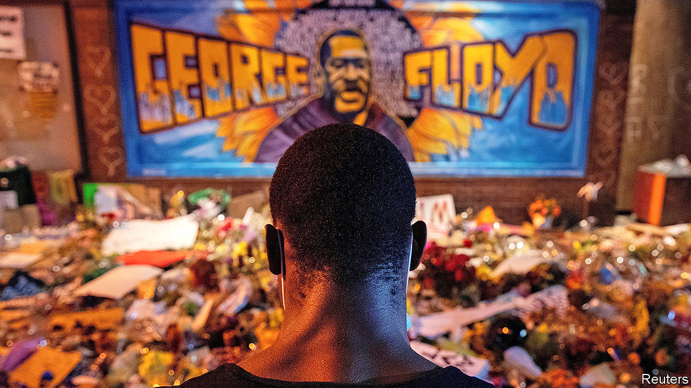
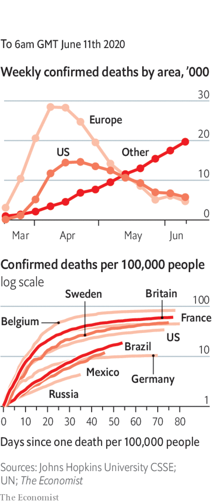

###### 

# Politics this week 

#####  

 

> Jun 13th 2020 

Democrats in the House of Representatives introduced legislation to reform policing in America in the wake of the killing of George Floyd. The measures, which will be resisted in the Senate, would simplify the process for prosecuting officers for misconduct and curtail the “qualified immunity” law that shields them from civil lawsuits. Mr Floyd was laid to rest in his home town of Houston. See .

Protesters turned their energy to toppling statues. Among those torn down were effigies of Jefferson Davis in Richmond, Virginia, and Christopher Columbus in a number of cities.  nascar, a car-racing tournament popular in the South, banned the Confederate flag from its events. See .


Israel’s high court struck down a law that sought to legalise Jewish settlements built on private Palestinian land as long as the Palestinians are compensated. The law would have retroactively legalised thousands of homes built in the occupied West Bank. Meanwhile, the Palestinian prime minister, Muhammad Shtayyeh, said the Palestinian Authority would declare an independent state if the Israeli government follows through on its plans to annex parts of the West Bank.

Militias aligned with the UN-backed government in Libya ousted the forces of Khalifa Haftar, a renegade general, from areas around Tripoli, ending his 14-month siege of the capital. General Haftar’s forces, which are backed by Russia, retreated to areas in the south and east which are under his control. The government’s forces, supported by Turkey, have pursued them to Sirte, where the fighting continues. See .

Russia was suspected of carrying out air strikes on the last rebel-held enclave in Syria. The bombing in Idlib province breached a ceasefire brokered by Turkey and Russia in March. Separately, protesters in the southern city of Sweida, fed up with a sinking economy, denounced President Bashar al-Assad in a rare show of dissent.

Pierre Nkurunziza, the president of Burundi, died, possibly of covid-19. Mr Nkurunziza, who was due to step down in August, had said that God would protect the country from the virus. See .

Ali Kushayb, a militia leader who is wanted by the International Criminal Court to face charges of war crimes in the Darfur region of Sudan, surrendered to authorities in the Central African Republic.

Mali said it would investigate the army after men in uniform attacked two villages and killed 43 civilians in Mopti, in the centre of the country.

The British government conceded that plans to return children to school in England were unworkable. After weeks of resistance from teachers and local authorities, barely half of the pupils in primary-year groups that could have gone back have done so. The return of pupils to secondary schools has also been postponed until September.

Spain’s supreme court opened an investigation into a former king, Juan Carlos, over possibly illegal commissions linked to a rail project in Saudi Arabia.

Brazil’s ministry of health removed briefly from its website much of the data it had reported on covid-19. The country’s president, Jair Bolsonaro, says that cumulative totals do not reflect the current situation. The government complied with an order by a justice on the Supreme Court to resume reporting the data. See .

A recount of votes in Guyana’s election, held in March, showed that it was won by the opposition People’s Progressive Party, a mainly Indo-Guyanese party. The government of President David Granger, who leads the mainly Afro-Guyanese A Partnership for National Unity, is to challenge the recount in court.

China reached a “positive consensus” with India over border scuffles between their two countries’ forces. India said they had agreed to “peacefully resolve” the matter.

The Chinese city of Mudanjiang, on the border with Russia, became the second in the country, after Wuhan, to test all of its residents for coronavirus. Among the 780,000 people examined, at least 19 were found to be infected, without symptoms. In April there had been a spike in cases in the city as Chinese citizens returned from Russia.

China warned its citizens to avoid travel to Australia, citing a “sudden rise in discriminatory and violent actions” against Chinese nationals. Australia said this description had “no basis in fact”. China is furious at Australian criticism of its initial cover-up of the new coronavirus.

North Korea shut down the hotlines it shares with South Korea’s leadership. The South’s defence department said the North was not answering calls on military lines for the first time since they were established in 2018. The North’s blood-drenched regime was upset because defectors in the South were flying insolent leaflets over the border by balloons.

Election officials in Singapore announced measures that make it safer for voters to cast their ballots during the pandemic, including time slots, stoking speculation that a poll will be called for July.

Coronavirus briefs

 


The World Health Organisation changed its advice and now recommends that people wear face masks on public transport and in other situations where social distancing is difficult.

Anthony Fauci, the chief scientist advising the American government about the virus, warned that the epidemic is far from over and that there was “no way” covid-19 would simply disappear.

India reported a surge in infections; it now has the world’s fifth-highest number of cases.

All workers in construction and manufacturing were allowed to return to work in New York City, and shoppers could pick up goods they ordered from stores.

Scientists in New Zealand proclaimed that the country was rid of covid-19 following a two-week absence of new cases. The country’s borders remain closed to foreigners.

