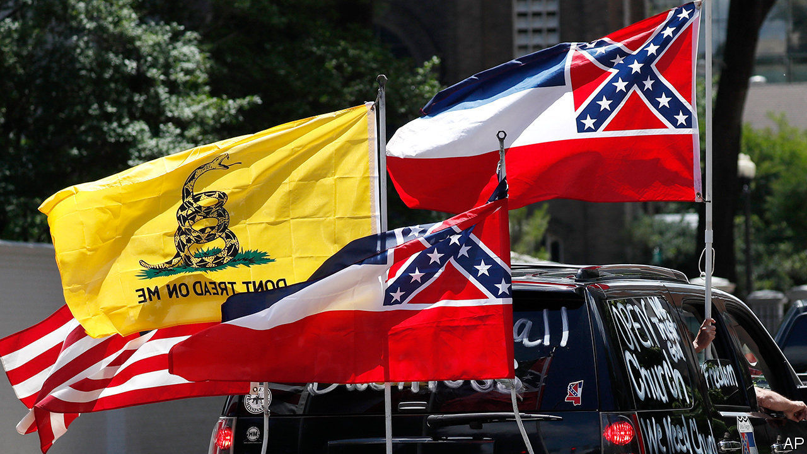

###### Supremacist safari

# A birdwatchers’ app inspires a field-guide to protesters’ symbols 

##### Struggling to sort your odal runes from your blood-drop crosses? There’s an app for that 

 

> Jun 13th 2020 

AMERICA’S CITIES teem with protesters and counter-protesters. But who are they? Among the crowds that have turned out for anti-lockdown “reopen” rallies and marches against police racism, various obscure insignia have been spotted. Members of the far-right, in particular, like to adopt symbols whose meaning is clear only to those in the know. Others may struggle to distinguish their odal runes from their blood-drop crosses. Now there’s an app for that.

VizPol, developed by researchers at Columbia University, uses machine learning to identify political symbols. Open the app, photograph the banner—or T-shirt, belt-buckle, tattoo or anything else that may contain a logo—and VizPol will tell you whether you are looking at a supporter of Antifa or the Aryan Nations. Most of the 50-plus symbols it recognises belong to the far right, whose insignia tend to be more cryptic and quicker to evolve than those of the left, says Ishaan Jhaveri, one of the app’s developers. But it can also spot left-wing logos, like the encircled arrows of the anti-fascist American Iron Front and the hourglass of Extinction Rebellion.


The idea was born at a “Unite the Right” rally in Washington, DC, in 2018. Nina Berman, a professor at Columbia, photographed a protester with the number 1488 tattooed on her arm. Only later did she learn that this was a white-supremacist reference (14 is the number of words in a popular slogan, “We must secure the existence of our people and a future for white children”, and 88 stands for HH, as in “Heil Hitler!”). Ms Berman drew up a crib-sheet of symbols, which colleagues at the Tow Centre for Digital Journalism helped to turn into an app.

Mr Jhaveri, an amateur birdwatcher, borrowed features from Merlin Bird ID, a twitchers’ app, such as the ability for users to upload their photos to improve and expand the database. Around 100 beta-testers have taken advantage of the protests this week to shovel more food into VizPol’s machine-learning algorithm. (The latest slogan it has learned is “ACAB”, which stands for “All Cops Are Bastards”.) If funding can be found, it may expand to cover more countries.

The developers stress that someone displaying a symbol does not necessarily subscribe to the beliefs associated with it. A Hawaiian shirt may indicate support for far-right extremism, but is more often evidence of nothing more serious than a crime against fashion. The potential for misuse and misunderstanding means that at present the app is available only to journalists. Perhaps that is just as well. During a field test in London, your correspondent’s children were identified as possible white-supremacists after VizPol mistook Peppa Pig, a cartoon character of unknown political leanings, for Pepe the Frog, an alt-right mascot.

