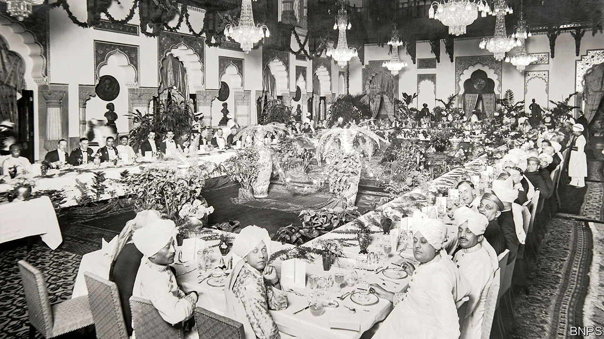

###### Manners maketh district commissioners

# In the bureaucracies of Bangladesh and Pakistan, the Raj lives on 

##### Recruits are taught Victorian table manners 

 

> Jun 20th 2020 

A  CLINK OF the spoon against the side of the teacup: one point deducted. One too many slices of carrot on the fork: another two points lost. When Sarim was training to become a civil servant in Pakistan, he was graded on his table manners. Everyone in his class was so cautious during the test that they would barely eat, he chuckles.

Etiquette lessons are still mandatory for those aspiring to become senior government officials in Bangladesh and Pakistan, although Pakistan no longer marks candidates down for a slip of the teaspoon. During six months living and studying at the Bangladesh Public Administration Training Centre (BPATC), future civil servants must eat with knives and forks, says Mehbub, a successful graduate. A watchful instructor is quick to chastise anyone who reverts to eating directly from the right hand, as is customary for most South Asians.


The centre’s guide to etiquette includes detailed passages on how to hold and use cutlery. It recommends the “Continental” style—cutting and eating each mouthful in turn, with the fork in the left hand, tines down—over the “American” practice of cutting the entire serving into bite-sized pieces and then scooping them up with the fork, tines up. Another section explains in depth the art of “managing bread and rolls”.

Naima, a graduate of Pakistan’s Civil Services Academy, grew up with such conventions as the daughter of a civil servant. But for people coming from other backgrounds it can be a struggle, she says. The weekly lessons on the customs of polite society, little changed since the colonial era, were daunting for her rural classmates. The BPATC’s injunctions not to dip bread in sauce and to stand whenever a woman comes or goes from the table would seem impossibly stuffy to most contemporary Britons.

In India the emphasis on colonial-era etiquette for trainees has waned as the civil service has become more inclusive. Rich, cosmopolitan Indians have turned to careers in banking and business, “more than we have pushed them out”, says an Indian official who hails from a rural part of the state of Rajasthan.

Centuries of formality are hard to slough off, however. When posted abroad, the Indian official often found himself overdressed compared with Americans and Europeans. “My Pakistani friends were even more so,” he laughs. He did dispense with the formal dinner service, however, and dished up Rajasthani thalis even to foreign guests.

The old ways are the best ways for Pakistan, argues Naima. Just because the British introduced them does not make them wrong, she says. Indeed, one reason colonial habits endure in Pakistan is because they suit its conservative culture, she argues. The formal etiquette helps the bureaucracy set itself apart, in her view. In hierarchical places like South Asia, bureaucrats are the top of the pile, says Ishtiaq Jamil of the University of Bergen. Rigid decorum adds to their sense of importance.

Mehbub thinks it will take “another hundred years” for Bangladesh’s civil service to lose its Britishness and become purely Bengali. He is leading the way, however. The head of his office, he sometimes wears jeans and a T-shirt to work: “What can I say? I’m a rebel.”

