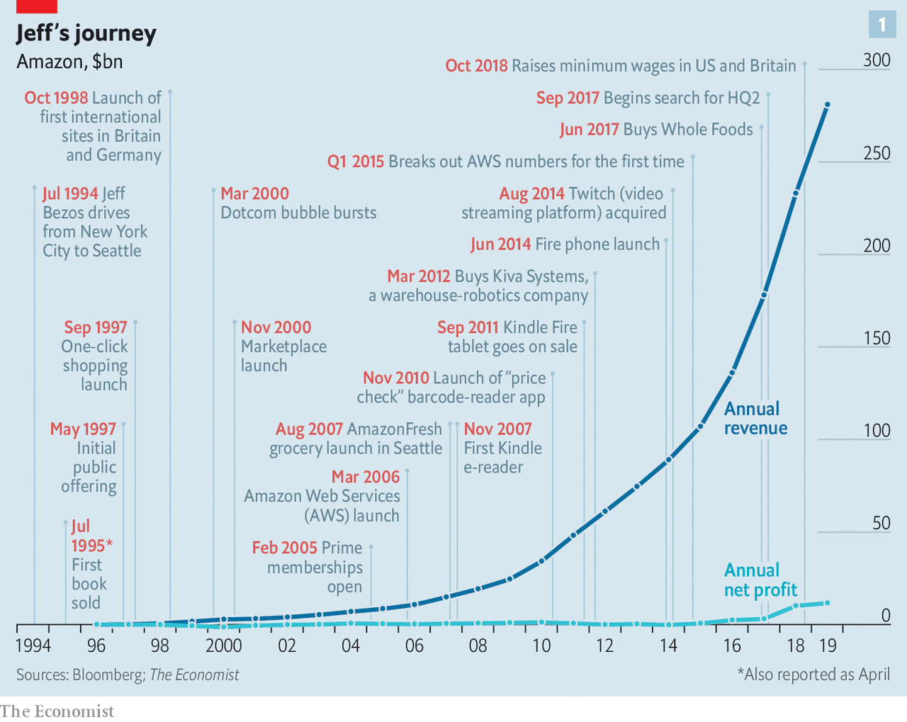
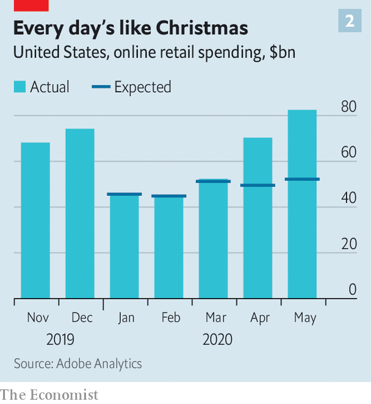
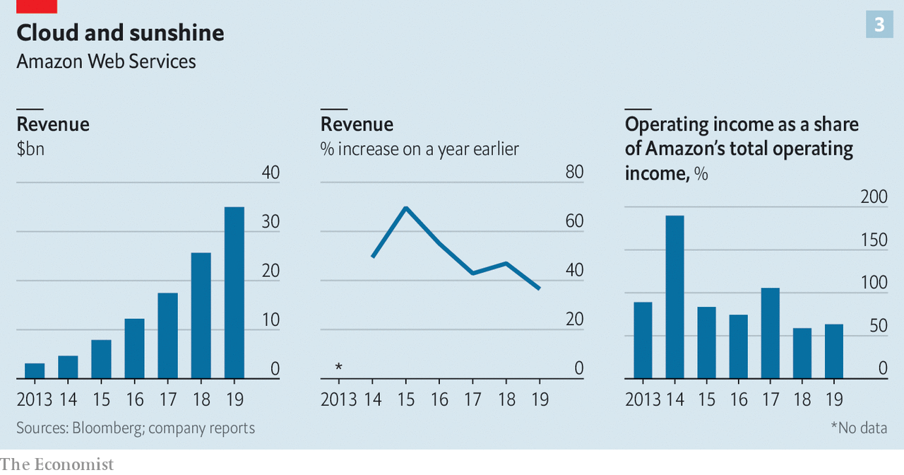

###### And on the second day...

# Can Amazon keep growing like a youthful startup? 

##### Investors certainly seem to think so 

 

> Jun 18th 2020 

NEXT MONTH Amazon will turn 9,500 days old. But for Jeff Bezos, the company’s founder and chief executive, it is always “Day 1”. Amazon, he has insisted since its founding in 1994, must forever behave like a feisty startup: innovate aggressively and expand relentlessly.

Adherence to this rule has made Amazon as convenient to consumers as it is feared by businesses which stand in its way. Today roughly $11,000-worth of goods change hands on Amazon’s e-commerce platform every second. The company delivered 3.5bn packages last year, one for every two human beings on Earth. Amazon Web Services (AWS), its cloud-computing division, enables more than 100m people to make Zoom calls during the day and a similar number to watch Netflix at night. In all, Amazon generated $280bn in revenues last year.


This year Amazon has become not just convenient, but essential. The smiling brown package left at the threshold as the neon-vested delivery worker backs swiftly away has become the hallmark of the locked-down pandemic. Shopless and officeless life would be unimaginable without deliveries and cloud-based work—and insufferable without distractions like video-streaming. Investors see this as an acceleration of a long-term trend towards life online from which the world will not turn back. “The explosive demand created by covid-19 catapults Amazon straight into 2025,” says Michael Moritz of Sequoia Capital, a venture-capital firm.

Amazon’s market capitalisation doubled to $734bn between 2016 and 2018. Since then it has close to doubled again. Its shares trade at 118 times earnings, compared with 25-35 times for Apple and Microsoft, the other members of the trillion-dollar-company club. Up and down Wall Street, brokers tell clients to hold Amazon shares if they have them, or buy them if they don’t.

But Amazon is not without problems. Rivals have emerged in both e-commerce and the cloud. Questions are being raised about its treatment of workers and independent merchants on its platform. Politicians in many capitals would like to see it broken up. So would some investors, on the basis that they would see higher returns that way. “Day 2”, which Mr Bezos characterises as “Stasis. Followed by irrelevance. Followed by excruciating, painful decline”, has not yet dawned. But it is well past noon on Day 1.

Prime position

No firm bestrides the physical and digital worlds in the way Amazon does. In the physical world, it has a logistics system second to none. The 150m customers who subscribe to its Prime service get all their purchases delivered promptly—as well as perks like free streaming of videos and films—for a flat fee, with same-day delivery in some places. The convenience leads them to shop more. The logistics system is also used to fulfil orders for other companies. In 2018 “third-party” sales accounted for 58% of sales through the platform.

The scale of its retail operation gives Amazon an unparalleled collection of data on the desires and decision-making of hundreds of millions of shoppers—the sort of data that advertisers love. Amazon’s advertising revenues are now $11bn; its 7% share of the global online-ad market is larger than any save Google’s (38%) and Facebook’s (22%).

In the digital world Amazon dominates the cloud-computing business. In 2003 two engineers suggested that Amazon’s in-house IT infrastructure could be provided as a service to other companies, as space on its website and use of its logistics system were. That intrigued Andy Jassy, Mr Bezos’s technical adviser at the time. Today Mr Jassy is AWS’s chief executive. The division has established the company’s credentials as a developer of serious technology on a very large scale, rather than just a user of it. It also provides lots of cash. Last year AWS contributed $35bn to Amazon’s sales—and a fat $9.2bn in operating profits.

 


The AWS piggy bank has supported both expansion in retail—in 2017 Amazon paid $14bn for Whole Foods, an upscale supermarket chain—and new projects which the company’s engineers cook up at a prodigious rate. One of the whizziest is Project Kuiper, a satellite-broadband venture; another is Haven Healthcare, a not-for-profit aimed at reducing health-care costs, created with JPMorgan Chase, a bank, and Berkshire Hathaway, a conglomerate.

Amazon is still growing briskly, especially so for a set of multi-billion-dollar businesses. But growth is no longer accelerating in a day-one-ish way. Start with retail. Between 2016 and 2019 growth in global sales of goods, Amazon’s own and third parties’, on its websites slowed from an annual rate of 27% to 18%, calculates Sanford C. Bernstein, a broker. The effects of covid-19 might drive it back up to 23% for 2020 as a whole, but the long-term trend is not expected to change.

And the coronaviral sales boost has come at a cost. The company is hiring 175,000 new workers in America to cope with surging demand; it has invested heavily in covid-proofing its operations; and it has sacrificed earnings by prioritising the delivery of essential items, which tend to have lower margins, while barring many lucrative non-essentials from warehouses and removing ads for them to tamp down demand. Even as sales rose by 26% between January and March, profits fell by 29% compared with the previous year.

With its range narrowed and shipping slowed, Amazon could not keep up with soaring online demand (see chart 2). In America and elsewhere shoppers turned to rivals, often on a “click and collect” basis. According to data from Rakuten Intelligence, an independent subsidiary of a Japanese e-commerce firm, Amazon’s share of online spending in America was 34% in mid-April, down from 42% before covid-19. For years Amazon has led the way as an e-commerce pioneer, says Mark Shmulik of Bernstein; now every big retailer will turn to the web as never before. Long-established retailers like Target and Walmart are already making hay.

 


Big resurgent rivals are not Amazon’s only competition. Shopify, a Canadian firm, offers retailers a way to sell online—and obsesses over the experience it provides to the companies which use it just as much as Amazon obsesses over its customers. It has gone from nowhere a few years ago to 5.9% of America’s online-retail market, second only to Amazon. It is now to become the back-end for Facebook Shops, the social networking giant’s new e-commerce venture. Taking a lead from Alibaba, China’s dominant online retailer, Facebook hopes to provide a setting where people will browse and socialise in a way that no one does on Amazon.

Amazon can no longer count on Prime to fuel prodigious growth at home; most American households that can afford the $120 fee are already members. Future retail growth will therefore depend on markets elsewhere. These currently account for 29% of the company’s total non-AWS revenues. In western Europe, Amazon is entrenched and has been doing well. But an ageing, economically sluggish continent is not exactly a long-term growth and profits motor. Many of the region’s consumers tend to browse online then buy offline. Meanwhile, things in emerging markets are not going to plan.

A year ago, after 15 years of trying, Amazon gave up on China. In 2012 it had managed to win an e-commerce market share of 7% there, but Alibaba and the other local success story, JD.com, squeezed it out, poaching customers with screaming deals and promotions. Had Amazon fought harder it might still have lost; it is possible, even likely, that the Communist Party would not long have tolerated a big American retail presence. But it does bear some blame: it failed to recruit talented locals, and made too many decisions in Seattle.

Failing to deliver

Elsewhere in the emerging world Amazon is still burning billions with no returns in sight. Its $6.5bn investment in India looks troubled. The nationalist government of Narendra Modi is making life hard for foreign firms—and easier for its local champion, Reliance Jio (in which Facebook is investing $5.7bn). In Latin America Amazon’s 3% share of online retail is barely one-fifth that of MercadoLibre, an Argentine firm better at dealing with bad roads, banditry and other local pitfalls. Because profits from western Europe are not enough to offset losses in the developing world, Amazon’s international division has been losing money for years.

Investors have mostly shrugged off Amazon’s global retail slowdown. The reason is simple—AWS. Its operating income usually adds up to well over half of Amazon’s total—in the most recent quarter it accounted for 77%. Bernstein estimates that Amazon’s retail business had an operating margin of -1% in 2019, and AWS 26%. But the cloud is getting crowded. Alibaba, Google and Microsoft have expanded their cloud offerings (though Alibaba Cloud still earns almost all its revenue in China). Globally, AWS’s share of cloud-computing declined from 53.7% to 47.8% between 2016 and 2018, according to Gartner, a research firm, while Microsoft’s nearly doubled to 15.5%. Revenue growth at AWS has slowed sharply, from 49% in the second quarter of 2018, year on year, to 33% in the first quarter of 2020 (see chart 3).

 


The AWS cloud is considered superior to the others in terms of reliability and speed. Azure experiences more service outages, for example. AWS also allows its customers to do more sophisticated things. But the rivals are good enough for most purposes, and improving. Large firms may prefer to deal with Microsoft because they have been dealing with it as a software provider for decades. George Gilbert of TechAlpha Partners, a consultancy, says that whereas AWS offers a wide range of platform services that suit the most technology-centric customers, Microsoft concentrates on integrating its servicesin order to make them accessible to mainstream customers.

AWS has the resources to defend its market-leading position. But in the cloud wars any handicap could cost it dearly. Its parent may be becoming one such drag. For years being part of Amazon was a huge advantage for AWS, says Heath Terry of Goldman Sachs, a bank. It needed cash from the rest of the group, as well as technology and data. But Mr Bezos’s habit of moving into new industries means that there are now ever more rivals leery of giving their data to it. Potential customers worry that buying services from AWS is tantamount to paying a land-grabber to invade your ranch. Walmart has told its tech suppliers to steer clear of AWS. Boards of firms in industries which Amazon may eye next have directed their IT departments “to avoid the use of AWS where possible”, according to Gartner.

This has fuelled talk that AWS might be better off pursuing its future as a separate company. In addition to putting a healthy distance between itself and the Amazon expansion machine, AWS would no longer need to cross-subsidise the firm’s less lucrative ventures. The transparency that would be offered into the financials of each business by a break-up would allow fund managers a better insight into how the new firms fulfil their investing criteria. In financial markets, a separation has been expected for the past year or so, according to the head of global internet banking at a leading financial institution.

Mr Jassy says that AWS was always designed to be separable from the rest of Amazon. If things get to the point where being inside Amazon is more disadvantage than advantage, says Mr Terry, AWS could go its own way.

Not that AWS gets nothing from being part of Amazon, however. Some data-driven technologies work better at scale. Data from Alexa, the virtual assistant Amazon makes available through its Echo smart speakers, helps feed Amazon’s voice-recognition algorithms, which can then be sold as a service to AWS customers, as well as back to shoppers. More shoppers and more data mean better algorithms, and so on. Yet such benefits could easily be set aside if AWS’s position inside Amazon continues to give powerful rivals such as Microsoft and Google a winning sales pitch.

Letting go of AWS would mark by far the most dramatic reorganisation in Amazon’s unremittingly accretive history. Analysts reckon the unit accounts for a third or more of Amazon’s value. A plausible valuation of $500bn would see it start out as one of America’s ten most valuable firms. And despite slowing growth it is still expanding twice as fast as the retail bit. If it grew at 20-30% a year for a decade—which is more slowly than in the past—while maintaining its margins, it could turn into the world’s biggest profit-generator.

The great migration

There is no historical precedent for a half-a-trillion-dollar firm growing that fast for that long. But the notion is not entirely outlandish. Less than 10% of the estimated $4trn in annual global IT spending has so far migrated to the cloud. Mr Jassy is not alone in arguing that “the overwhelming majority” of computing is going to end up there one day. A company focused entirely on making that happen could become vast.

How would Amazon fare without AWS? In some ways, the change might be salutary: some close to Amazon feel that it has grown too big. Elements of unproductive bureaucracy and politicking are creeping in, they report. A lot of high-level Amazon meetings these days are about lobbying for promotion rather than innovation or operational excellence, says a former executive. A slimmed-down and refocused company might be on a better footing.

It would, though, also be one with much less cash to back its further growth. As well as helping pay for the purchase of Whole Foods, AWS money has paid for international expansion and heavy investment in “last-mile” delivery, among other things. If the e-commerce rump were to inherit a hefty chunk of the company’s $59bn cash pile it might be able to keep spending—but not for long, at its recent rates. An Amazon without AWS “might not be one I would want to own”, says a representative of a big institutional shareholder in Amazon.

 


Mr Bezos’s views on a break-up are unknown (he declined to be interviewed for this article). He may believe that AWS and the rest of the group are symbiotic and would both suffer if separated. Even if he does not, though, it is a fair bet that he would be reluctant to let go of a cash-cow that enables Amazon to pursue new ventures. In time, the ad business might grow to fill that role. Last year it boasted an operating margin of 49%, and it is standing up to the current collapse of the advertising market better than its larger online rivals. But it is still small compared with AWS.

Whatever Mr Bezos’s views are, though, they will not be the final word that once they would have been. For a few years Seattle tech insiders have reckoned that Mr Bezos has been preparing to give up the top job to become executive chairman. He has already shed some of the management burden. In 2016, when Mr Jassy became chief executive of AWS, he named Jeff Wilke as “chief executive worldwide consumer”.

Though the pandemic has now brought Mr Bezos back into day-to-day involvement in the e-commerce operation, in recent years he has mostly confined himself to new projects such as Amazon Go, a till-less supermarket, and, earlier, Alexa. He has also been devoting a fifth of his working week to Blue Origin, his private rocket company, which is currently working on satellite launchers to compete with those of SpaceX and a Moon lander for NASA.

There is also the matter of his private life. In January last year Mr Bezos tweeted a bombshell: he and his wife, MacKenzie, were getting divorced. Days later the National Enquirer published details of an extramarital affair. The news shook the tight group of executives who run the company alongside him. Amazon’s meritocratic culture depends on “truth-seeking”, says a former senior executive. But it only works “if people at the top behave accordingly”, he adds. “Jeff’s episode put a dent in the company’s values.” Investors, for their part, fretted that Mr Bezos’s eventful personal life had become a distraction.

If Amazon fissions, Mr Jassy and Mr Wilke will be the obvious candidates to run the two firms—if, that is, one or other of them does not leave before then (they are both high on every recruiter’s wish list). Mr Bezos might stay on to oversee both companies as executive chairman. Amazon’s board will want to hang on to his magic touch for as long as possible, says a headhunter who knows the firm well.

But over time his influence may dwindle. He remains the company’s biggest shareholder—and thus the richest man in the world. His divorce settlement cut his economic stake from 16% to 12% (though he kept the voting rights of the portion he gave up). Still, every year he sells a slug of stock to fund Blue Origin, so in some years’ time he may come to own less than a tenth of his creation. Excluding the big three passive fund managers, the four largest institutional investors in Amazon already control 10% of the stock. And unlike many technology firms, Amazon has no dual-class shares that would let Mr Bezos control the board regardless of the size of his stake.

There might be other attractions to new leadership. While on Wall Street and in Seattle investors and insiders talk of one way of splitting up the company, in Washington, DC, they talk of another. A growing chorus of politicians, accompanied by an ensemble of antitrust experts, accuse Amazon of abusing the market power its size and reach provide.

Elizabeth Warren, a Democratic senator and scourge of big tech, has proposed sundering Amazon’s private-label business—which produces goods for sale on the site—from that of third-party sellers on its platform. The company would also have to sell Whole Foods and Zappos, an e-commerce rival it bought over a decade ago. Two Republican senators, Ted Cruz and Josh Hawley, also speak of breaking up big tech, for different reasons. Donald Trump reserves especial spite for Mr Bezos on the basis that he owns the Washington Post, a newspaper critical of the president.

Soul-searching in Seattle

Anti-Amazon feeling grew stronger in April, after the Wall Street Journal reported that Amazon employees used data on third-party sellers to pinch ideas for the private-label business. Amazon has launched an internal inquiry into the incident, which violated the company’s own guidelines. But lawmakers who had been investigating Amazon, Alphabet (Google’s parent), Facebook and Apple for antitrust violations, still threatened to subpoena Mr Bezos if he did not voluntarily appear at an upcoming hearing. (In June Amazon signalled it was ready to send Mr Bezos.) The European Commission is reportedly preparing to file formal antitrust charges against Amazon over its treatment of third-party sellers in the coming weeks.

In America Amazon’s market share is nearly two-fifths in e-commerce, but only 6% in all of retail. The firm’s low prices and high-quality service certainly do consumers no harm. But even Amazon insiders say accusations of stealing small firms’ ideas are becoming harder to brush off.

So are criticisms with respect to Amazon’s treatment of its workers, a large proportion of whom are African-American or Hispanic. During the pandemic a number of warehouse employees have been publicising safety shortcomings to activists and the media. According to a tally by an Amazon worker, there have been 1,079 coronavirus cases among American warehouse workers. Amazon has said that the firm’s rates of infection and quarantine are never higher than those of the communities in which its facilities are located, and sometimes lower. In May a group of 13 state attorneys-general asked Amazon to hand over data on covid-related infections and deaths at its warehouses.

In May a furore erupted after Amazon fired two tech employees who worked on user-experience design, after they organised a live-stream for warehouse workers to explain their pandemic safety fears. Democratic senators have demanded more information from Amazon on the dismissals. So have a handful of shareholders.

The incident prompted the resignation of Tim Bray, a respected senior vice-president at AWS (and co-inventor of XML, an internet data-description language). The sackings, and those of other activists at the firm, Mr Bray wrote, were evidence of a “vein of toxicity” running through Amazon’s culture. A leading engineer inside Amazon’s Grand Challenge team, a secretive skunk-works unit working on ambitious projects, says morale is rock-bottom. He plans to leave.

The risk of Amazon’s labour practices inviting more regulatory scrutiny—and, possibly worse, alienating brainboxes—is not lost on investors. The firm needs to be “very, very careful”, says the institutional shareholder’s representative. Amazon raised workers’ wages by $2 an hour from mid-March until June 1st and allowed warehouse employees worried about infection to go on unpaid leave without the risk of being sacked. It made 150 changes to the way its warehouses function to ensure social distancing and more cleaning.

Still, says the shareholder rep, rather than leading by example on labour Amazon “seems to be playing catch-up”. Mr Bezos, who has added $54bn to his net worth thanks to his company’s buoyant share price while low-paid warehouse workers toil through the pandemic, “needs to lean over backwards to make sure workers are properly treated”, cautions a leading Silicon Valley venture capitalist.

The antitrust cudgel may in fact be an attempt to force Amazon to spruce up its labour track record. How far regulators are willing to go will depend on the public mood. Americans’ reliance on the company and the goodwill it has generated with consumers may help it, says an antitrust expert close to Congress. An AWS spin-off, if it occurred, might obviate the need for drastic antitrust action.

Mr Bezos has managed to keep Amazon from ageing beyond Day 1 for longer than most companies can dream of. But not even the best magician can stop the passage of time. One day, Day 2 will come. ■

