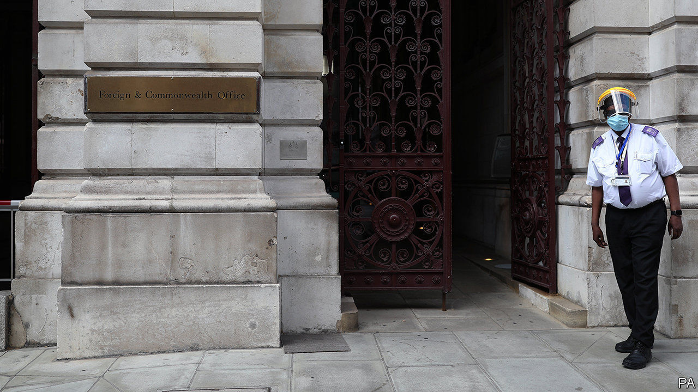

###### A Boris bombshell in Whitehall

# British diplomats and donors are told to merge 

##### Melding the Foreign Office and the Department for International Development leaves big issues unanswered 

 

> Jun 20th 2020 

FOR THE PAST two decades Britain’s Foreign and Commonwealth Office has been steadily hollowed out, while a separate ministry that hands out aid to poor countries has grown in wealth and stature. As Brexit grinds on and co-operation with the EU in diplomacy and development dwindles, Boris Johnson wants to reinvigorate the Foreign Office to prepare Britain to stand alone. With much bombast on June 16th, he declared that the Department for International Development (DFID) would be folded back into the Foreign Office, from which Tony Blair had detached it with much fanfare in 1997. Will this move beef up British foreign policy or help to reduce poverty abroad?

Judging by the reaction of an array of aid pundits and former bigwigs in the diplomatic service, the answer to both questions is no. Mr Johnson’s declaration was met with lamentation from all sides, including Conservatives such as David Cameron, his predecessor-but-one as prime minister, and a bevy of Tory former ministers in charge of dispensing aid. One called the decision “mystifying...a quite extraordinary mistake”. Mr Blair said he was “utterly dismayed”. His Labour successor as prime minister, Gordon Brown, was “sad”.


Mr Johnson may have been thinking more of the many British voters, especially hard-pressed ones from blighted parts of the country, who consider foreign aid an extravagance. He sought to touch a chord among them by claiming that British aid has been treated by recipients as “some giant cashpoint in the sky that arrives without any reference to UK interests”.

Using typically colourful language, he went on to deplore what he claimed was a lack of co-ordination between the diplomatic and aid-giving arms of government. “It’s no use a British diplomat going in to see the leader of a country and urging him not to cut the head off his opponent...if the next day another emanation of this government is going to arrive with a cheque for £250m.” Emphasising rugged realpolitik over kind-hearted zeal for reducing poverty abroad, he went on to complain that Britain gives as much aid to Zambia as to embattled Ukraine, and ten times more to Tanzania than to the six countries of the western Balkans that need bolstering in the face of Russian meddling.

It was nonetheless notable that Mr Johnson ducked any suggestion that he would drop the pledge by Mr Cameron’s government, currently enshrined in law, to spend 0.7% of GDP on development each year. At last count Britain disbursed more than £14bn in foreign aid, mainly through DFID. The Foreign Office’s core budget has shrunk to £1.1bn. Aid agencies fear that Mr Johnson’s government will try to fiddle the definition of foreign aid in order to hit the 0.7% target. Folding DFID into the Foreign Office, they argue, may make it harder to scrutinise how aid is dispensed and whether it goes to the truly poor.

Getting the balance between hard and soft power is tricky at the best of times. Especially in Africa, where most British aid is disbursed, diplomats involved in conflict resolution have complained that their punch has weakened as DFID’s has grown. One called it “the DFID-isation of foreign policy”. Rory Stewart, a former minister for DFID who competed against Mr Johnson to lead the Conservatives last year, has bemoaned the shrinkage of the Foreign Office. “It is no longer staffed or funded to act as a global power,” he says.

But folding DFID into it is not the answer, he argues. At Mr Johnson’s request a historian, John Bew, has been reviewing Britain’s foreign policy with the aim of integrating diplomacy with commerce, security and aspects of soft power such as development aid. Friends and foes of the new arrangement are equally puzzled by the prime minister’s decision to act before Lord Bew reports. ■

