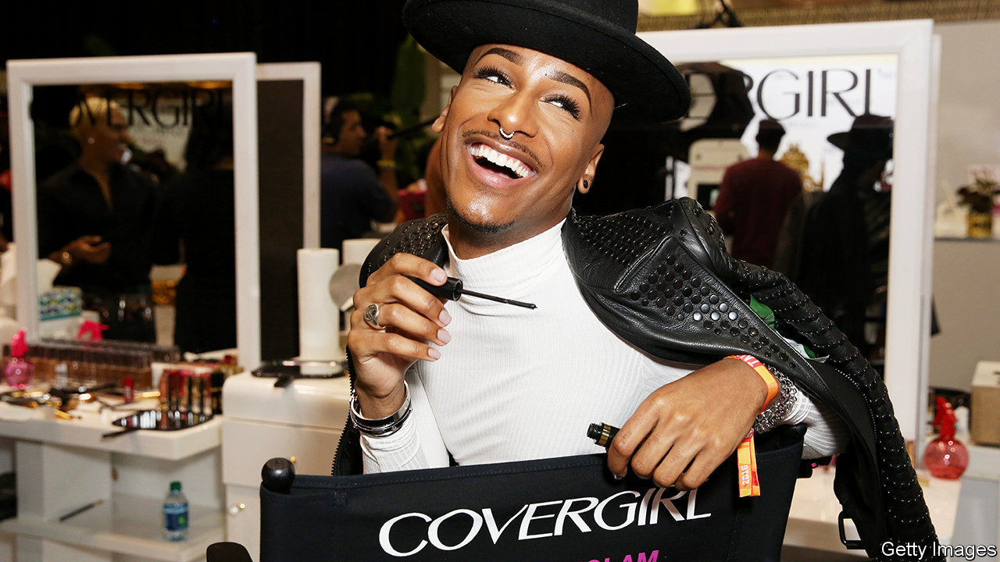
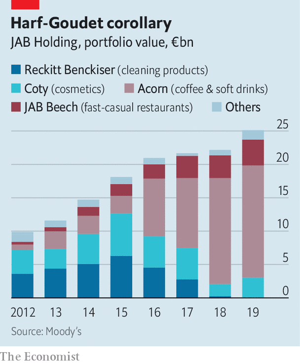

###### The Reimann hypothesis

# A peek inside JAB Holding 

##### One of Europe’s biggest family-owned companies is also among its most taciturn 

 

> Jun 20th 2020 

THE REIMANNS are as fabulously rich as they are faceless. On turning 18, each of Albert Reimann’s nine children signed a codex, pledging to stay out of Benckiser, the family chemicals business in Ludwigshafen, Germany, and never show their face in public. Reimann died in 1984, leaving each of his offspring with 11.1% of his company. Good luck finding a photograph of any of them, including the five who have sold their stakes in the family concern. Its public face is Peter Harf, a Harvard-educated manager whom Albert hired in 1981 as an adviser. A restless sort, with a sharp mind and a dislike of sharp suits, which he spurns for jeans and colourful shirts, Mr Harf transformed Benckiser from a medium-sized manufacturer typical of Germany’s Mittelstand into an international consumer-goods powerhouse overseeing operating companies worth some $120bn.

JAB Holding, as the Luxembourg-based group was renamed in 2012 in honour of its founder, Johann Adam Benckiser, is as anonymous as its camera-shy owners. Its assets are anything but. Having sold off the last of its stake in Reckitt Benckiser, a London-listed consumer-goods group, in 2019, JAB has focused on three main business lines. The first two revolve around caffeine and carbs. Over the years JAB has snapped up purveyors of coffee (like Keurig and Jacobs) and places to consume it (Peet’s Coffee and Pret A Manger, among others), as well as makers of sugary drinks (Dr Pepper) and sellers of snacks (such as Krispy Kreme Doughnuts and Panera Bread). These operations accounted for 85% of JAB Holding’s estimated €25bn portfolio in 2019.


Most of the rest sat in beauty. In 1992 Mr Harf orchestrated JAB’s purchase of Coty, a maker of perfume, from Pfizer, an American drugmaker, for $440m. Coty was listed in New York in 2013, and in 2016 Mr Harf added to it 41 beauty brands, including Wella (shampoo), Max Factor and Covergirl (make-up), bought from Procter &amp; Gamble (P&amp;G), an American giant, for $12bn.

Alongside JAB Holding, which manages the Reimanns’ money (and that of Mr Harf, whom they treat almost like a family member) is a larger sister holding, JAB Consumer Fund (JCF), with investments in the same group of businesses. It was set up in 2014 with cash from other wealthy families, including the Peugeots, a French carmaking clan, and Colombia’s Santo Domingo beer dynasty.JCF adds complexity to the federation, which comprises several intermediate holding companies co-owned by JAB and JCF that in turn control underlying operating assets. But it enables the structure to take on more debt, which Mr Harf has used to enlarge the empire with deals like the $19bn purchase of Dr Pepper Snapple in 2018. The two vehicles are run jointly by Mr Harf and Olivier Goudet, a former finance chief at Mars, a huge American confectioner (which is also family-owned). An admirer of Warren Buffett, Mr Harf likes to refer to the JAB-JCF as Benckiser Hathaway.

Like the famed American investor’s conglomerate, JAB favours long-term bets on businesses that are easy to understand. What sets it apart from Berkshire Hathaway, and many family offices, is a focus on a few big assets. According to Moody’s, a credit-rating agency, 96% of JAB Holding’s funds were in the three biggest last year (see chart). Investor AB, another large and complex investment fund, controlled by Sweden’s Wallenberg clan, has 37% of its portfolio in its top three assets. Mr Harf wants JAB Holding to own a stake of 30-40% in each portfolio firm, so that even if JCF’s backers exit, the Reimanns would retain the ear of the operating firms’ CEOs.

 


Such concentration is a boon when things are going well, as they have been with the coffee business, which Mr Goudet envisaged as a rival to Switzerland’s Nestlé. Defying the covid-19 pandemic, JAB listed 16.5% of shares in JDE Peet’s, the result of a merger between Jacobs Douwe Egberts and Peet’s Coffee, at the end of May in Amsterdam. Out of ten “smart investors”, nine warned Mr Harf to wait with the IPO, he says. In the event, the offering raised a caffeinated €2.25bn, making it Europe’s biggest IPO this year and valuing the firm at €15.6bn. The share price surged by 15% on the first day of trading. The outlook for JAB’s other cafés, starved of customers amid pandemic lockdowns, may improve as economies reopen.

The same cannot obviously be said of the cosmetics arm. Mr Harf may have overpaid for P&amp;G’s brands and folding them into Coty has proved tricky. Coty’s market capitalisation has shrunk by more than 80% since 2016, to $3.7bn. In May KKR injected €750m into the debt-laden business, which will eventually give the private-equity firm a 60% stake in a professional-beauty firm to be hived off from Coty. Mr Harf himself will run the consumer operation. On June 1st he took over as Coty’s CEO after it went through four chief executives in five years, to clean up what he calls “the greatest blemish on my vest”.

“Overall Mr Harf has done well for the Reimanns,” says Jean-Philippe Bertschy at Vontobel, a Swiss bank. Despite Coty’s pallid record, JAB investor returns have averaged 15% a year since 2012. But Mr Bertschy cautions JAB against more break-neck acquisitions. Previous ones provoked the departure last year of JAB Holding’s chairman, Bart Becht, who reportedly quit after failing to convince the other partners to scale back expansion and focus instead on running the companies under their wings better. 

Mr Harf will now try to do just that. The spry 74-year-old plans to overhaul Coty, starting with distribution. That will not be easy. Cosmetics is cut-throat and Coty must find a niche between the two giants of the industry, L’Oréal and Estée Lauder, and trendy “indie” brands. At least Mr Harf has plenty of coffee to keep him going. ■

