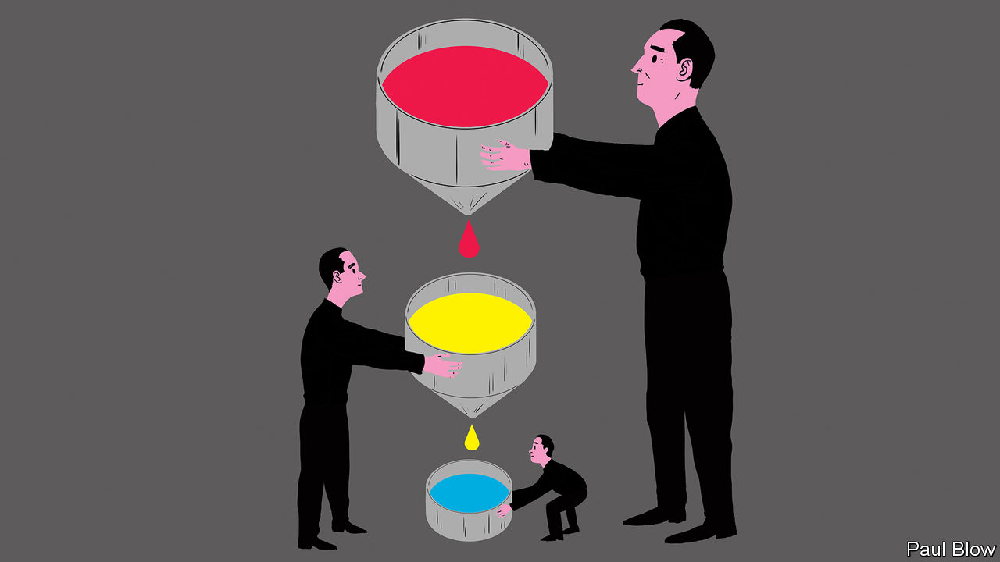

###### Bartleby

# Waging war on recessions 

##### An early analysis of furlough schemes 

 

> Jun 20th 2020 

SINCE THE emergence of the welfare state, adults who want to work have generally found themselves in one of two positions: earning a wage from their job or receiving unemployment benefits. The pandemic has led many people to find themselves in a halfway stage—furlough. This often involves the state paying a large slice of employees’ wages so that firms can keep them on the payroll during the lockdown.

How effective is this approach? A new paper* by Morten Bennedsen of INSEAD business school in France and colleagues surveyed 8,781 Danish firms with anywhere between three and 2,000 employees. Around two-thirds of the firms said that the effect of the pandemic on their revenues had been negative, or very negative. Of those companies that had experienced a fall in revenues, the median decline was 35%.


The Danish government offered a variety of financial-aid programmes to firms, including a furlough scheme which paid 75% of salary costs (subject to a cap) to eligible companies. The academics found that 56% of the firms surveyed had taken some form of government aid and this was true of almost all businesses that had suffered a revenue decline of more than 50%. Unsurprisingly, companies in the most distressed industries were most likely to have taken assistance.

The aid seemed to work. Firms that received it laid off fewer workers and furloughed more people than firms which received no aid at all. But, as the authors of the study point out, this definition of success might be subject to a selection bias—firms that wanted to furlough workers may have been likelier to apply for aid.

So they also asked firms a counterfactual question: what decisions would they have taken had they been unable to get aid? On this basis, the researchers estimate that taking the aid increased a firm’s furloughed workers as a share of its total workforce by about 20 percentage points, and decreased the share of laid-off workers by almost the same amount.

If these findings are replicated elsewhere, furlough schemes may be adopted in future recessions. Some commentators point to the record of Germany, which suffered a much smaller rise in unemployment than other rich countries during the recession in 2008-09 because of a scheme that subsidised short-term working.

There are two obvious concerns about such support schemes. The first is the cost. The British scheme, which started in March, is expected to cost around £60bn ($75bn) by the scheduled end in October, or a bit less than 3% of GDP. The second problem is that such schemes may prevent the necessary role that recessions play in “creative destruction”, whereby resources are reallocated from failing businesses to successful ones (see ). The survival of “zombie” companies may make the next recovery less vigorous.

On cost, the counterargument is that widespread job losses lead to deep recessions and thus sharp declines in government revenues. They can also be bad news for laid-off workers who may take years to find another job. Paying money upfront to reduce the severity of a recession can thus be a good investment in both social and economic terms.

It would be great if governments could save only companies that have a viable long-term future. The analogy might be an old rule of thumb among central bankers that they should lend money in financial crises to banks that have a liquidity problem, not a solvency one. In practice, however, financial crises in recent decades have been so acute that central banks have mostly been unable or unwilling to discriminate. Similarly, while governments have imposed conditions on wage-support schemes in the current crisis, their main priority has been to dole out aid as quickly as possible in order to save jobs.

A lot more research is clearly needed to see whether furlough support schemes will have adverse long-term economic effects. The longer the schemes are in place, the more likely it is that market distortions will occur. But the principle that governments should intervene to support struggling banks and unemployed workers, as a way of reducing the severity of recessions, has long been established. It is conceivable to think that furlough schemes might eventually be viewed in the same light.

* “The impact of public aid programs on distressed firms: Evidence from COVID-19 in Denmark”, by Morten Bennedsen, Birthe Larsen, Ian Schmutte and Daniela Scur■

Editor’s note: Some of our covid-19 coverage is free for readers of The Economist Today, our daily . For more stories and our pandemic tracker, see our 

