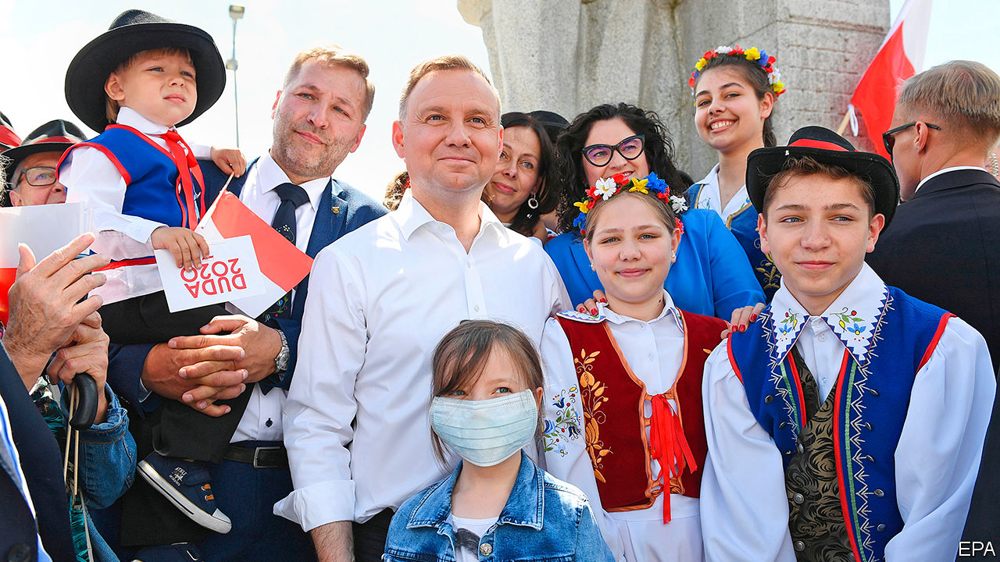

###### Playing the family card

# Gay “ideology” is worse than communism, says Poland’s president 

##### Facing a tough election, Andrzej Duda needs enemies 

 

> Jun 20th 2020 

POLES WILL go to the polls on June 28th to vote for their next president, a mostly ceremonial position but with the crucial power to veto laws. The election will be the latest popularity contest between the ruling populist Law and Justice (PiS) party and the centrist Civic Platform, which governed from 2007 to 2015. PiS lost ground in parliamentary elections last year, and it looks as though the contest will go to a run-off on July 12th.

The two candidates, barring a big surprise, will be Andrzej Duda, the PiS-backed incumbent, and Rafal Trzaskowski, Warsaw’s mayor, who joined the race at the last minute. If the liberal, pro-European Mr Trzaskowski beats Mr Duda, his supporters will surely greet it as the beginning of the end of PiS rule.


This will be Poland’s second shot at holding an election during the covid crisis, after the original exercise set for May was called off. Mr Duda faces five main challengers, all men, ranging from the centre-left to the nationalist far-right. Like Mr Duda they all came of age after 1989, a generational shift in Polish politics which has long been dominated by politicians shaped by the struggle against communism.

Mr Trzaskowski joined the race after Civic Plaform’s previous candidate, Malgorzata Kidawa-Blonska, pulled out in mid-May after a lacklustre campaign in which support for her dropped to single digits. On paper, he and Mr Duda are remarkably similar. Both were born in 1972; Mr Duda to a pair of academics in Krakow and Mr Trzaskowski in Warsaw, the son of a jazz composer. Both have doctorates and served as members of the European Parliament. (Mr Trzaskowski also served as Europe minister in 2014-15.)

Yet their politics have placed them on opposite sides in the bitter struggle between PiS and Civic Platform that has gripped the country since the mid-2000s. Mr Duda’s unexpected election as president in 2015 paved the way for PiS’s return to power later that year after eight years in opposition (he resigned from the party after his victory). Three years later, Mr Trzaskowski’s victory in the Warsaw mayoral election, crushing the PiS candidate, showed the limits of the ruling party’s brand of populism.

Mr Trzaskowski won in Warsaw by appealing to liberals. Soon after taking office he signed a declaration in favour of lesbian, gay, bisexual and transgender (LGBT) rights, with proposals including a shelter in Warsaw, anti-discrimination measures and more sex education in schools. This led to a backlash from PiS, supported by the Catholic church. Poland faces an “attack on the Polish family”, warned Jaroslaw Kaczynski, the party’s leader.

Beating them at their own game

This time Mr Trzaskowski is casting his net wider. He is appealing to moderate conservatives tired of PiS’s radical streak and its disregard for checks and balances (especially judicial ones), which the European Commission has warned undermines the rule of law. “Conservatism rejects radicalism, conservatism rejects nationalism,” he told a crowd in Krakow, Mr Duda’s hometown, on June 6th. He has also pledged to support the PiS government on matters of state interest. The president cannot be in “total opposition” to the government, he says. However PiS does not have nearly enough seats in parliament to override a presidential veto, which could well be applied on a number of other issues.

Suddenly on the defensive, Mr Duda is trying to mobilise socially conservative voters by presenting himself as the defender of the traditional family (56% of Poles oppose gay marriage and 76% are against adoption by same-sex couples, according to a poll last year). LGBT is an “ideology” worse than communism, he told supporters on June 13th in Brzeg, a town in south-western Poland. A “Family Card” of policies presented by him last week includes continuing hefty handouts for children introduced by PiS and not allowing gay couples to marry or adopt. He has been supported by the public-television broadcaster, which PiS took over shortly after it came to power in 2015. “LGBT ideology is destroying the family,” read a caption on its evening news programme also on June 13th.

Since Poland’s rapid and strict lockdown in mid-March, the government has eased most of its coronavirus restrictions. Infections remain lower than in many European countries (30,701 cases and 1,286 deaths, according to official figures from June 17th), despite some recent new outbreaks among coal miners. The government has introduced measures to protect businesses and workers from the economic effects of the epidemic, including a 100bn zloty ($25bn, or around 4.5% of GDP) support package for local firms.

Mr Duda continues to lead in the polls, but the distance between him and Mr Trzaskowski is narrowing. One poll conducted on on June 12th and 13th gives him 40.7%, ahead of Mr Trzaskowski’s 28%, with the other candidates below 10%. With no candidate above 50%, a run-off seems inevitable. The polls suggest that it will be close. The winner will not only claim the presidential palace, but shape whether Poland becomes more open or closed. ■

