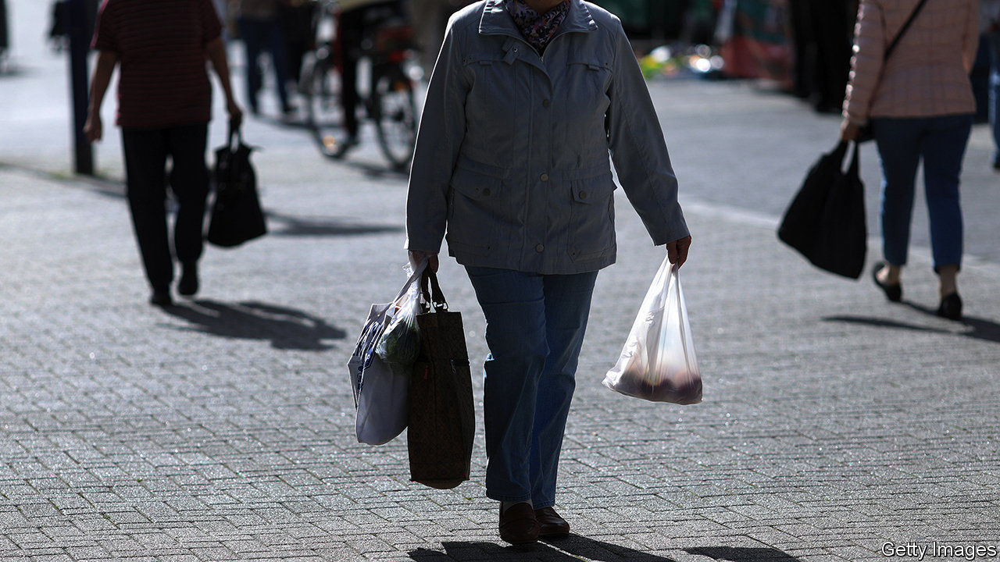
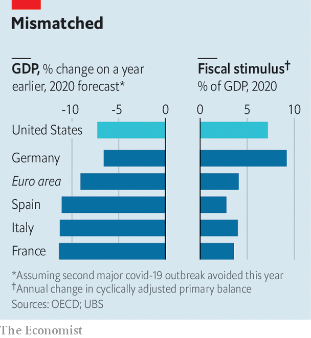

###### Better tailored

# The euro area’s stimulus is less stingy than in past crises 

##### Even so, more stimulus will be needed this year 

 

> Jun 20th 2020 

THOSE STRUGGLING to break bad habits should take inspiration from the euro zone. During the global financial and sovereign-debt crises it did too little to shore up growth; at times monetary and fiscal policy were tightened precisely when they should have been loosened. By contrast, its response to the covid-19 pandemic has been less flat-footed. Consider the events of the first three weeks of June alone. Germany’s government, usually tight-fisted, announced a stimulus package of at least €130bn ($146bn). The European Central Bank (ECB) said it would buy another €600bn in bonds. And as The Economist went to press, national leaders were due to discuss setting up an EU-wide “recovery fund” of €750bn, an idea first floated in April.

The question is whether policy can remedy a grave weakness: that countries facing the greatest economic damage are also those with the least fiscal space. Germany’s outbreak was relatively less severe, and its lockdowns less stringent. Its new programme takes its total fiscal stimulus this year to 9% of GDP, according to economists at UBS, a bank (see chart). That is bigger than America’s. But France, Italy and Spain, which have had worse outbreaks and stricter lockdowns, and risk losing valuable tourism revenues over the summer, also have higher government-debt ratios. Fiscal support has been stingier there.


The good news is that EU policymakers are trying to redress the imbalance. Thanks in part to Germany’s newfound generosity, the recovery fund could direct cash to countries according to need rather than what they contribute. A proposal by the European Commission suggests that Italy could receive grants equivalent to about 5% of its GDP, and loans worth another 5%, says Jacob Nell of Morgan Stanley, a bank. Germany and the Netherlands might receive funds worth only 1% of GDP. The bad news is that although many economists expect an agreement to be struck, a few countries—such as the Netherlands and Sweden—are yet to sign up. As a result the fund could well become stingier. Moreover, the cash will only begin to be doled out in 2021, and will be spread over a number of years.

 


That means that the ECB must do the heavy lifting this year. All told, it is due to buy €1.6trn in public and private-sector debt in 2020, equivalent to 14% of last year’s GDP. Like the commission the bank has shifted away from its usual “one-size-fits-all” approach. Instead of buying assets in line with its “capital key” (ie, a country’s contribution to the bank’s capital, which is in turn proportional to its economic size), it seeks to contain the spread between the bond yields of riskier countries and those on German bunds. Around 22% of the purchases through its pandemic programme and its older quantitative-easing scheme in April and May were of Italian paper, whereas Italy’s share of the capital key is 17%, says Sven Jari Stehn of Goldman Sachs, another bank. That means the ECB could indirectly fund all of Italy’s deficit this year.

Despite all this, the euro area is probably still short of stimulus in 2020. Though it seems likely to suffer a bigger economic hit than America, its overall fiscal support is smaller. The pace of ECB purchases is more sedate than that of America’s Federal Reserve. Few economists think existing stimulus will rouse inflation, which was stubbornly below the ECB’s target even before covid-19. Still more bond-buying is therefore probably on the cards. The recovery fund could set a precedent, hopes Mr Nell, allowing for a common fiscal tool to be used in other times of need. Good habits, once formed, tend to stick. ■

