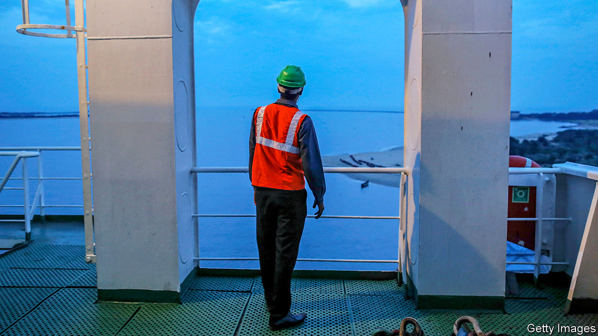

###### Sailors are stranded at sea

# Cargo ship crews are stuck at sea 

##### A crewing crisis 

 

> Jun 20th 2020 

AS YOU READ this, over 60,000 cargo ships are on the high seas, laden with iPhones from China, dresses from Bangladesh, beef from Argentina, oil from the Gulf and much, much more. The industry likes to say that it is responsible for “90% of everything”. Indeed, its ships are the circulatory system of global commerce and their 1.2m merchant seamen its lifeblood. They enable nations to turn their comparative advantage into wealth. If they were to stop, much of humanity would soon begin to starve or freeze.

Throughout the covid-19 pandemic merchant seamen have kept working (see ). But they have been stuck on board. In a normal week around 50,000 finish their contracts and are relieved. The virus has cut that number to almost nothing. Over 250,000 mariners are stranded at sea, even though they are at least a month past the end of contracts that typically last three to nine months. Each day that total rises, and an essential job starts to look more like indentured labour.


Most merchant seamen are from developing countries, in particular India, Indonesia and the Philippines. They start and end their contracts in whatever port a shipping schedule stipulates. The ship-management firms that organise rosters and contracts for shipowners fly them out and back again. But most commercial flights have been grounded for months. Managers would have used charter planes, but many countries are refusing entry to non-citizens. Some are turning citizens away, too. Sailors are forbidden to disembark, and their reliefs are barred from entry.

The situation is unjust to sailors both on board and onshore. The first lot do not know when they will see their families again; the second do not know when they will next be able to earn a wage. It is also dangerous. Fatigue makes it hard to concentrate, and cargo ships are high-pressure, high-risk places. Forcing sailors to work endlessly is a recipe for accidents.

In the pandemic’s early days, governments could perhaps have been forgiven for their neglect. There was much else to worry about. But their confinement has dragged on and sailors now have every right to feel bitter. After being locked down for months, seeing nobody but the odd pilot or port official, they are some of the world’s least likely virus-spreaders. They know that they are being ignored simply because they can be. Lorry-drivers, whose goods cannot cross borders without them, were quickly classed as essential workers. Sailors, unfortunately for them, can stay on board while their cargoes are loaded and unloaded.

On June 16th an industry-wide agreement allowing emergency extensions to labour contracts expired. Unless crew-changes restart, insurance contracts could lapse—a headache for the entire industry.

But it is governments, not shipowners and managers, who must solve the problem. Last month the International Maritime Organisation, an arm of the UN, published a protocol for safe crew-changes in the pandemic. Almost no country has yet got round to implementing it. The most important step is to classify merchant seamen as essential workers, thus enabling them to cross borders and travel to and from ports during lockdowns. Ports and airports need holding facilities and accommodation for testing and quarantine for sailors. In ordinary times, all this might seem onerous. But the covid-19 world is one where hairdressers sterilise their scissors between cuts and offices allocate desks on a rota to maintain social distancing. Shipping needs to adapt to these new realities, too.

Global trade’s invisible hands must not be forgotten. When their work is done, they deserve to go home. ■

