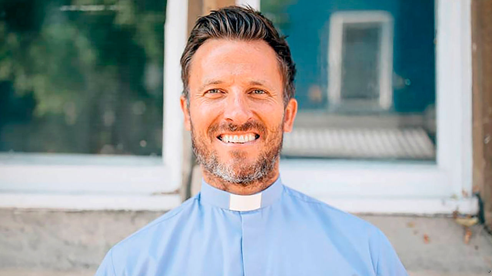

###### On prosecutors, the media, mercenaries, Greek, carbon pricing, the Bible, Andrew Johnson

# Letters to the editor 

##### A selection of correspondence 

> Jun 20th 2020 

 


In defence of prosecutors

As a former prosecutor, with more than a decade of experience in Miami, I take issue with your statement alleging that prosecutors are not inclined to bring charges against police because we’d rather secure convictions to advance our careers (“”, June 6th). The “elaborate culture” described in your article of turning a blind-eye to police misconduct is an academic chimera. I have never met a prosecutor who engaged in that kind of unethical calculus and am confident that it would not have been tolerated by our fellow prosecutors or our managers. That being said, I’m sure that racism exists at all levels of government. But speciously suggesting that there is an unspoken quid pro quo between police and prosecutors is false and does nothing to advance the rights of victims of police brutality.


J.P. NIXONWestport, Connecticut

 


One rule for some

There is another reason for the popularity of fake news on the political right (“”, June 6th). It is the double standards found in most of the media’s reporting. This conservative complaint is not entirely a myth. Take covid-19. Widespread demonstrations in early May by right-wing anti-lockdown protesters were depicted by the media as selfish and menacing acts that would result in the virus being spread. Yet the protests that erupted over George Floyd’s horrific death just a few weeks later were praised by the same media. The same Democratic governors who supported lockdown and prevented businesses from reopening even participated in the marches.

One group of experts on infectious diseases, whom I presume supported the lockdowns, penned a letter with over 1,200 signatures stating that the protests were necessary to fight “white supremacy”. It is hard to imagine that these experts would support street demonstrations by conservatives in the middle of a pandemic. Commentators on the right had a field day pointing out the hypocrisy. A politicised scientific and medical community is deeply worrying because it boosts the argument on the far right that supposedly unbiased science and scholarship are a sham.

ARVIN BAHLNew York

 


Soldiers for hire

The trend in Africa towards using mercenaries, who work for private military companies, has been observed elsewhere (“”, May 30th). Left unabated, the privatisation of warfare will increase the risk of human-rights abuses and worsen humanitarian problems, especially where conflict persists and governance is weak.

This is why governments, civil-society organisations and private-security companies set up the International Code of Conduct Association for private security-service providers, based in Geneva. All those who use private contractors for legitimate security purposes, including governments, businesses, international organisations and NGOs, should exercise greater responsibility and due diligence. The UN now requires its own private-security providers to be members of the association, opening up their operations to continual monitoring and oversight by it. Nevertheless, more must be done to reel in rogue private contractors and to strengthen accountability.

JAMIE WILLIAMSONInternational Code of Conduct AssociationGeneva

The rise of mercenaries in the 21st century is indeed a striking, if not worrying, phenomenon. However, the term “mercenary” may be misleading because it refers to soldiers who serve any state for pay, as A.E. Housman famously put it in verse. Yet most contracted soldiers are actually employed by their own government, in whose armed forces they have served, or by its local allies. In each case, they are advancing national policy. These mercenaries might be better defined as privatised state forces, rather than dogs of war. They are closer to Francis Drake than John Hawkwood.

ANTHONY KINGChair of war studiesWarwick UniversityCoventry

 


Greek lesson

An article referred to the hooligan fish’s genus name, Thaleichthys, as Latin for rich fish (“”, June 6th). The word thaleichthys does not stem from Latin but comes from ancient Greek, a merger of the words thalein (to flourish) and ichthys (fish).

HARRY CORDATOSColchester, Connecticut

 


Pricing emissions

Your briefing on carbon pricing argued that “there’s got to be something better” than border carbon adjustments, in effect tariffs on countries that are not members of the carbon-pricing scheme (“”, May 23rd). But you did not propose any realistic alternatives. The European Union’s system of freely allocating emissions-trading allowances to placate concerns over carbon leakage for energy-intensive, trade-exposed industries (EITEs) is becoming unsustainable, now that the number of allowances in the EU’s carbon market must shrink to meet tighter climate goals. A global carbon market involving billions of euros in wealth transfers between Europe, America and China is Utopian.

Thus, the EU is left with two options: either introducing border adjustments or low-carbon product standards, while progressively diminishing the use of free allocation. Both are complicated, but such standards have been proven to work in other contexts, such as the Montreal protocol.

EITE products account for less than 2% of global GDP but 20% of carbon-dioxide emissions. Without a sustainable system to manage international differences in climate-policy ambition, they will not be decarbonised.

OLIVER SARTORAgora EnergiewendeBerlin

 


We all stumble in many ways

It was apparently too obvious that the scriptural basis for old-fashioned Christians’ fondness for old-fashioned communal worship could only come from the Old Testament to bother checking the quote “Don’t forsake the gathering of the brethren” (“”, June 6th.) The reference is in fact found in the letter to the Hebrews in the New Testament. This old-fashioned priest would like respectfully to remind The Economist that the internet allows Bible references to be checked in a matter of seconds.

FR PHILIP-THOMAS EDWARDSLondon

 


Drunk on power

compared Donald Trump to one of his most hapless and divisive predecessors, Andrew Johnson (June 6th). In addition to being an unreconstructed shire supremacist and notoriously thin-skinned, Johnson was one of mid-19th century Washington’s heaviest drinkers, to the point of arriving at his own vice-presidential inauguration in 1865 drunk and slurring his words.

Some of Johnson’s more erratic acts, such as comparing himself to Jesus Christ, could be chalked up to his extreme alcoholism. Trump, a life-long teetotaller, has no such excuse.

SCOTT PLATTONPrinceton, New Jersey

