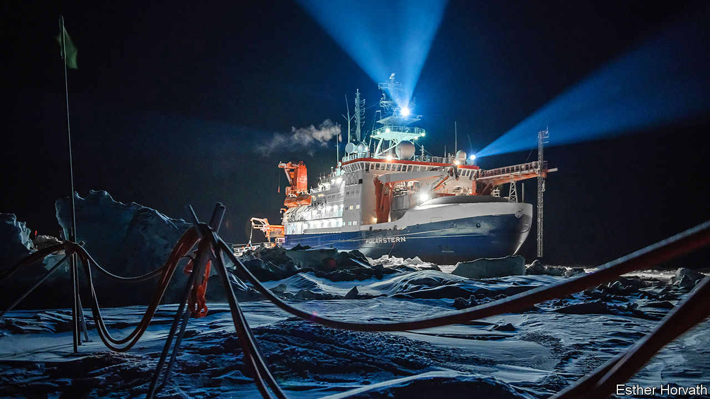
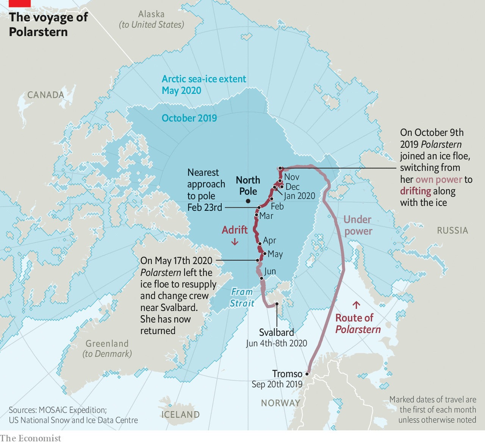
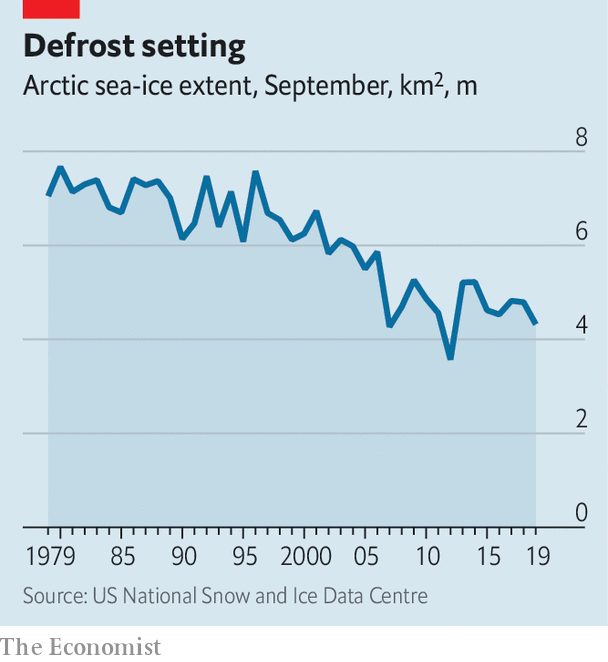
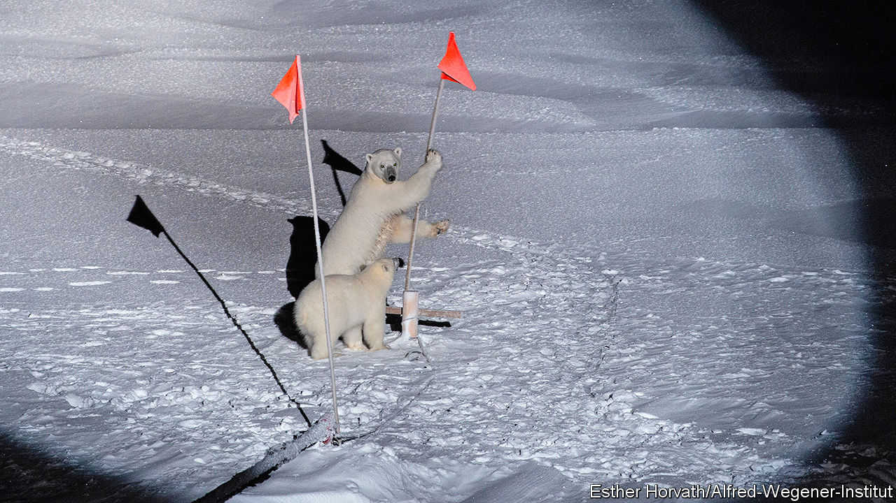

###### A floating Arctic laboratory

# An icebreaker called Polarstern is revealing the Arctic’s secrets 

##### Everything depends on how the ice behaves 

 

> Jun 20th 2020 

THERE IS “LOCKDOWN”. And then there is lockdown. Those who have spent the past weeks allowed out only to exercise and visit the shops might spare a thought for the passengers and crew of Polarstern (Pole Star), pictured above. Polarstern is an icebreaker belonging to the Alfred Wegener Institute for Polar and Marine Research, in Germany, and her ship’s company are in a different class of lockdown entirely. Their vessel is afloat in the pack ice of the Arctic Ocean, and communications are so minimal as to preclude phone calls, let alone Zoom. Only pictureless messages and emails are possible.

Polarstern is the location of MOSAiC, the Multidisciplinary drifting Observatory for the Study of Arctic Climate. She sailed from Tromso, in Norway, on September 20th 2019 and travelled to a point at latitude 85°N (see map). Here, mimicking the first high-Arctic voyage, made in 1893 by Fridtjof Nansen, a Norwegian explorer, her captain fixed her into an ice floe that carried her along at about 7km/h, courtesy of an ocean current called the transpolar drift stream. Her closest approach to the pole itself, 156km, was on February 24th.

 


Things have not, however, gone according to plan. The idea was for a revolving cast of 300 scientists each to spend two months on board. This would have permitted specialists in the study of different seasons and conditions—winter or summer ice, say—to be there at the appropriate moment, and would also have had the benefit of protecting everyone from cabin fever.


Unplugging the freezer

A planned rotation in April had, though, to be cancelled. Norway, the new shipmates’ intended departure point, had closed its borders in response to covid-19. That left the original company with no liberation date. Eventually, two transfer ships with the newbies on board sailed from Bremerhaven, in Germany. And on May 17th Polarstern broke free from her icy prison and headed south to meet them off the coast of Svalbard. On June 8th she began the return trip, and arrived back at her original piece of ice (which had moved) on June 17th, to resume drifting with it until she breaks free in September, in the Fram Strait between Greenland and Svalbard.

The coronavirus has not changed MOSAiC’s objectives, however. These are to study the structure of Arctic ice and how this changes with the seasons, and to look at the air above that ice, the water below and the creatures living in that water—and, indeed, in the ice itself. All of these are interlinked. They also link the place with the wider world, for the Arctic is both a recorder and a driver of climate change.

It is a recorder because the visible difference between ice and water, and the obvious relationship between global temperatures and the amount of ice around, mean together that the ice’s waxing and waning shows in an easily graspable way how things are changing. And changing they are, for the extent of the Arctic sea ice in summer has declined by 30% in the past 30 years, and that loss is accelerating (see chart).

 


The Arctic is also a driver of climate change, though, because the whiteness of ice means it reflects sunlight back into space, thus cooling Earth, whereas the darkness of open water means it absorbs that light. The less of the former that is happening, and the more of the latter, the faster global temperatures will rise.

Start, then, with the ice. At the moment this is monitored mainly by satellite. Measuring the extent of the Arctic’s ice from space is easy. Measuring its thickness is trickier. From orbit, this is done by a mixture of radar and laser beam. Icesat 2, an American craft, provides laser-altimeter data that record the height above sea level of the top of the snow that overlies the ice. Cryosat 2, a European one, uses radar to penetrate the snow and measure the height of the top of the ice itself. The thickness of the ice in a particular place can then be calculated by applying Archimedes’ principle of floating bodies to the mixture of ice and snow, and subtracting the thickness of the snow. However, Julienne Stroeve of University College London, now safely returned from her leg of the mission, believes that the data collected by these two satellites may be inaccurate, leading to an overestimation of the ice’s thickness.

When all is working perfectly, the return signal for Cryosat 2 comes exactly from the boundary between the ice and any overlying snow. Dr Stroeve thinks, though, that this is not always what happens. Variables such as layering within the snow, along with its temperature and salinity, might affect the returning radar signal by changing the snow’s structure and density. This could cause the signal to be reflected from inside the snow layer, rather than from the boundary where it meets the ice. If that were happening, it would create the illusion that the ice beneath the snow is thicker than is actually the case.

To investigate this possibility Dr Stroeve took a purpose-built radar on board Polarstern. Each week, she and a colleague mounted this 170kg instrument on a sled and dragged it to a new site, to sample different snow conditions. As they towed it, they sent radar pulses on the frequency bands used by the satellites downwards into the snow and measured the amount of backscatter. The deflection of the signals in this backscatter gives a picture of how particular snow conditions might be changing the way the satellite’s radar is returned.

Dr Stroeve’s radar died on January 31st—one of many of the expedition’s machines that fell victim to the Arctic winter. But by the time that had happened she had managed to gather a fairly good set of data. Her conclusion is that the reflection does indeed sometimes come from the interface between snow and ice, as it is supposed to. But not always. The discrepancy is important. Her measurements already show that the ice is “definitely thinner than the satellites suggested”. She has yet to analyse the data fully, but preliminary investigation indicates that both snow depth and temperature influence backscatter. It therefore looks likely that the amount of Arctic sea ice around has been overestimated. That brings closer the moment when, if temperatures continue to rise, the ice will vanish altogether in the summer.

The thickness of the pack ice is not the only thing that matters, though. Its topography is also important. This is the province of Jennifer Hutchings of Oregon State University. She is using GPS buoys to track the motion of the ice around the ship. Though sea ice is solid, it is not rigid. It forms but a thin skin on the ocean—varying in depth from around 30cm in summer to a couple of metres in winter—so is readily moved by wind and current.

As the ice moves it stretches and cracks in some places. Large cracks formed in this way are called leads, because they are wide enough to “lead” a ship. In other places, by contrast, movement makes the ice thicker. As individual panes of ice butt up against each other, they create ridges that can be metres high. Dr Hutchings has not yet had a chance to process her data. But even from the ship’s deck she has been able to watch leads opening and ridges forming around the vessel. Her eyes and ears, as well as her instruments, tell her that this winter the ice has been particularly mobile—and has thus become particularly rough, with a surprising number of ridges.

These ridges may affect the rate at which the ice melts—but to complicate matters, this could happen in two opposing ways. Ridges make ice thicker, and thicker ice melts more slowly. On the other hand, a ridge projects down into the sea as well as up into the air (Archimedes, again), so it may stir up water from below the surface. Deep water is warmer than the surface layer, so this stirring would serve to increase melt rates. Moreover, to add to the confusion, ridges are prone to having pieces of ice fall off them into the sea, to form small blocks known as brash. This brash, having more surface area per unit volume than unbroken ice, melts faster.

Dr Hutchings’s main observation, though, is a change in the ice’s structure. Historically, this far north, where ice is always present in some form, winter is the time when it builds up as new layers are adding to existing floes, thickening them. In summer the ice then melts back a little. But a core of the stuff remains from year to year and, over successive winters, more layers are added. That forges what is known as multi-year perennial ice.

Dr Hutchings and her colleagues have, however, found something rather different is now going on. Instead of being composed of ice accumulated over many years, much of the perennial ice pack is no longer truly perennial—it is “juvenile”, having built up over only the past two years.

To Dr Hutchings, this is further evidence confirming what satellite images of the ebbing and flowing of the pack ice suggest—that the end of year-round ice cover at the North Pole may be near, with a summer melt-back so substantial that the pole itself sees clear, blue water.

Jeff Bowman of the Scripps Institution of Oceanography, in San Diego, is also interested in the behaviour of the ice. In his case, that interest is directed towards its effects on Arctic life. The main question he has been asking is whether the Arctic ecosystem as a whole is a net producer or absorber of carbon dioxide. The answer to this question has implications for the amount that the Arctic contributes to global warming. It depends on how much photosynthesis is taking place in the region. And that, in turn, depends on the extent and topography of the ice cover.

The Arctic Ocean has few multicellular plants. But it does have single-celled algae and photosynthesising bacteria. These live both in the water and in the ice itself. And, though tiny, they are abundant. It is they that Dr Bowman, who is a marine microbiologist, is studying, to discover how they affect the Arctic’s carbon balance.

To measure the activity of these micro-organisms he has been analysing the amount of oxygen in the water. This is an indicator of how much photosynthesis is taking place. In doing so, he has discovered that the physical condition of the ice—particularly the ridges being studied by Dr Hutchings—has an important effect on these creatures and their productivity.

Oceans, the Arctic included, fall naturally into layers, with the stillest water at the bottom, where there is also little light. Ascend the water column and both motion and light increase. Near the top is what is known as the surface mixed layer, which turns over continuously in response to the wind. Sea ice generally reduces this wind-induced mixing. But ice ridges act like tiny sails, catching the wind, moving in response and thus stirring the water beneath. The consequence, Dr Bowman has found, is a surprisingly deep mixed layer.

That is bad news for photosynthesising planktonic microbes. The already low level of light below the ice means they can grow only when they are close to the surface. If they get “mixed down” away from the light they cannot photosynthesise.

This is not, however, a problem for those organisms actually embedded in the ice. For them, thinner ice means they get more light, rather than less. That raises their productivity. The result, as observed by Dr Bowman, was an unusually early spring-ice algal bloom this year.

It remains to be seen what the effects of the early bloom are. But shifts in the timing of events of this sort can have consequences. For example, if the algae bloom early, the tiny animals that eat them may hatch too late to catch their main food source. Fewer of these zooplankton means, in turn, less to eat for things further up the food chain—like fish, seals and polar bears.

 


But what is true of winter is not necessarily true of summer. The return of the sun means the winter’s subtleties are now being replaced by a stronger, more obvious consequence of the reduced sea ice. This is that more light can blast through the water into the ecosystem. That, too, will affect the timing and intensity of phytoplankton and ice-algal blooms.

The effects on the carbon balance of the early algal bloom in the spring will play out in the coming months. The uneaten algae may act as a carbon sink, mopping up carbon dioxide. Alternatively, they may increase levels of carbon dioxide if their mistiming serves to put out of kilter an ecosystem that would otherwise have absorbed it. The new set of researchers on MOSAiC will follow this up.

The changes in the ice that Dr Hutchings has been observing also seem to influence the atmosphere, according to one of the other researchers on board Polarstern—Lauriane Quéléver of the University of Helsinki. Ms Quéléver is interested in the chemical composition of Arctic air, and in particular how certain scarce molecules in it act as precursors for the formation of clouds. This, she has discovered, seems to be controlled by the behaviour of the ice.

On most parts of Earth clouds form as droplets of water condense around “seeds” of dust or organic molecules. In the Arctic there is little dust. Biological activity, too, is in short supply compared with elsewhere—and is, moreover, conducted mainly below the barrier of the sea ice. It might therefore be expected that there would be few seeds present for clouds to form around. And yet, clouds are present.

Clouds on the horizon

Ms Quéléver’s starting point for investigating this matter was previous research carried out on islands at lower latitudes in the Arctic—specifically, Greenland and Svalbard. Cloud seeds there tended to be compounds containing sulphur, nitrogen, chlorine, bromine or iodine. Using a score of instruments held in a container at the ship’s bow, she looked for these molecules. And she found them.

That was not a complete surprise. What did surprise her, though, were the quantities she found them in. She expected their concentrations in winter, the least biologically active time of year, to be low to non-existent. In fact, they were similar to those found in Greenland.

The only plausible source of these molecules is the micro-organisms Dr Bowman is studying. And, as if to support that idea, she also saw that spikes in the concentrations of molecules of interest correlated with “ice events” around the ship, such as the opening of big leads which brought the air into contact with the seawater below.

The link between the sea ice cracking and the release of potential cloud seeds suggests that more cracks in the ice sheet could lead to more clouds in the Arctic. What overall effect that might have on the climate is unclear. Summer clouds would reflect sunlight back into space, cooling the planet. Those formed in winter, when the sun is below the horizon, would serve as insulation, warming it. As with the way Dr Hutching’s ridges affect the melting of ice, two opposite outcomes are possible—or perhaps the net effect will be that they cancel each other out.

As this example shows, properly disentangling the interactions between Arctic ice, atmosphere and ocean life will require data collected across a full year—for the contrast between winter and summer at the poles is greater than anywhere else on the planet. Polarstern’s unexpected detour has come at the cost of some of these data, but in partial compensation the expedition left several autonomous machines on the ice, to continue harvesting as much information as possible during the ship’s absence. With luck, then, the expedition has been saved to finish what will be the most comprehensive study so far made of the Arctic and its influence on the climate. If that happens, the researchers on board will have had the most productive lockdown imaginable—with no Zoom involved.■

