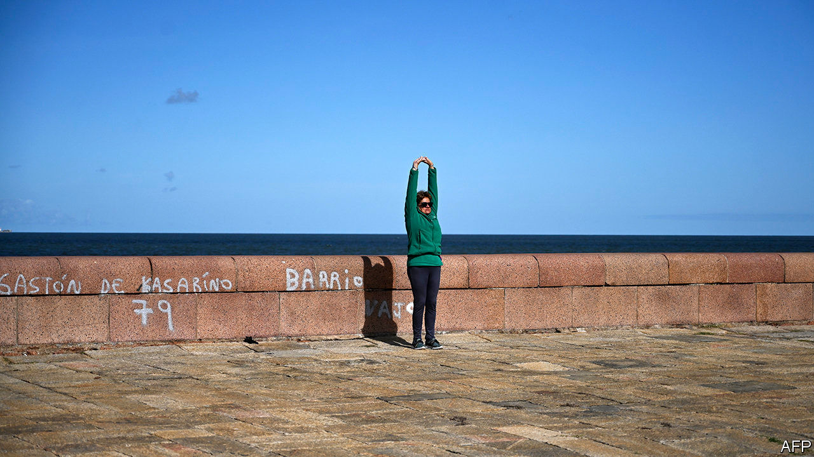

###### Standing apart

# How Uruguay has coped with covid-19 

##### Low density and high trust help 

 

> Jun 20th 2020 

BETWEEN TAKING calls on his radio show, Horacio Abadie explains to a journalist Uruguay’s success in curbing the spread of covid-19. Rather than locking people down, the government trusted them, he says. And people behaved responsibly. “Mutual trust has us controlling the virus.”

By June 18th Uruguay had reported 849 confirmed cases and 24 deaths from covid-19, the lowest number as a share of population of any country in South America. Uruguay has administered 55,215 tests, a regional record.


Luis Lacalle Pou, the centre-right president, was swift but not strict. On March 13th he declared an emergency and shut the borders. Like the populist leaders of Brazil and Mexico, he is at pains to shield the economy. Unlike them, he does not make light of the disease. “It was such a surprise to see a president listen to a doctor, or a mathematician, digest the advice, then communicate a message to the public free of any politics,” says Eduardo Savio, an epidemiologist who advised the government.

The government calls its policy libertad responsable (responsible liberty). It shut down schools, cinemas and shopping malls. It urged people to work from home, wear face masks and keep their distance from each other, but did not confine them to their houses. Mr Lacalle Pou “was not going to imprison people”, says an adviser.

They seem to be paying heed. Alberto, a pensioner, wears a face mask as he jogs on the beach in Montevideo, the capital, and does not linger to sunbathe. “The government trusts me to behave, and I trust the government to look after me,” he says.

Alberto is among the 14% of Uruguayans older than 65, the largest share in the Americas. That should make the country more vulnerable to the pandemic’s ravages, but its advantages matter more. They have little to do with its new president.

Montevideo, which has 1.4m people, two-fifths of Uruguay’s population, is the only largish city. It has no metro. Its network of buses, on which the virus can easily spread, is small. Uruguay’s century-old welfare state, the first in Latin America, created “confidence that the state looks after you”, says Adolfo Garcé, a political analyst. Free, reasonably good health care is available to everyone. Three-quarters of workers have formal jobs, well above the regional norm.

In a poll by Latinobarómetro in 2018, 39% of respondents in Uruguay said they trusted the government, the highest share in Latin America. When the president enlists them to fight an emergency, they are disposed to listen. Mr Lacalle Pou won the election in November by less than two percentage points, but 77% of Uruguayans support his handling of the pandemic.

The president campaigned as a reformer of the welfare state, the cost of which has led to large budget deficits. He promised to slash the bureaucracy while maintaining the level of service it delivers. He imposed a temporary tax increase on public-sector employees, including himself, during the pandemic. The $12m in extra revenue is to be spent on boosting the economy. He is pressing ahead with an omnibus “law of urgency”, which has 476 measures to shrink the government payroll, strengthen the police, reform education and weaken trade unions. On June 5th the Senate reassembled to debate and then approve it. The opposition called the rush to pass it an “abuse of power”.

The trust Mr Lacalle Pou enjoys may drop if the recession caused by covid-19 is long and deep. The IMF expects the economy to shrink by 3% this year, less than the regional average but painful enough.

The president is putting Uruguay back to work. Nine-tenths of businesses have reopened. On June 1st the government began reopening schools, with sample testing of teachers and students. If that reveals an outbreak, they will shut again. “Uruguay looks like the exception in Latin America,” with an economy that can rebound from the pandemic, says Aldo Lema, an economist. If it can contain covid-19 at the same time, its neighbours will look to the one-time buffer state for lessons. ■

Editor’s note: Some of our covid-19 coverage is free for readers of The Economist Today, our daily . For more stories and our pandemic tracker, see our 

