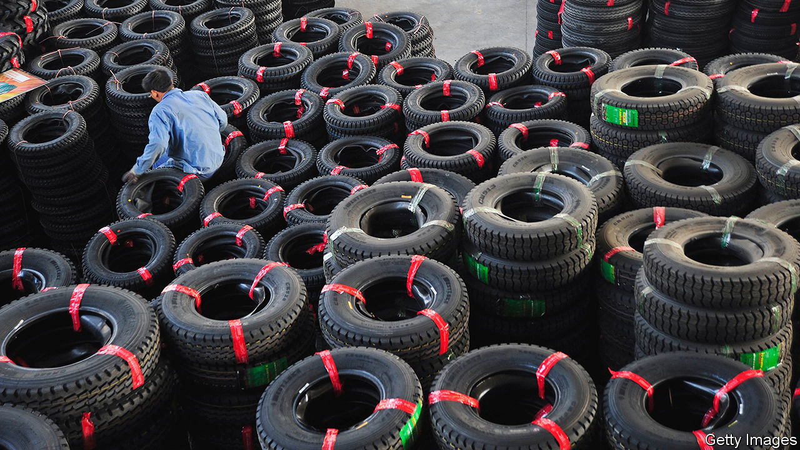

###### A hill of beans to die on

# Chronicling Donald Trump’s trade war with China 

##### Two books explain the origins of the tension—and why it is set to last 

 

> Jun 27th 2020 

Superpower Showdown. By Bob Davis and Lingling Wei. Harper Business; 480 pages; $32.50 and £25.

Trade Wars are Class Wars. By Matthew Klein and Michael Pettis. Yale University Press; 288 pages; $28 and £20.


ROBERT LIGHTHIZER, the United States trade representative, joined the Trump administration as a longtime critic of China. A protectionist, he had prospered as a lawyer by fighting Chinese steel firms over their exports to America, denounced the country’s admission to the World Trade Organisation (WTO) in 2001, and disparaged the American government’s approach to its subsequent rise. As America’s chief trade negotiator from 2017, he saw an opportunity to right old wrongs.

Two new books offer accounts of the economic conflict that Mr Lighthizer stepped into. In “Superpower Showdown” Bob Davis and Lingling Wei chronicle his attempts to negotiate a deal between America and China, which were at times so muddled that the Chinese failed to realise who was leading the talks. “Trade Wars are Class Wars”, by Matthew Klein and Michael Pettis, offers a deeper argument about the source of the trouble. The pair think the real battle is being fought inside China, between workers and elites.

Both books point out that the problems had been building for decades, but, say Messrs Klein and Pettis, the rot took a while to set in. When a country is trying to grow richer, it can help to keep consumer spending low and to channel resources into investment instead. But in China this strategy lingered for too long. Suppressed interest rates robbed savers of spending power and encouraged wasteful investment; internal migration restrictions held down wages; a weak currency subsidised exporters at the expense of consumers. The result is that Chinese producers make more stuff than ordinary people can afford to buy.

Diplomatic tensions arose when the excess spilled into foreign markets. Spurred on by the world’s hunger for dollars, America has mopped up much of it—to the detriment of its own manufacturing base.

“Superpower Showdown” illustrates these trends with stories from both sides of the Pacific. It includes the tale of Liu Zhanyi, whom locals in Guangrao often mistook for a truck-driver because of his modest attire, instead of recognising him as the owner of one of China’s largest tyre exporters. Between 2004 and 2008, as his business was enjoying success, employment in the American tyre industry shrank by 14%. The Obama administration responded with temporary tariffs on Chinese-made tyres in 2009, to little effect. By then some tyre wholesalers and retailers were so dependent on imports that the tariffs pushed them into bankruptcy.

Mr Lighthizer took a different line of attack. He convinced Mr Trump to launch an investigation into China’s economic practices, including the alleged theft of American intellectual property. Unsurprisingly, this concluded that the Chinese had indeed sinned, for example by abusing joint ventures with foreign companies to force them to hand over valuable technology. It was not lost on the Chinese that Thomas Murphy, chairman of General Motors, had first suggested these partnerships in 1978 as a way to boost China’s car industry.

Resolving this clash of economic systems peacefully was always going to be difficult, particularly given the interventionist inclinations of China’s president, Xi Jinping. Mr Lighthizer understood the challenge, but figured that the administration’s pressure might bolster market-minded reformers within China and loosen the state’s grip on the economy. That had happened when China joined the WTO. He hoped to repeat the trick.

What followed was, in Mr Davis’s and Ms Wei’s telling, a stunningly cack-handed negotiation. Mr Lighthizer was undermined by colleagues pushing for tariffs on American allies who might have helped cajole the Chinese. Mr Trump himself was torn between a desire to lift the stockmarket and fury that the Chinese were not buying more soyabeans (John Bolton, his former national security adviser, alleges in his new book that the president was preoccupied with the impact on his own re-election prospects: see Lexington). At one point in the talks Washington was full of references to Mr Trump as the title character in “Jack and the Beanstalk”: might all this fuss have been over a cup of beans? A Chinese delegation interpreted a packed room of officials as evidence that they were being taken seriously. In fact it indicated that the Americans did not trust each other.

Ultimately the two sides settled, literally and metaphorically, for a few beans. The initial deal they signed in January 2020 left the hardest problems for another day. Mr Klein and Mr Pettis demonstrate that giving up is unwise, because ordinary folk deserve a bigger share of the economic pie, and conflicts will persist until they get it. Mr Davis and Ms Wei show that the Trump administration was unfit to do the job. ■

