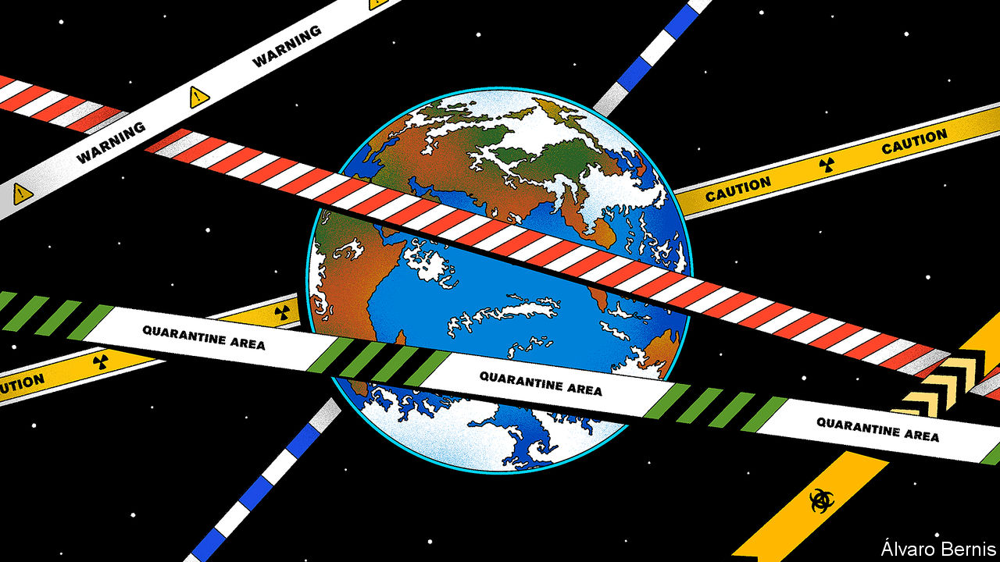
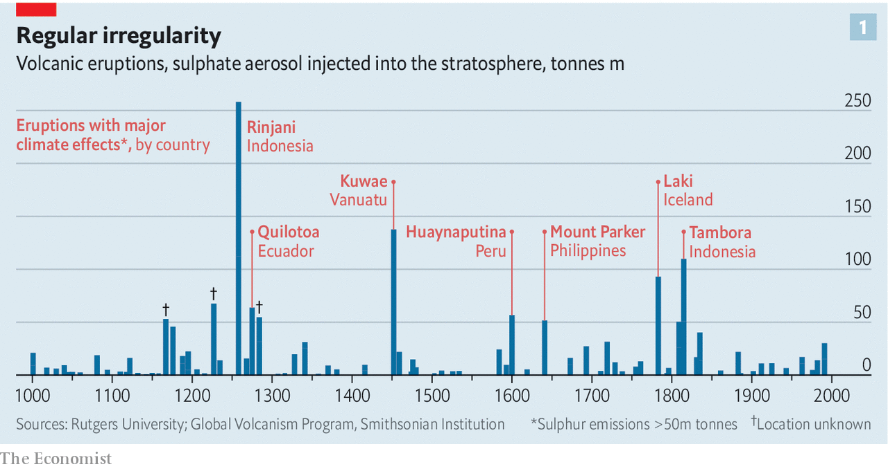
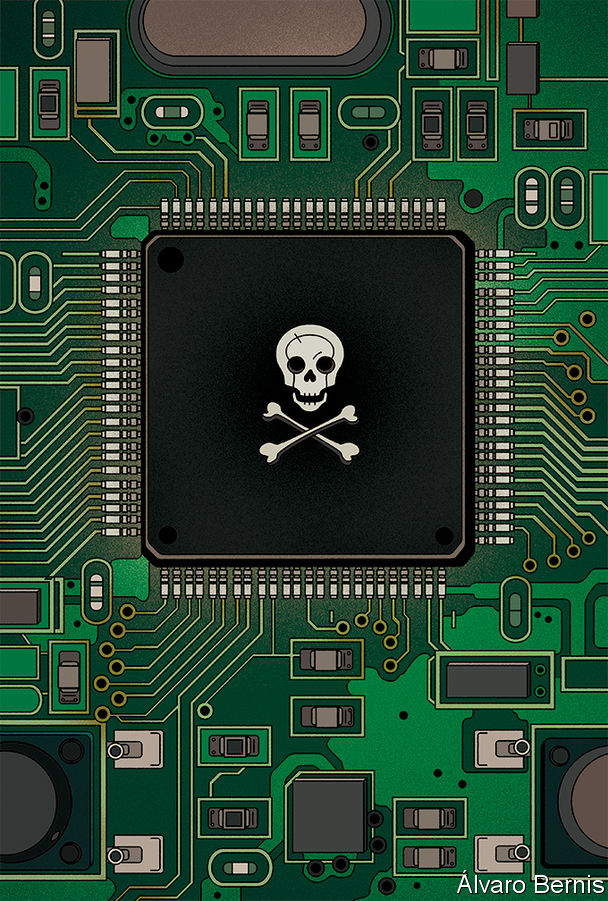
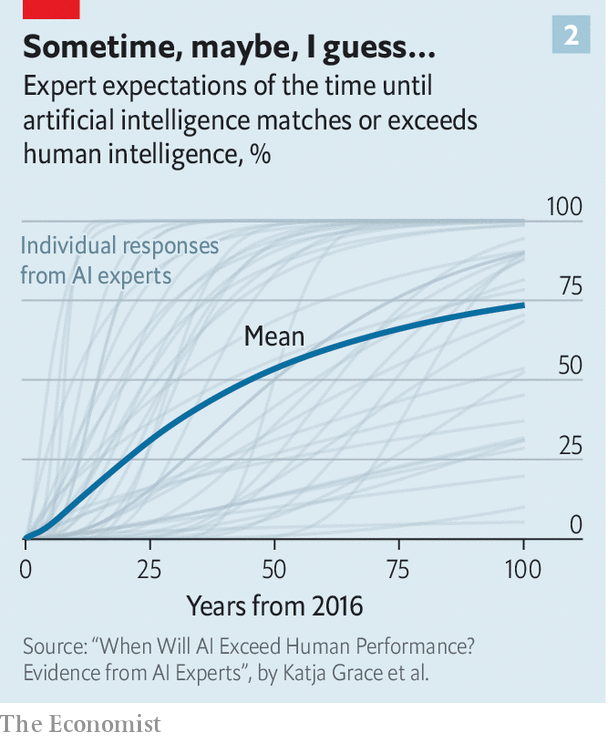

###### What’s the worst that could happen?

# The world should think better about catastrophic and existential risks 

##### Plans and early-warning systems are always a good idea 

 

> Jun 25th 2020 

Editor’s note: Some of our covid-19 coverage is free for readers of The Economist Today, our daily . For more stories and our pandemic tracker, see our 

ON SEPTEMBER 2ND 1859 C.F. Herbert, prospecting for gold in south-eastern Australia, saw something sublime in the evening sky. “A scene of almost unspeakable beauty presented itself, lights of every imaginable colour were issuing from the southern heavens,” he would later recall. “The rationalist and pantheist saw nature in her most exquisite robes. The superstitious and the fanatical had dire forebodings, and thought it a foreshadowing of Armageddon and final dissolution.”

Those who saw cataclysm in the auroral display were not exactly wrong: just ahead of their time. The Carrington event, as the geomagnetic storm Herbert observed came to be known, was the result of 100m tonnes of charged particles thrown off by the Sun a few hours earlier slamming into Earth’s magnetosphere, a protective magnetic sheath generated by currents in the planet’s liquid core. The electromagnetic effects of the onslaught did not just produce a truly spectacular display of the Southern Lights (and the Northern ones, too, visible as far south as Colombia). They induced powerful currents in any electrical conductors to hand. Some telegraph networks took on a life of their own, no longer needing batteries to generate signals.


Such effects mattered little 20 years before the advent of the light bulb. In today’s ubiquitously, fundamentally and increasingly electrified world a “coronal mass ejection” (CME) as large as that of the Carrington event could cause all kinds of chaos. Induced currents would topple electrical grids. Satellites would have their circuitry fried or be dragged from the sky as the outer atmosphere, bloated by the storm’s energy, rose up towards them.

How bad the effects of an off-the-charts CME might prove is up for debate. Some say a really big storm would knock the power out in various places for a few hours, as a moderate one did in Quebec in 1989. Others predict something little short of the end of days. That the world will some day find out who is right, though, is beyond debate. Solar physicists put the odds of a Carrington-level geomagnetic storm some time in the next ten years at around one in ten. Eventually one will come.

Geomagnetic storms are one of a small set of events found in the historical and geological record that present plausible threats of catastrophe. Pandemics are another, giant volcanic eruptions a third. Seeing how well—or how poorly—countries are currently coping with the only one of these catastrophes of which they have prior experience raises the question of how they might cope with the others.

Technology plays a crucial role in the hazards such events generate. It can bring surcease, as a vaccine might for a pandemic. It can bring vulnerability, as electric grids have when it comes to geomagnetic storms. And it can also bring forth new risks of its own. The most obvious are the technologies of internal combustion and nuclear weaponry, which made possible catastrophic global warming and war on an unprecedented, environment-shattering scale. It is possible that further techno-disasters may lie ahead—and that they may be the most serious of all, putting the whole human future in jeopardy.

In a recent book, “The Precipice”, Toby Ord of the Future of Humanity Institute at Oxford University defines an existential risk as one that “threatens the destruction of humanity’s long-term potential”. Some natural disasters could qualify. An impact like that of the 10km asteroid which ushered out the dinosaurs 66m years ago is one example. A burst of planet-scouring gamma rays from a nearby “hypernova” might be another. A volcanic “super-eruption” like the one at Yellowstone which covered half the continental United States with ash 630,000 years ago would probably not extinguish the human race; but it could easily bring civilisation to an end. Happily, though, such events are very rare. The very fact that humans have made it through hundreds of thousands of years of history and prehistory with their long-term potential intact argues that natural events which would end it all are not common.

Do you feel lucky, punk?

For already existing technologically mediated risks, such as those of nuclear war and climate collapse, there is no such reassuring record to point to, and Mr Ord duly rates them as having a higher chance of rising to the existential threat level. Higher still, he thinks, is the risk from technologies yet to come: advanced bioweapons which, unlike the opportunistic products of natural selection, are designed to be as devastating as possible; or artificial intelligences which, intentionally or incidentally, change the world in ways fundamentally inimical to their creators’ interests.

No one can calculate such risks, but it would be foolish to set them at exactly zero. Mr Ord reckons almost anyone looking at the century to come would have to concede “at least a one in 1,000 risk” of something like a runaway AI either completely eradicating humanity or permanently crippling its potential. His carefully reasoned, if clearly contestable, best guesses lead him to conclude that, taking all the risks he cites into account, the chances of humankind losing its future through such misadventure in the next 100 years stands at one in six. The roll of a single die; one spin of the revolver chamber.

Mr Ord is part of a movement which takes such gambles seriously in part because it sees the stakes as phenomenally high. Academics who worry about existential risk—the trend began, in its modern form, when Nick Bostrom, a Swedish philosopher, founded the Future of Humanity Institute in 2005—frequently apply a time-agnosticversion of utilitarianism which sees “humanity’s long-term potential” as something far grander than the lives of the billions on Earth today: trillions and trillions of happy lives of equal worth lived over countless millennia to come. By this logic actions which go even a minuscule way towards safeguarding that potential are precious beyond price. Mr Ord, one of the founders of the “effective altruism” movement, which advocates behaviour rooted in strongly evidence-based utilitarianism, sees a concern with existential risk as part of the same project.

Risks that are merely catastrophic, not existential, do not tend to be the subject of such philosophical rumination. They are more amenable to the sort of calculations found in the practice of politics and power. Take the risk of a nuclear attack. According to Ron Suskind, a reporter, in November 2001 Dick Cheney noted that America needed new ways to confront “low-probability, high-impact” events. “If there’s a 1% chance that Pakistani scientists are helping al-Qaeda build or develop a nuclear weapon,” the vice-president said, “we have to treat it as a certainty in terms of our response”. Such responses included new wars, new government agencies (the Department of Homeland Security) and new executive powers, including warrantless surveillance.

If every perceived 1% risk were met with such vigour the world would be a very different place—and not necessarily a safer one. But it is striking that some risks of similar magnitude are barely thought about at all. Imagine Mr Cheney was considering the possibility of losing a city over a 20-year period. What else puts a city’s worth of people and capital at a 1% risk every few decades? The sort of catastrophic risks that crop up every millennium or so, threatening millions of lives and cost trillions. Perhaps they should be treated equally seriously. As Rumtin Sepasspour of the Centre for the Study of Existential Risk at Cambridge University puts it: “Governments need to think about security as just one category of risk.”

Carrington events are a good example. The most devastating effect of a really large CME would probably be on the transformers in electrical grids: gigantic, purpose-built machines that step voltage down between the long-range transmission grid and the distribution grid which runs lower-voltage power into homes, businesses and hospitals.

Strong enough induced currents could damage some of these transformers beyond repair. Because it typically takes between six and 12 months to get a replacement transformer made—and only a few countries have the industrial capacity to make them—that could leave grids crippled for some time. “If you simultaneously lose the ability to pump water, to pump fuel, to communicate, lose eyes in the sky, you pretty quickly get into territory that’s never really been explored before,” says Dan Baker, the director of the Laboratory for Atmospheric and Space Physics at the University of Colorado, Boulder.

Stockpiling backup transformers could help mitigate some of those problems. But large transformers are not commodity items. “They don’t have a big warehouse holding these things ready to roll out,” says Mr Baker. Redundant local supplies, such as backup generators, would also help. Mr Baker is not sure, though, that enough is being invested in them.

Sudden impact

In general, scientists and policy wonks who think about these things suspect that grid operators are not as prepared as they should be for a Carrington level storm. But some see progress. William Murtagh, who works at the Space Weather Prediction Centre in Boulder, says American policy on space weather has come a long way, to the point where there are now bipartisan bills going through Congress and that grid operators are being required to certify the excess voltages their systems can cope with.

America does, at least, have a solid plan: the National Space Weather Strategy and Action Plan, published in March 2019. It also has an early warning system. The National Oceanographic and Atmospheric Administration, which runs the space-weather centre in Boulder, also runs a satellite called DSCOVR. Rather than orbit the Earth, DSCOVR circles a point on a line between the Earth and the Sun—the point about 1.5m kilometres inward from Earth where the two bodies’ gravitational attractions balance each other out. Conceived of mainly as a way of looking back at an Earth spinning in eternal sunshine, DSCOVR also measures the stream of charged particles flowing past it from the Sun. When a storm passes by, the satellite’s operators down in Boulder will hear about its approach from DSCOVR between 15 minutes and an hour before the brunt of it hits the magnetosphere, depending on its speed.

There is little planning anywhere for what to do in response to a volcanic eruption large enough to cool and dry the climate around the world, as the eruption of Tambora, a volcano in Indonesia, did in 1815. The fact that the stratospheric sulphate particles which bring about such cooling leave a distinctive residue in glaciers and ice sheets reveals the frequency of these eruptions (see chart 1). But there is no pattern which says when another one might be due.

 


Careful remote monitoring of the world’s volcanoes, including those that are apparently dormant, should reveal if one is likely to blow in a big way. Again, satellites can play a key role. A technique called radar interferometry makes it possible to see when mountains start to deform as a result of the pressure of the magma building up beneath and within them. Scientists at the University of Bristol are using such data from past eruptions to train machine-learning systems on how to see future ones. Very large eruptions should be fairly easy to anticipate; but quite how large one will prove, and thus quite what effects to expect, will be hard to say in advance.

There are also projects devoted to looking for potentially hazardous asteroids. Here, though, the threat is not what it was. When people began to worry about asteroid impacts in the 1980s, the focus was on events smaller than the dinosaur-killer—too rare to worry about—but still big enough to disturb the climate in the way a very large volcanic eruption does, and thus do damage worldwide rather than just wiping clean some random, and probably sparsely inhabited, part of the planet’s surface. Theoretical models of the population of near-Earth objects suggested there might be 1,000 or so big enough to wreak such havoc, of which only a hundred or so had been discovered. Subsequent observation has found most of the rest of them, and they are all, at the moment, keeping a safe distance. As of 2019 the data suggested that only around 43 near-Earth objects of a potentially climate-changing stature were still to be discovered, according to Alan Harris of MoreData!, a research outfit.

As the need to worry about big asteroids has diminished, though, interest in spotting smaller ones has grown—as has an urge to be able to swat them aside. Next year America will launch a space mission called DART (Double Asteroid Redirection Test) which will change the orbit of a small asteroid orbiting a larger one, thus demonstrating the first step towards a “planetary defence” capability. It is an exciting, dramatic idea. If your aim were to effectively fund ways of lowering the death toll in future catastrophes, though, it would probably not strike you as the best use of $300m. Investing in early-warning systems for pandemics (see ) would seem a much better bet.

Every which way

It is possible to imagine better early-warning systems for pandemics, solar storms and volcanic eruptions, and carefully considered plans which would use that knowledge to reduce the hazard. What of the other big bads?

 


Existing anthropogenic risks are already quite well dealt with. There are aspects of climate change that could and should be better monitored—methane sources, for example, and changes in soil moisture—but the subject is hardly systematically understudied. It is in the nature of nuclear weaponry that its possessors spend a great deal of time monitoring each other’s capacities and intentions. As for those trying to develop nuclear weaponry covertly, the Comprehensive Nuclear-Test-Ban Treaty Organisation operates a remarkably acute network of monitoring stations that brings together seismometers, radioisotope sensors and detectors of low-frequency sound waves which makes setting off a nuclear weapon of any size without being noticed effectively impossible.

 


Hazards that do not yet exist but may soon come to pass present a harder problem. The prospect of synthetic biology producing advanced bioweaponry is a fitting target for traditional intelligence methods, coupled with the sort of monitoring that might be used to detect novel natural pathogens, too. Countermeasures might emerge from “precision medicine” approaches built around platform therapies which can be reprogammed for various diseases. Deadly AIs, though, are a different kettle of pseudofish. Today’s AI systems, powerful as they are at recognising patterns, are worrying only to the extent that people use them in worrying ways; in themselves they are no more dangerous, or sentient, than stamp collections. That may change. Most in the field seem to think that one day AIs will be to give humans a real run for their money. But their views as to when vary widely (see chart 2). Such disparity does not mean no threat will emerge. It does suggest that no one really knows what it may look like.

As a field and a threat, though, AI, like synthetic biology, does have the advantage of emerging from an open academic culture. Its expert practitioners eschew closed publication and discussion. This makes it plausible, at least, to monitor both fields.

Getting such risks taken seriously will never be easy. It is to some extent contrary to human nature. Humans assume that the future will be like the past; they prepare for things they have experience of. Mr Murtagh says that grid operators at high latitudes take solar storms more seriously than others do because of experiences like that of Quebec in 1989. Countries hit hard by SARS have, by and large, done better against covid-19 than those which never had to get to grips with the previous pandemic. When it comes to the truly novel, no one will have that core of experience to build on.

Where experience fails, though, science and imagination may sometimes fill in. Humans often look to the future like Herbert’s superstitious and fanatical mates staring up at the Carrington event’s strange skies, filled with “dire forebodings”. But it can be seen in other ways. You do not have to believe in trillions of people living the good life for ever. Just that there are things to come which are worth caring about, and worth protecting from those threats that reason reveals.■

