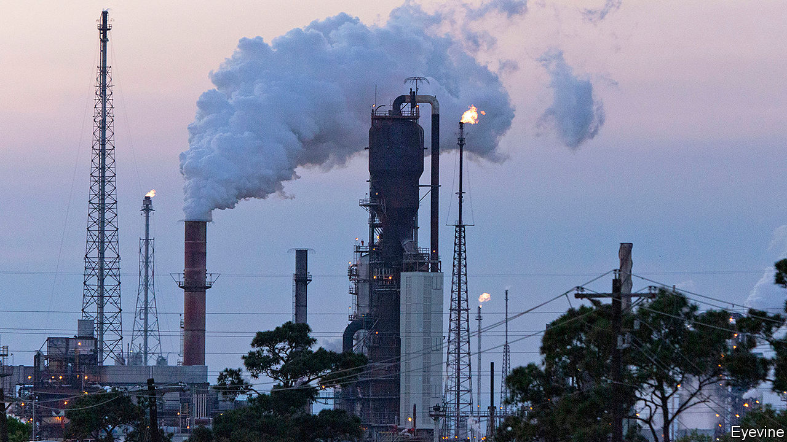

###### The hole in the hedge

# Oil companies’ diversification into petrochemicals may not go to plan 

##### Investment in plastics may prove too much of a good thing for the oil industry 

 

> Jun 27th 2020 

OIL ANALYSTS debate the future of transport fuels. That of petrochemicals—used to make everything from plastic packaging to paint—has seemed unequivocally bright. The International Energy Agency (IEA), an industry forecaster, expects them to account for half the growth in oil demand from 2019 to 2025. Better yet, America’s shale boom has furnished cheap feedstock in the form of natural gas. ExxonMobil is spending $20bn on chemical and refining facilities along America’s Gulf Coast, near Texas’s Permian basin. Royal Dutch Shell is building a huge complex in Pennsylvania, atop the Marcellus shale formation—President Donald Trump has called it “one of the single biggest construction projects in the nation”. Saudi Aramco, the largest oil firm of all, this month completed its $69bn acquisition of a 70% stake in SABIC, Saudi Arabia’s chemicals giant.

Covid-19 would seem to validate such moves. Use of petrol, diesel and jet fuel has plunged amid lockdowns but plastic packaging and medical supplies are in high demand. However, diversification that makes sense for any individual firm may prove risky for the industry as a whole.


On paper, the allure of petrochemicals remains strong. If the internal-combustion engine falls out of favour, the thinking goes, even sanctimonious environmentalists will still purchase polyester camping tents and synthetic sandals. The market increasingly punishes companies that invest in new drilling, so it seems only sensible to build “crackers”, sprawling networks of pipes and furnaces that break the molecular bonds in ethane, a substance extracted from natural gas, to produce ethylene, which can then be woven into those sandals, camping gear and much else besides.

The trouble is that too many big oil companies are making the same bet. Last year the increase in ethylene capacity was 60% higher than the rise in ethylene demand, according to the IEA.

The subsequent decline in ethylene prices had little impact on companies’ strategies. In November Bernstein, a research firm, tallied nearly $40bn a year in planned capital spending on petrochemical facilities from Shell, ExxonMobil, Total, Chevron Phillips Chemical, Aramco, Abu Dhabi’s ADNOC, Russia’s Gazprom and Rosneft, and China’s Sinopec. All told, global ethylene capacity would rise by about 13m tonnes annually over the next few years, once again about 60% more than the annual rise in demand.

The pandemic does mean that oil companies have less cash for new projects. Cheap oil is also benefiting naphtha crackers in Asia, which produce chemicals from crude, and eroding the advantage of American ethane crackers, which rely on gas.

Even so, the coronavirus looks unlikely to sap individual oil firms’ enthusiasm for petrochemicals. Extra demand for single-use plastics during the pandemic has combined with lower appetite for recycled goods to lift ethylene prices a bit since April. Converting ethane to ethylene is still profitable, says Alan Gelder of Wood Mackenzie, an energy-research firm, “just not as profitable as some hoped”. For many oil companies facing sceptical investors and an upstream business with uncertain short- and long-term prospects, petrochemicals have the dubious honour of being among their least bad options. ■

