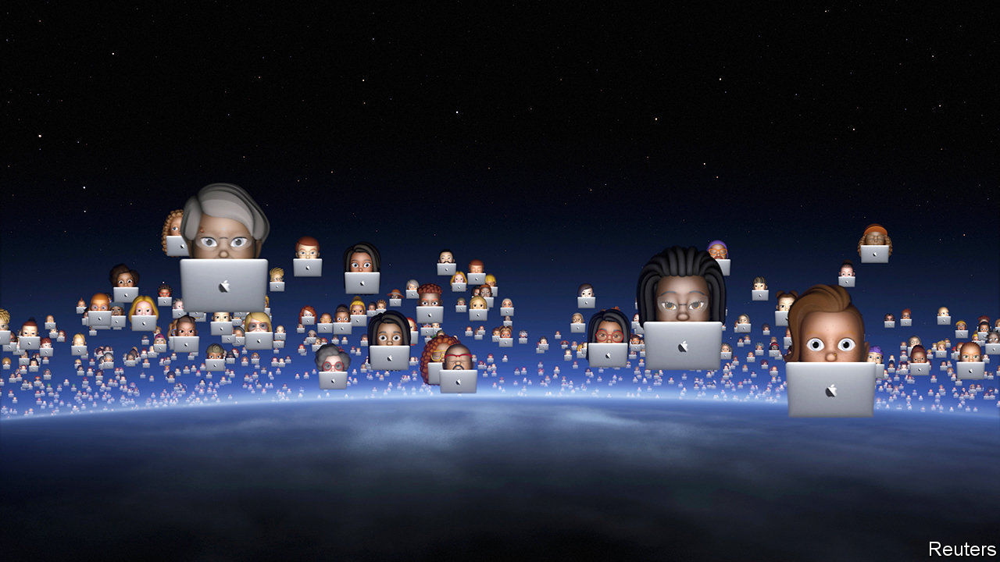
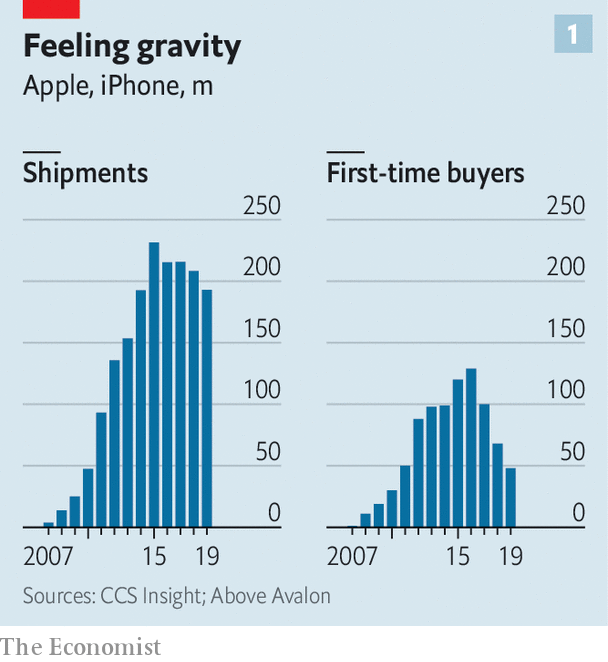
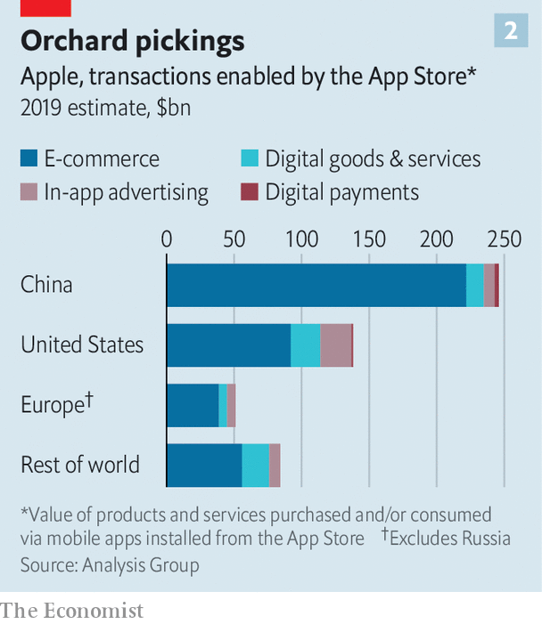

###### Squeezing the pips

# Why Apple’s developers are cross 

##### The iPhone-maker may be tempted to squeeze third-party apps further 

 

> Jun 27th 2020 

IF APPLE’S PR operation has a centrepiece, it is the Worldwide Developers Conference (WWDC). The covid-19 pandemic forced this year’s jamboree, which began on June 22nd, online. Instead of the usual cheers and whistles at the keynote speech, viewers were treated to a slick pre-recorded video of Tim Cook, Apple’s boss, listing the usual slew of announcements: a new version of the iPhone’s operating system, new chips for Apple’s desktops and laptops, plans to let iPhones unlock some BMW cars.

Perhaps that is just as well—for this year Mr Cook may have heard a few boos. A week before the WWDC the European Union had announced antitrust probes into Apple’s App Store. That, in turn, came amid an outbreak of restiveness among the developers who provide software to Apple users, and at whom the WWDC is ostensibly aimed.


The EU’s investigation follows complaints from Spotify, a Swedish music-streaming firm, Tile, which makes tracking devices, and Kobo, a maker of e-book readers. They are unhappy about rules that force app-makers that sell digital services on Apple devices to use Apple’s own system for handling purchases made in their apps. Apple takes a cut of up to 30% from each such transaction. At the same time the rules limit firms’ ability to guide users to other payment options (via their websites, for instance). Since the App Store is the only way to sell software to iPhone users, the firms allege that Apple’s rules amount to an abuse of its control over the platform.

 


The grumpiness extends beyond firms that have formally complained. Just before the WWDC, Basecamp, which makes an email app called Hey, publicly fell out with Apple for the same reason. Match.com, an online-dating firm, says it is unfair that purveyors of digital services must fork over 30% to Apple, while other businesses, such as ride-hailing apps like Uber, do not have to. Other developers grouse in private, fearing reprisals if they speak up. Apple, for its part, has dismissed the complaints as mere moaning from companies keen to get a “free ride”, though it did quietly make a few small concessions, such as promising to loosen restrictions on non-Apple web browsers, music-streaming apps and other software, and letting developers appeal when their products are said to violate App Store rules. 

Apple’s legal troubles extend beyond its payments systems, and beyond the EU. Besides charging for in-app transactions, the firm also takes a 30% cut from every sale of any app in the App Store. A court case in America alleging that the App Store’s monopoly has driven up prices for consumers was given the green light to proceed by the Supreme Court last year. Attitudes towards the tech industry in general are hardening on both sides of the Atlantic. Google, Facebook and Amazon all face their own scrutiny from trustbusters. On June 18th Brad Smith, the president of Microsoft—which lost a landmark antitrust case in 2001—gave the pot a vigorous stir when he opined that Apple and Google exert far tighter control over smartphones than Microsoft ever had over desktop PCs.

Mr Cook and Sundar Pichai, who runs Google’s corporate parent, Alphabet, may beg to differ—not least because each can claim to have to compete with the other. Either way, Apple may be tempted to carry on squeezing its developers even as regulatory storm clouds gather. Smartphones, which have powered the firm’s transformation from also-ran to colossus over the past decade, have become a mature market. Sales of iPhones are stagnant. Those who already own a device replace it less frequently. And the number of people buying an iPhone for the first time has fallen by 63% from its peak in 2016, calculates Neil Cybart of Above Avalon, a tech-analysis firm (see chart 1).

 


Apple plans to replace revenue from selling phones with that from services. This includes proceeds from, among others, warranties and video-streaming, as well as App Store fees and commissions. A new study, financed by Apple, estimates the size of the global market for everything that the App Store has created, from food-delivery to online shopping, at $519bn a year (see chart 2). One way to read this is as an advertisement for Apple’s benevolence. Advertising and digital goods, from which the firm takes a cut, make up just a fifth of the total. On the other hand, the study also highlights just how much more digital terrain remains to be harvested. ■

