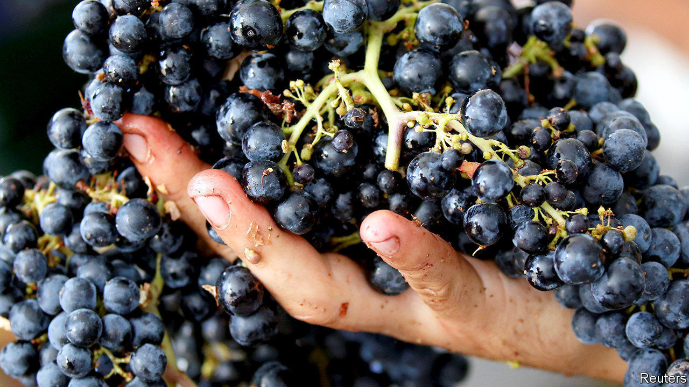
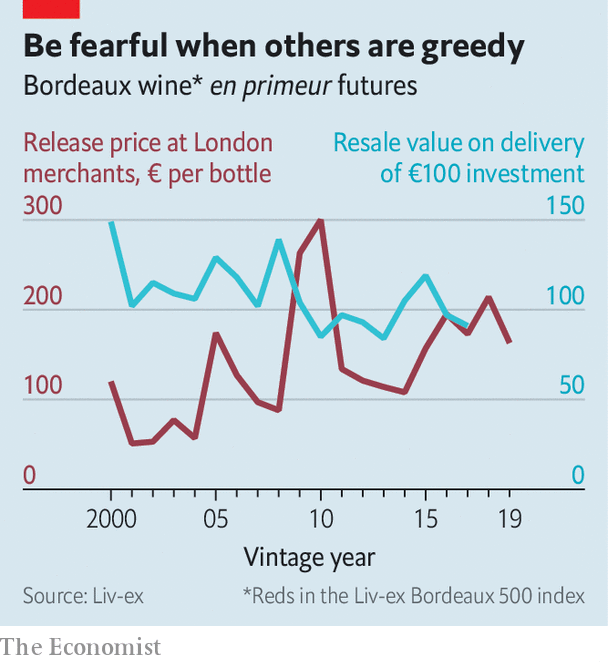

###### Claret correction

# Why covid-19 is good for Bordeaux wines 

##### A handy pretext to discount overpriced vintages 

 

> Jun 27th 2020 

AMID ECONOMIC gloom, a small solace for wine investors. Last year’s excellent vintage of Bordeaux reds is selling for 15-30% less than the crop of 2018. Top labels retail for $350-500 a bottle and the second tier for $100-175, prices last seen in 2016.

The bargains will not sustain tipplers through lockdowns. Bordeaux estates sell wine two years before bottling it, via a system called en primeur. They set prices based on scores from critics, who taste wines as they mature in oak barrels, and are paid up front by middlemen. These négociants then sell wines to wholesalers and importers, who supply shops and restaurants.


The modern version of this network evolved 70 years ago, when wineries needed money and patient buyers snapped up cheap claret. By the 1990s leading estates had cash aplenty. But the system turned into an investment vehicle. Investors who bought wine en primeur each year between 2000 and 2008, and sold each vintage after two years, made a return of 19% on average, according to Liv-ex, a trading platform.

 


Since then en primeur has seen booms and busts (see chart). The great years of 2009 and 2010 were sold just as Chinese consumers embraced fine wine, sending prices up. When China banned lavish gifts in 2012 investors were stuck with wine they literally could not give away. Western drinkers’ taste shifted from Bordeaux’s Cabernet Sauvignon and Merlot blends to rarer Pinot Noirs from Burgundy.

Although Bordeaux is abundant—the biggest names make up to 200,000 bottles a year of their top wine—inattentive farming and inconsistent weather have limited the stock of truly great wines. Until now. Mid-range estates have raised quality by investing in modern wineries and row-by-row vine monitoring. Climate change has helped grapes ripen. From 1980 to 2010 Bordeaux enjoyed two or three blockbuster vintages per decade. Critics’ scores put four of the past five years at or near this level.

Since 2015 en primeur prices have gone up by 24% with each good crop. But a run of fine vintages also created a glut in négociants’ cellars which they have struggled to offload at a reasonable mark-up. Between 2011 and 2018 they went from 239 days of inventory on average to 313 days; their net debt as a share of equity rose from 58% to 92%. “When intermediaries make a low margin, they’re not interested in distributing your wine,” says Stéphanie de Boüard-Rivoal of the Angélus estate.

So the case for a price cut by the estates was strong, and bolstered further by a new 25% American tariff on European wine. Except that discounting the 2019s would have left négociants and investors who ponied up last year feeling bitter. Covid-19 provided the perfect pretext. Saskia de Rothschild of Lafite Rothschild, the priciest big producer, speaks of “a good opportunity to reshuffle the cards”. Having reset the system, most estates have also cut the amount they offer en primeur, to avert another glut. Just as well, for 2020 is shaping up to be yet another fine vintage in Bordeaux. ■

