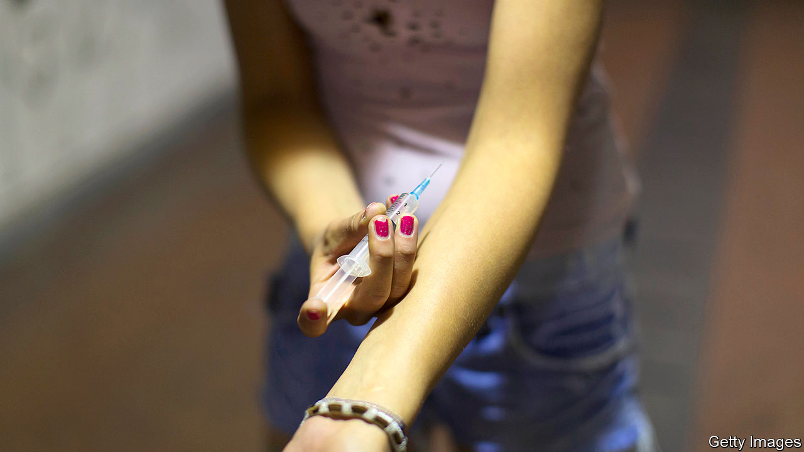

###### Overdosed

# Tough-on-drug policies often hit women hardest 

##### Harm-reduction services can help 

 

> Jun 27th 2020 

SVITLANA MOROZ started injecting opium as a 16-year-old in Ukraine. Soon she grew accustomed to policemen and their friends taunting her, or assaulting her. Their attitude, she recalls, was “you are a woman who uses drugs, so we can use you how we want.” At 19, she received a double diagnosis: pregnant and HIV-positive. Scared of harming her baby, she decided to quit drugs, but to do so alone. If she sought treatment she would need to register as a drug user with the state. Then would come coaxing by doctors to have an abortion, or later, threats of losing parental rights: drug abuse is grounds enough. If that happened, she would need proof of maternal stability—an income, a residence—to get her child back. But a drug-user designation scares off employers.

Such cycles churn across much of culturally conservative eastern Europe, where drug use is high and punishments are severe. Devised in the Soviet Union and known today in Russia as “social intolerance”, the region’s standard approach is to make drug users’ lives miserable so they will stop. Western Europe, by contrast, inherited another strategy, this one from Switzerland in the 1980s and other countries. “Harm reduction” encourages people to address their addictions gradually with support rather than punishment. On paper, the western way has gained ground. In 2019 all eastern European countries except Russia had some national commitment to harm reduction (though implementation is patchy). Almost none focused on the problems of female drug users; globally, too, just 2% of resolutions adopted by the United Nations Commission on Narcotic Drugs over nine years (2009-18) did so. Yet women often suffer the most.


More than a third of women addicted to opioids in Ukraine say they have been threatened with violence by police; 13% say they have been raped by them. In St Petersburg, 81% of HIV-positive women who inject drugs say they have suffered violence at the hands of partners. But the region’s domestic-violence shelters frequently turn away women who abuse drugs or alcohol.

To make matters worse, eastern Europe plus central Asia now has the world’s fastest-growing HIV epidemic. It is unsurprising, then, that Ukraine, home to the region’s second-largest HIV scourge, behind Russia, has outlawed knowingly putting someone at risk of HIV. The rule is supposed to drive down infection rates, but it doubles as an excuse to punish the HIV-positive, especially women. From 2015 to 2018, only women were sentenced under the provision. And in late 2018, a judge used it to give a Ukrainian woman five years in jail for biting someone. Such harshness reflects cultural stereotypes, reckons Maria Plotko of the Eurasian Harm Reduction Association in Vilnius: that a man can “drink a lot” but a woman is “a mother first of all and mothers cannot use drugs.”

Stigma helps explain why women struggle to get treatment. Some do not want to be spotted at treatment centres or harassed by male addicts there; others have no child care. In Ukraine, about 17% of harm-reduction sites had not one female patient. Pregnant users may suffer worst. The World Health Organisation recommends they protect themselves and their babies by undergoing opioid-substitution therapy, a process of replacing injectable drugs with pills dispensed in careful doses. Russia bans the therapy, so its drug users who get pregnant are simply told to go cold turkey or pushed to try unproven treatment such as antipsychotic medication or religion.

Harm-reduction advocates have tried to help. Ukrainian activists are lobbying to nix the part of the family code that deprives drug users of parental rights. In Hungary, Chicks Day, a weekly women-only needle-and-syringe exchange service, has provided clean equipment. Such services matter for female users, who often get “second on the needle” after men have used it.

Most portents, though, are bleak. Last year Russia’s President Vladimir Putin urged tougher punishment for spreading “drug propaganda”, or any information “encouraging” drug use, which includes harm-reduction charities. Anya Sarang, president of the Andrey Rylkov Foundation in Moscow, has resigned herself to removing some of the most controversial material from her organisation’s website or risk bankruptcy from unaffordable fines. Bulgaria temporarily stopped its safe-needle-and-syringe programmes after the Global Fund, a health charity, withdrew funding. Advocates fear the same could soon happen in Ukraine.

Twelve years into her recovery, Ms Moroz, now a human-rights campaigner and mother of two, started using drugs again, though these days it is cannabis and pills, rather than the injectable sort. The relapse was the result of wartime despair in Ukraine, which left her displaced and her husband captured. Female drug users are still fighting to become anything else. ■

