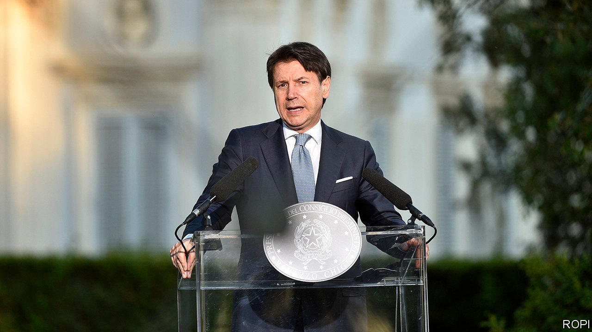

###### No longer a figurehead

# Why Italy’s technocratic prime minister is so popular 

##### Giuseppe Conte gets credit for handling covid-19 calmly 

 

> Jun 27th 2020 

ITALY HAS had other non-party, technocratic leaders in modern times: Carlo Ciampi, Lamberto Dini and Mario Monti, all of whom came into office with more illustrious CVs than Giuseppe Conte. Mr Conte was an unknown law professor when, in 2018, he was tapped by the anti-establishment Five Star Movement (M5S) to lead its populist coalition with the hard-right Northern League. Yet none of the other technocrats succeeded in heading a second government, as Mr Conte has done since last September, when the M5S switched partners to yoke itself to the centre-left Democratic Party.

Not only that; Mr Conte has grown increasingly popular. Surveys by Ipsos, a polling firm, found that the prime minister’s approval ratings shot up in March from around 50% to 61%, the same figure as recorded again on June 11th. That was clearly because of covid-19, which may seem odd. On March 9th Mr Conte imposed one of Europe’s strictest lockdowns, and his government’s handling of the crisis was scarcely faultless. But within Europe Italy was the first country badly hit by covid-19, and Italians seem not only to have made allowances for that, but to have appreciated the way Mr Conte took responsibility for managing the crisis.


Reinforcing his authoritative image, Mr Conte called a nine-day think-in on how to revive Italy’s economy, grandiloquently entitled a States General. Its most eye-catching suggestion, a drastic cut in VAT, received a lukewarm reception. Still, Mr Conte remains more popular than any party leader, and much recent speculation has centred on whether he might become one—either as head of the Five Stars, leaderless since the resignation of Luigi Di Maio in January, or a new formation which, it has been mooted, could name itself Con te (Italian for “With you”).

Mr Conte has pooh-poohed the second possibility. He is doubtless aware of Mr Monti’s unhappy experience at a general election in 2013, when his alliance won less than 11% of the vote. Polls have suggested a putative Con te could fare even worse, but that an M5S headed by the prime minister might harvest 20% or even 30% of the vote. That is a tempting prospect, not just for Mr Conte, but for a party that has lurched between fiascos and scandals since last September. The latest setback came in a report that Gianroberto Casaleggio, who helped create the M5S, accepted a secret €3.5m ($3.8m) donation from the far-left Venezuelan regime of Hugo Chávez in 2010. Venezuela’s embassy in Rome and the M5S have denied the report. But repeated defections from the Five Stars—the latest on June 23rd—have left the government with an alarmingly slim parliamentary majority.

Not that it is the only Italian party in difficulty. The League, though still the most favoured party, has slipped in the polls to around 25%—12 points below its peak last July. Its leader, Matteo Salvini, blames the pandemic, specifically the restrictions that have prevented him holding his usual rallies and walkabouts. But the slide began well before lockdown, and the polls suggest growing numbers of right-wingers are attracted to the more conventional, though arguably more extreme, conservatism of the Brothers of Italy (FdI) party. The FdI was built on what was left of the neo-fascist movement. It has been getting around 15% in recent polls. Italians can still give their fellow Europeans plenty to worry about. ■

