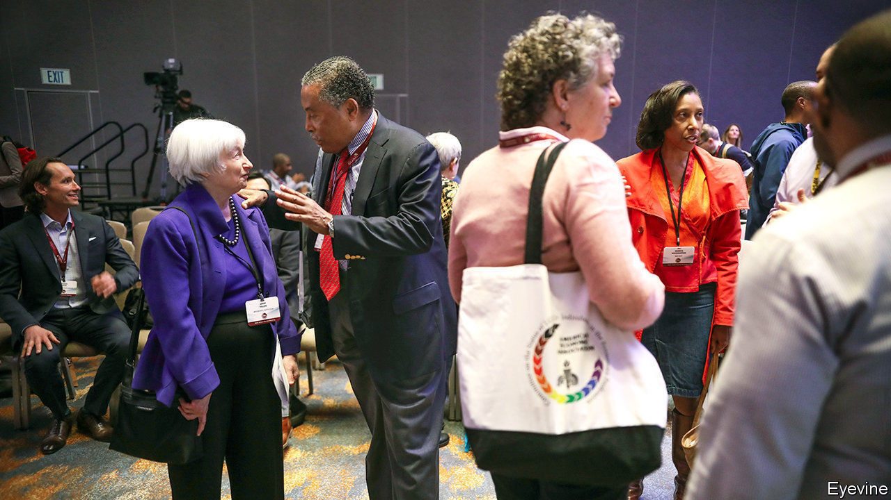

###### Gains to diversification

# Economists grapple with their race problem 

##### Greater openness to people and ideas should enhance their understanding of the world 

 

> Jun 27th 2020 

IN JANUARY 1970 a group of black economists wrote a letter to the American Economic Association (AEA). They criticised colleagues who ignored discrimination in the profession and paid no heed to racial inequality in their own research. Just over half a century later, similar complaints have resurfaced. This time the AEA seems to be listening. On June 5th it issued a statement saying that “we have only begun to understand racism and its impact on our profession and our discipline.”

Openness to more diverse groups of people and ideas should enhance the profession’s understanding of the world. Barriers to entry are not only unfair, they could undermine healthy competition in the marketplace for ideas. And a better grasp of, say, the huge racial gaps in income and wealth in America seems essential to a profession that studies who gets what.


The complaint in 1970 led to attempts to increase the number of black economists, and the creation of the National Economic Association, which supports minorities. But progress has been disappointing. In 2017-18 just 2% of assistant professors in prestigious universities were black. Some departments have never had one.

The killing of George Floyd and the ensuing protests have led to a flurry of anecdotes suggesting that a hostile environment might be putting some people off the profession. A survey of economists in 2019 found that 62% of black women and 43% of black men felt they had experienced racial or gender discrimination, compared with 6% of white men. An accusation of racist comments in the classroom led to the suspension of Harald Uhlig, a professor at the University of Chicago, on June 12th. He was reinstated on the 22nd after an internal investigation found no reason to proceed.

All this has renewed calls for more black economists. By June 24th the Sadie Collective, a new group trying to encourage more black women into the subject, had gathered around 2,000 signatures calling for measures such as more cash for diversity initiatives. Experienced hands are more cynical. Rhonda Sharpe of the Women’s Institute for Science, Equity and Race says that “when individuals change, the profession will change.”

Another charge against the profession concerns its study of race. Economists have not ignored the topic: 3% of working papers published by the National Bureau of Economic Research since 1980 mentioned “race”, “racism”, “racial”, “black” or “African-American” in the title or abstract. But the AEA’s statement tacitly acknowledges a shortcoming: it pointed people not to research in its own elite journals, but to the Review of Black Political Economy, which is neither well-cited nor widely read.

More mainstream research has come under attack for treating race too narrowly, in a way that leaves important context unexplored. When studying discrimination, for example, economists often ask only whether it is motivated by animus (“taste-based”), or by a lack of information that forces people to rely on stereotypes (“statistical discrimination”), without asking why such tastes and stereotypes exist in the first place. Some evidence suggests that economists think too narrowly within that framework. A study by J. Aislinn Bohren of the University of Pennsylvania, Kareem Haggag and Alex Imas of Carnegie Mellon University and Devin Pope of the University of Chicago found that, of 105 papers in top journals testing for discrimination between 1990 and 2018, only 11% discussed the possibility that statistical discrimination might be based on odious beliefs.

A solution would be to acknowledge rather than sideline existing research that delves into the cultural context. Encouraging scholars working in the area would help. Dania Francis of the University of Massachusetts Boston was told that as a black person doing research on race (“me-search”) she would be taken less seriously. For Lisa Cook, a member of the AEA’s executive committee, the very fact that it issued a statement is progress. But avoiding another conversation in 50 years’ time will require more than that. ■

