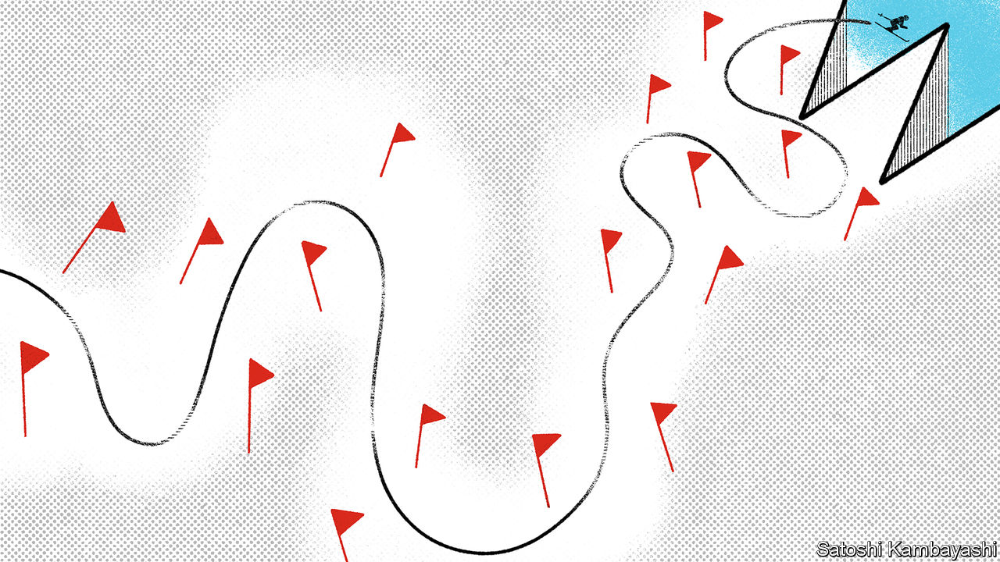

###### The demise of a Wunderkind

# How Wirecard fooled most of the people all of the time 

##### A financial scandal at the once-feted firm leaves Germany reeling 

 

> Jun 25th 2020 

WIRECARD’S SUCCESS was once regarded in Germany as rivalling that of SAP, a software-maker and the country’s most valuable firm. No longer. Felix Hufeld, the head of BaFin, the financial regulator, was blunt: the accounting scandal at the payment-processing firm is a “complete disaster”, and a “shame for Germany”. “We would have expected such a situation anywhere in the world, but not in Germany,” said Peter Altmaier, the economy minister. Mr Altmaier may have unwittingly put his finger on a key point—that everyone with influence over the firm, from board members to auditors and regulators, seems to have been complacent. In a darker version of events, the actions of some may have been complicit, even criminal.

On June 18th Wirecard’s auditor for the past decade, EY, said that it could not find €1.9bn ($2.1bn), amounting to nearly a quarter of the firm’s balance-sheet, that was meant to be held in escrow accounts in the Philippines. Wirecard then withdrew its results for the last fiscal year and for this year’s first quarter. Markus Braun, the chief executive, resigned. On June 22nd Wirecard admitted that the €1.9bn “probably does not exist”. By then more than 80% of its market value had evaporated within three trading days. Later that day Mr Braun was arrested on suspicion of using fraudulent accounting techniques to inflate reported revenues. The next day he was released on bail. On June 25th Wirecard began insolvency proceedings.


It is a brutal fall from grace for a once-feted executive. After taking the helm in 2002 Mr Braun transformed the startup into a pioneer of processing digital payments, offering its services to porn sites and online-gambling sites, which other digital-payment platforms tended to shun. Over the years Wirecard attracted hundreds of thousands of new merchants, including Aldi and Lidl, supermarket chains, and several airlines. In 2006 it bought a bank and evolved into a full-service payment operation. In 2018 it knocked Commerzbank out of the DAX, Germany's main stockmarket index, causing a sensation in the country. “It was an amazing growth story,” recalls Wolfgang Donie, an analyst at Norddeutsche Landesbank who, like many other equity analysts, used to recommend the stock to his bank’s clients. By June 18th Mr Donie’s notes to clients were warning: “hands off Wirecard shares!!!”

Neither equity analysts, asset managers, auditors nor regulators come out of the story well. All seem to have ignored numerous red flags. BaFin’s record looks especially poor. In 2016 short-sellers released a report accusing Wirecard of corruption, fraud and weak money-laundering controls, which the company denied. In 2019 the Financial Times (FT) published an investigation into Wirecard’s dubious accounting practices. In response BaFin filed a criminal complaint against two FT journalists and several short-sellers. It also took the unprecedented step of banning short-selling against Wirecard, citing risks to the economy and market stability.

On paper, BaFin is required to regulate only Wirecard’s banking arm. But it is also meant to make sure that the boards of listed firms are up to the job. The members of both Wirecard’s management and its supervisory board lacked the competence to lead a multinational tech firm, says Bernd Ziesemer, chairman of the Cologne School of Journalists. None sat on the boards of any other firms in the DAX. Three of the four members of the management board came from Austria, like Mr Braun, inviting comparisons of board meetings to a Brettljause, a hearty Austrian snack break with mates on an Alpine peak.

Germany will need to rethink its piecemeal regulatory system, particularly if it wants Frankfurt to lure business from London. The bulk of Wirecard’s business, bizarrely, is regulated by the Upper Bavarian district government, which was woefully ill-suited to oversee a global fintech firm. After claiming that the regulators “worked very hard and did their job”, Olaf Scholz, the finance minister, has promised to consider changing the rules. That is surely only the start of the soul-searching. ■


