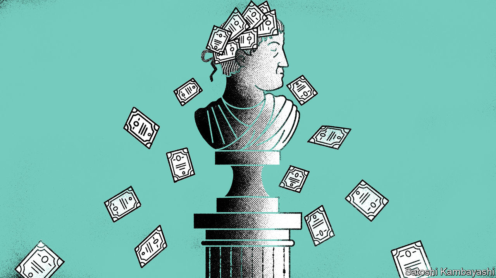

###### Buttonwood

# What if the dotcom boom and bust hadn’t happened? 

##### Value investing might not have the same moral authority as today 

 

> Jun 27th 2020 

THERE IS A lovely quotation at the start of “Security Analysis”, a canonical text by Benjamin Graham and David Dodd published in 1934. “Many shall be restored that now are fallen and many shall fall that are now in honour.” It is by Horace, a Roman poet who knew all about reversals of fortune, having lived through Rome’s bloody transition from republic to empire. Two millennia later, amid the ruins of the dotcom mania, Warren Buffett was moved to recall Horace’s words. “My appreciation for what they say about business and investments continues to grow,” he wrote.

It is now 20 years since the NASDAQ, a tech-heavy index of shares, reached a peak after a frenzied rise during the late 1990s. The apex, on March 10th 2000, marked the end of the internet bubble. The bust that followed was a triumphant vindication of the sober valuation methods pioneered by Graham and Dodd and popularised by Mr Buffett. True value is a low price relative to some financial measure of intrinsic worth—recent profits, say, or the book value of assets. Dotcom-era analysts, if they bothered at all, used flakier metrics: “eyeballs”, “engagement” or simply “the opportunity”.


Perhaps you can have too much sobriety. For the past decade buying “value” stocks has been an unrewarding strategy. America’s stockmarket is dominated by a handful of technology companies, whose stocks trade on steep multiples of earnings and book value. The current recession has not changed matters. The fallen have not been restored. If anything, those in honour have more of it. Value investors, meanwhile, are unmoved. This begs a heretical thought. If the dotcom boom and bust had not happened, would value investing have quite the same moral authority today?

In posing such a question, you run into an immediate problem. Value investing is an austere creed. It is as much about moral fibre as business analysis. Value investors hope to be rewarded for enduring the pain of waiting for their strategy to come good. Most investors don’t like to be wrong for so long, to hold the unfashionable stocks and to spurn the faddish ones. But value investing is a faith that is sustained by the scepticism of non-believers. Indeed their scorn is in large part the point of it. For its adherents, vindication will surely come. It has before, even when all seemed lost. That makes rebutting its tenets hard.

The legacy of the dotcom bust makes it all the more difficult. So as a thought experiment let’s imagine, for a moment, that the late 1990s bubble never happened. Value investing would have lacked its most spectacular vindication. Its hold on the investment world would be less secure. The use of forward-looking scenarios to judge the long-term prospects, and thus the worth, of a fast-growing company could not be so easily decried as foolish. The business of stock-picking would be much more about engaging with, and understanding, the peculiarities of companies rather than an arms-length selection based on financial characteristics. And without the frauds and scandals of the late 1990s, the public markets might have remained a welcoming place for small, early-stage firms. More start-ups might in turn have tailored themselves for an IPO rather than for a sale to an incumbent technology giant.

The value creed says rapid growth must eventually peter out. Instead the big business successes of the past decade—Google, Amazon and Facebook in America; Alibaba and Tencent in China—have grown to a size that was not widely predicted. Companies of this kind are characterised by network effects. The more people use them, the more useful they are to other customers. They enjoy increasing returns to scale. The bigger they get, the cheaper it is to serve another customer. Dotcom-era gurus banged on about the power of network effects and scale economies. There is more to building an enduring company, though. A business also needs something unique, a distinctive culture or a superior technology, that cannot be replicated by others. Picking winners is not easy; nor is paying a price for them commensurate with their chances of success. But screening for stocks with a low price-to-fundamentals is more likely to select businesses whose best times are behind them than it is to identify future success.

In the late 1990s ideas about fundamental value went by the wayside. A bubble blew up. It then burst dramatically. The bust was a painful lesson for investors. But perhaps some lessons were learnt a little too well. “When fools shun one set of faults”, wrote Horace, “they run into the opposite one.”

