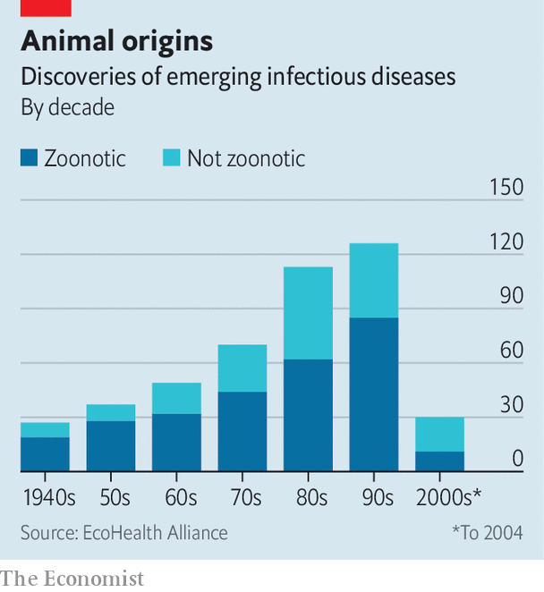
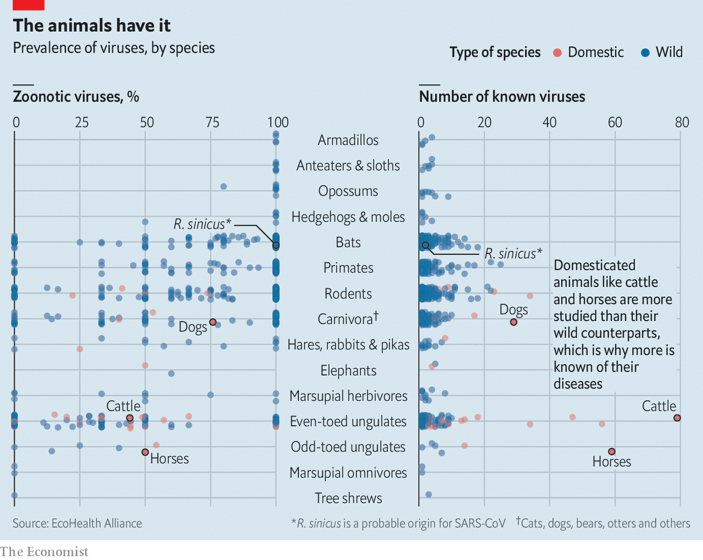
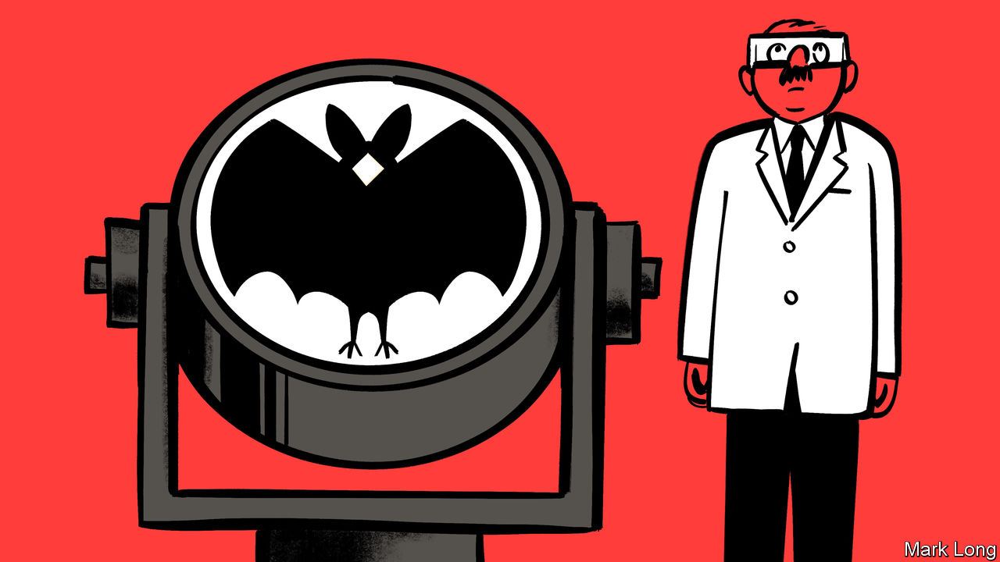
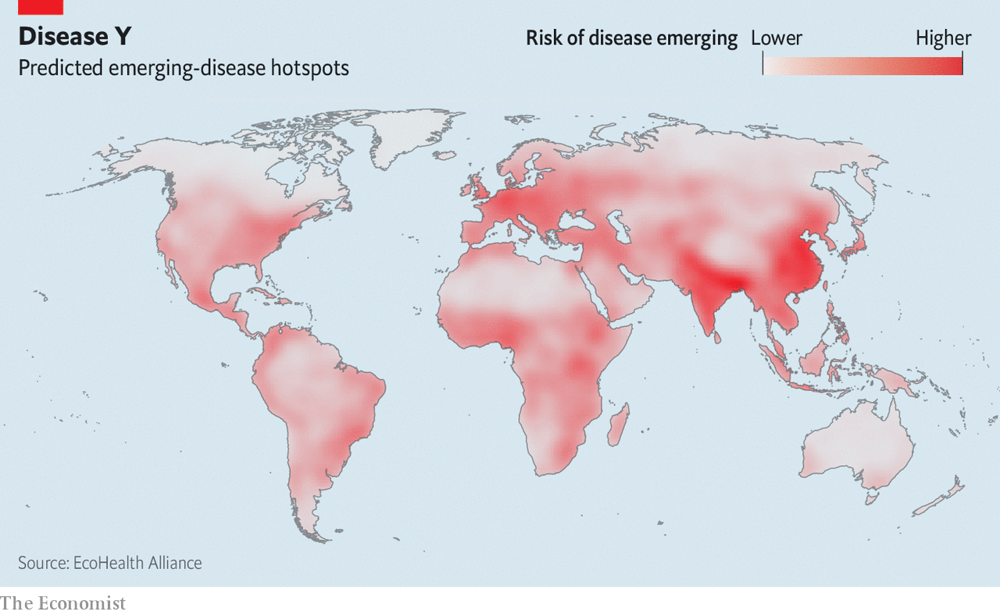
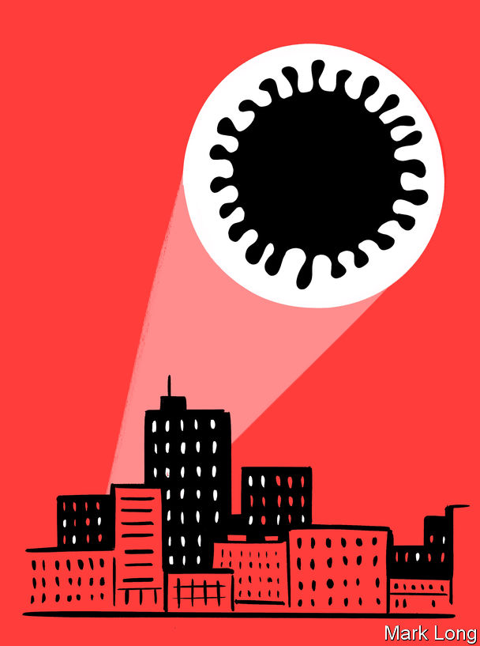

###### Global health

# Pandemic-proofing the planet 

##### New diseases are inevitable. Ensuing global calamities are not 

 

> Jun 25th 2020 

Editor’s note: Some of our covid-19 coverage is free for readers of The Economist Today, our daily . For more stories and our pandemic tracker, see our 

IN FEBRUARY 2018 a panel of experts convened by the World Health Organisation (WHO) put together a list of diseases that posed big public-health risks but for which there were few or no countermeasures. It featured various well-recognised threats, including Ebola, SARS, Zika and Rift Valley fever. But it also included “Disease X”.

This illness, caused by a pathogen never before seen in humans, would, the panel said, emerge from animals somewhere in a part of the world where people had encroached on wildlife habitats. It would be more deadly than seasonal influenza but would spread just as easily between people. By hitching rides on travel and trade networks, it would journey beyond its continent of origin within weeks of its emergence. It would cause the world’s next big pandemic, and leave economic and social devastation in its wake.


Indeed.

Less than two years after the report was published Disease X turned up. It began late last year in Wuhan, China, and the wider world became aware of it in January. It has now infected nearly 10m people and killed almost 500,000 of them. That death toll is also likely to reach seven figures before things are over. For Disease X now has a name: covid-19.

I told you so

Though perhaps the loudest, the WHO’s was not the only warning that something like this might happen. Moreover, some of the prophets, such as Peter Daszak, a disease ecologist who is head of an independent research organisation called the EcoHealth Alliance, specifically focused on the risk posed by bat-borne coronaviruses, as SARS-CoV-2, the cause of covid-19, has turned out to be. And the point of issuing those warnings was preparedness. With the correct systems in place a potential pandemic, spotted early, might be nipped in the bud.

Instead, the world’s response to the new illness has been similar to its response to SARS in 2002 and, after that, to H5N1 avian influenza in 2005. This is to move into a costly panic mode intended to slow the spread of the disease while scientists race to develop a vaccine. “This,” as Dr Daszak, observes wryly, “is not a plan.”

To see Disease X simply as a warning about covid-19 that the world ignored is, though, to miss the point that the WHO panel was making. Disease X was also a warning about Disease Y, and after it Disease Z. It was a warning about aspects of modern life that encourage the spread of previously unknown pathogens like SARS-CoV-2. As long as these matters are not addressed, the risk will remain of further zoonotic outbreaks, in which a pathogen passes from animals to human beings, and then from human to human in the exponential way now sadly familiar.

Dr Daszak’s point is that the matters in question can and should be dealt with. Future zoonotic outbreaks are surely inevitable. But with the right precautions it should be possible to ensure that they do not, as the current one has, lead to pandemics.

The precautions Dr Daszak and his colleagues have in mind add up to a three-layered defence. The first layer is a worldwide effort to find and track the hundreds of thousands of as-yet-unseen pathogens that might threaten human health. The second is the monitoring of blood samples and other indicators from people living in places where new diseases are most likely to emerge. The third is a concerted programme that employs all the data thus collected to get a head-start in the development of drugs and vaccines that might be used to meet an emerging disease halfway.

More than 1,400 pathogens are known to infect human beings. Only a fifth of these are viruses. But viruses are the cause of more than two-thirds of new human diseases, which is why both the discussion and the effort are focused on them.

Being simple organisms that can reproduce quickly, viruses undergo much more rapid evolution than other types of pathogens. Hence their ability to adapt to novel hosts. Simian immunodeficiency virus (SIV), for example, moved from monkeys to chimpanzees and, separately, to gorillas before one of the chimpanzee strains got into people and became HIV-1, which went on to cause the AIDS pandemic (see ). Influenza viruses that break out into human beings are routinely found to have cycled through pigs or chickens first. And SARS-CoV, as the virus which caused the SARS outbreak in 2002 is now known, started in bats before (it is widely believed) migrating to civets.

Going viral

Ecologically, human beings as a species are particularly likely to be on the receiving end of this process. Few wild animals spend as much time cooped up with members of their own and other species as do herd animals and their herders. So when people domesticated animals and began to live in large, fixed settlements they gave viruses many opportunities to jump back and forth between species, a process called viral chatter. Many common diseases date back to the early days of domestication, and the population densities it brought with it. The species involved were not all domesticated. Smallpox appears to have come from rats. But the animals involved were ones that thrived in human company.

 


Zoonoses have continued ever since. Of more than 330 diseases which emerged between 1940 and 2004, over 60% were zoonotic. Of those over 70% originated in wildlife. For viruses the proportions were 69% and 87% respectively (see chart).

This process seems to be accelerating. As human populations grow, previously wild areas are settled. That brings people into contact with sources of infection they would not otherwise have encountered. And, having encountered them, it is also easier to pass them on. Modern transport means that if a disease gets into people living in this frontier between civilisation and the wilderness it can quickly make its way to a local metropolis and thence, courtesy of lorries, trains and planes, to others anywhere in the world.

The idea that these risks deserve systematic appraisal and monitoring surfaced after the emergence, in 2005, of the H5N1 strain of avian influenza. This was first detected in 1996, when it killed some geese in Guangdong province, China. The following year it infected 18 people associated with a poultry market in neighbouring Hong Kong, six of whom died. But for most of the subsequent decade the virus was restricted to farmed birds on the Chinese mainland.

In 2004, however, a highly pathogenic strain emerged and began to spread across South-East Asia, killing tens of millions of birds. By the middle of 2005 this version of the virus had infected wild geese, which took it into Europe, India and Africa. That year, 98 people were infected, and 43 of them died—a death rate severe enough for David Nabarro, then co-ordinator of the UN’s response to influenza, to issue a warning that an unchecked H5N1 outbreak could kill up to 150m people. In 1968 a less pathogenic strain of flu, which had originated in the same area, killed 1m people when it spread around the world. In 1957 a still-earlier relative killed 1.1m. H5N1 was considerably more lethal than either.

In the end, forms of H5N1 that could spread easily from person to person never arose. But they came close. In 2012 Yoshihiro Kawaoka of the University of Wisconsin-Madison and Ron Fouchier of Erasmus University in Rotterdam undertook to discover how many mutations would have been required to make H5N1 transmissible between people via the droplets expelled in a sneeze. They found that changes at just five points in the genome would have done the trick. Two of these mutations were later shown to exist already in wild populations of the virus.

Fortunately, the other three never happened. The disease was brought under control among farmed birds, though it still circulates at a low level in wild populations, and human fatalities remained in the tens, rather than the tens of millions. This near miss may have spurred complacency among laymen. Scientists’ dire warnings had come to naught. Among virologists and epidemiologists, though, it was a call to action—and one which came at an opportune time. The cost of sequencing the DNA and RNA in which viruses store their genes was, in the second half of the 2000s, falling at extraordinary speed (see ). That made virus hunting possible on a previously unimaginable scale.

Predict and survive

In 2009 Dennis Carroll, an infectious-disease expert at USAID, America’s international development agency, who had led that agency’s response to the H5N1 outbreak, set up PREDICT. This project investigated and catalogued potential disease threats to people living near wildlife, with a particular focus on viruses. A few years later Jeremy Farrar, an infectious-disease doctor who was then at Oxford University’s clinical research unit in Ho Chi Minh City and now heads the Wellcome Trust, a large medical-research charity, created Vizions. This project tracked pathogens circulating in people and animals living close together in farms and markets across Vietnam.

PREDICT ran for just over a decade. Scientists working with local teams in 30 countries collected around 170,000 samples from people and wild animals, mainly non-human primates, bats and rodents. In the process they discovered 1,200 new viruses belonging to families known to have the potential to infect people and cause epidemics. Among these were more than 160 potentially zoonotic coronaviruses.

This, though, just scratched the surface. On the basis of how much they found during their early work Dr Carroll and his colleagues made a statistical estimate that, all told, the world’s mammals and birds play host to between 700,000 and 2.6m as yet unknown species from families of viruses that have shown the potential to cause zoonotic disease in humans. Between 350,000 and 1.3m of these unknown viruses, they argued, could have zoonotic potential.

In 2018 Dr Carroll, Dr Daszak and Jonna Mazet, an epidemiologist at the University of California, Davis, put forward a proposal aimed at turning those statistical estimates into genetic sequences. The Global Virome Project is conceived of as a decade-long effort to scour the entire world for its millions of unknown viruses and then read out all their genomes. The cost, the three researchers reckoned, would be $4bn. A scaled-back version—one that concentrated on the highest-risk countries, the groups of people most vulnerable to outbreaks within those countries and the species, particularly mammals and water birds, most likely to be sources of spillover—might get 70% of the data for a quarter of the money. But that was still five times the cost of PREDICT, the most ambitious such project to date. No funding bodies have yet taken the bait.

The fact that viruses with zoonotic potential outnumber those that have actually made the jump to people by something like a thousand to one reinforces the idea that, for any given virus, getting into humans and staying there is not that easy. The final products of PREDICT, which are now wending their way to publication, try to tease out the factors that help the jump to happen.

Among other things, having a registry of such risks might make it possible to identify hotspots where an unhealthy number of the conditions for zoonoses coexist. The PREDICT programme’s risk registry includes virological, ecological and sociological factors. Viruses which store their genes as RNA, for example, are categorised as more risky than DNA viruses, because of their increased ability to mutate. Viruses already found in more than one host are also flagged up. They clearly have an adaptive knack. And being adapted to a species reasonably close to Homo sapiens matters too. A virus able to reproduce in the cells of one species will, other things being equal, have a better chance of adapting to life in a related species than an unrelated one. SIV did not have to change all that much to become HIV. Reptile viruses, by contrast, are less of a threat.

The boys who cried “Goose!”

On the human side of the equation the presence of people who are using an environment in new ways is a palpable risk. Proximity and frequency of contact are important as well. Farmers who work with lots of animals day-in and day-out are the most threatened, especially where this happens in the presence of wild animals, too. And the sheer number of viruses a species has to offer is also significant (see chart). Bats are a particularly rich source of emerging infections. The large groups in which many bat species live, sometimes numbering in the millions, give viruses a huge arena in which to mix, evolve and develop the kinds of characteristics that might make them capable of spilling over into people.

 


Besides being the original reservoirs of SARS-CoV and SARS-CoV-2, bats also harbour another coronavirus, MERS-CoV, which causes Middle Eastern respiratory syndrome, an illness first detected in 2012. They are also the source of the virus which causes Ebola and of the hendra and nipah viruses which, over the past three decades, have led to small outbreaks of deadly respiratory and brain infections in Australia and South-East Asia.

 


The viruses in question do not always travel directly from bats to people, as the civet-related example of SARS-CoV shows. Ebola seems to have done so. But hendra and nipah arrived via horses and pigs respectively that bats had defecated onto. In the case of MERS, the intermediaries were camels. Pangolins have been suggested as a conduit for SARS-CoV-2.

Dr Daszak and his colleagues at the EcoHealth Alliance have collaborated with Chinese researchers, including some at the Wuhan Institute of Virology, which established the chiropteran links with both SARS and covid-19, to gather samples from thousands of bats and other mammals across southern China. In a recent paper posted to bioRxiv, a preprint server, they published the genetic sequences of 781 coronaviruses found in bats, including more than 50 close relatives of SARS-CoV. In a paper in the March edition of Biosafety and Health Dr Daszak describes how some of these viruses have been shown to bind to human cells. In mice with genetically engineered “humanised” cells in their lungs, some of them cause a disease similar to SARS that is not responsive to therapies and vaccines developed against SARS-CoV.

On top of this, several groups studying blood samples from the parts of China where the new coronaviruses were found have seen antibodies suggesting that people there were exposed regularly to some of these viruses between the emergence of SARS-CoV in 2002 and of SARS-CoV-2 in 2019. “Together,” Dr Daszak wrote in the paper “these data mark wildlife-origin coronaviruses as a ‘clear and present danger’. They also highlight exactly the issue of key concern in the current [covid-19] outbreak—that there is a large diversity of viral strains in wildlife in China with significant potential for emergence in people.”

If something like the Global Virome Project were to identify markers for most of the world’s potentially zoonotic viruses, keeping an eye out for one of them cropping up in a species that human beings routinely mix with would be easy—especially as genetic sequencing is now a hundredth of the price it was in the early days of PREDICT. But, as with the coronavirus work in China, it would also be advisable to keep an eye on the people doing the mixing with the animals, to look for viral chatter.

Dr Farrar’s Vizions project ran in Vietnam from 2011 to 2017, with sampling teams regularly visiting farms, markets and abattoirs across the country and taking blood samples from people living and working there. They also took blood and faecal samples from animals in the vicinity, such as pigs, chickens, cats, dogs, bats, civets and rats. An important aim of the project was to set up local capacity to catalogue the diversity of viruses in these animals, some of which might become threats to human and animal health in future.

Vizions was only a pilot study, however. In light of covid-19 Dr Farrar proposes beefing up the human side of the surveillance effort by creating a Global Immunological Observatory that would monitor blood banks and discarded blood samples taken originally for clinical purposes for evidence of new viruses, as well as collecting blood samples specifically for this purpose from people in emerging-disease hotspots (see map). This would reveal not only what was there, but also how immune responses formed in response to the possible new threats.

 


It would, though, be both morally iniquitous and politically naive to run such a system mainly in order to protect rich people in far-away lands from an eventual pandemic. Any scaled-up versions of these surveillance projects will need local support in order to work, says Dr Mazet. That means generating information which is useful where it is being collected, and building up countries’ public-health capacities at the same time. Paying for the new capacity could be linked to the funding of primary health care. Tests to monitor antimicrobial resistance in known pathogens could be run on the same equipment.

The knowledge produced might, for example, be used to direct public-health messages to the appropriate recipients. Dr Mazet says that as people became aware of the pathogens in their neighbourhoods they could alter their behaviour accordingly. Guano farmers, who collect bat droppings to use as fertiliser, might improve their personal protection—or move to another line of work. People who hunt wild animals could increase their hygiene standards when butchering meat.

As well as providing services for locals and early warnings for public-health systems, such surveillance could be useful for preparing countermeasures. Dr Daszak does not just want the coronaviruses he sees as a danger in South-East Asia to be catalogued in a way that would make it easy to pick out the one responsible in early cases of a new disease. He also wants them to be available in advance, for the development of potential broad-spectrum antiviral drugs and vaccines.

He cites the example of remdesivir, a substance originally intended to treat Ebola that recently became the first antiviral drug approved by America’s Food and Drug Administration for use against covid-19. Researchers led by Ralph Baric, a virologist at the University of North Carolina at Chapel Hill, have spent years testing a library of around 200,000 drugs to see which, if any, would inhibit the novel coronaviruses collected and sequenced by EcoHealth. His team identified remdesivir as a promising candidate well before SARS-CoV-2 emerged. Paying for research into therapies for diseases that are not yet a problem may prove difficult. But mechanisms might be invented.

“We’re not going to defeat the pandemic era by waiting for vaccines,” says Dr Daszak. “We need to get ahead of the curve.” But the politics and practicalities required to create a monitoring network capable of putting the world into that advantageous position may be hard to crack.

 


Many governments are reflexively unwilling to share data about their citizens (and some citizens have their doubts, too). They are often also protective of the potentially lucrative genetic details of their native biodiversity. Local officials are concerned about their power, and worry about being shown up as incompetent by surveillance. Zoonotic hotspots are, almost by definition, a long way away from the infrastructure that big biological-research programmes depend on. And not all public-health systems would be able to act on the sort of early warning such a system might provide.

But if there were ever a time when those problems looked tractable, surely that time is now. It is no coincidence that many of the countries which have responded most effectively to covid-19 are those that were dealt the heaviest blows 18 years ago by SARS. Canada, Hong Kong, Singapore and Taiwan were all hit in this way. And though South Korea, another effective responder, got off lightly when SARS was around it saw an outbreak of MERs in 2015. People do learn from experience. And now the world has experienced a pandemic that has affected almost everyone, whether they have become infected or not, maybe it will think more seriously about measures that could smother the next one at birth. ■

