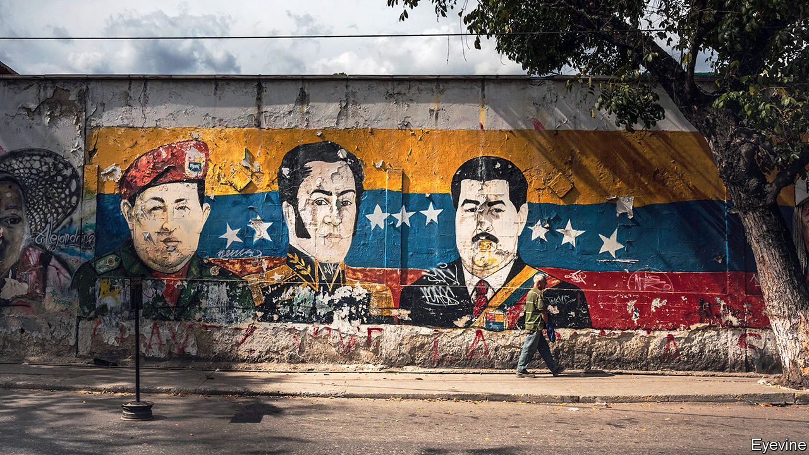

###### Maduro’s machinations

# How Venezuela’s regime plans to win this year’s legislative election 

##### Nicolás Maduro, though reviled by most voters, is manoeuvring to secure victory 

 

> Jun 27th 2020 

WHENEVER HE APPEARS on Venezuelan state television, Nicolás Maduro is introduced as “el presidente constitucional”, the constitutional president. The announcer often reminds viewers that he is “legitimate”, too. The reminder is needed because Mr Maduro is a dictator. It shows, too, the regime’s craving for legitimacy. Mr Maduro’s belief in his right to rule comes in part from the status he claims as the heir of the late Hugo Chávez, the regime’s founder (pictured, far left) and, less plausibly, Simón Bolívar, Venezuela’s liberator (centre). He also wants the affirmation that comes from a popular mandate, even though just 13% of Venezuelans back the regime, according to Datanálisis, a polling firm. To that end, he has sought to keep democracy’s form even as he drains it of content.

With a legislative election due by December, this month the regime took two big steps to ensure it will not lose. The current National Assembly is the only arm of the state controlled by the opposition. Its president, Juan Guaidó, is recognised by nearly 60 countries as Venezuela’s interim president (on the grounds that Mr Maduro rigged his re-election in 2018). Mr Maduro has in effect stripped the legislature of its powers. Now he is manoeuvring to bring it under direct control of the regime.


On June 12th the Supreme Court, an appendage of the regime, appointed new members to the National Electoral Council (CNE), which oversees elections. The CNE’s reform has been a central demand of Mr Guaidó and his foreign supporters. This shake-up is not that reform. Three of the five new members are allies of the regime, like the last slate. The three are subject to sanctions by the United States and Canada for human-rights abuses or financial crimes or both. The other newcomers are members of the opposition who have broken with its leaders.

To guarantee victory in the parliamentary vote, though, more is needed. On June 15th the Supreme Court ruled that control of one opposition party, Democratic Action, should pass to Bernabé Gutiérrez, who was previously expelled from that party for “conspiring with the regime of Nicolás Maduro”. Mr Gutiérrez is the brother of one of the CNE’s new members. On the next day the court suspended, then replaced, the directors of Justice First, whose best known member is Henrique Capriles, once a presidential candidate. The regime has not yet targeted Mr Guaidó’s Popular Will party. But the attorney-general proposes branding it a terrorist organisation.

The regime is assaulting an opposition in disarray. After 18 months of failed attempts to unseat Mr Maduro, Mr Guaidó is struggling to look relevant. He gave initial backing to a hare-brained plot for American mercenaries to kidnap Mr Maduro, which flopped in March. Mr Guaidó’s approval rating has dropped from 61% in February 2019 to 26%. The covid-19 pandemic has further constrained him. Mr Maduro has locked down the country, thwarting protests and reinforcing the impression that his rival counts for little.

Mr Guaidó and his allies must now decide how to react to fraud in the legislative election. Some factions of the opposition may participate to guarantee their political futures, as some did in the presidential election in 2018. That would confuse opposition supporters and give Mr Maduro a chance to claim the vote is fair. “Such dynamics will all but guarantee that the opposition loses control of the National Assembly,” says Eurasia Group, a consultancy. Opposition legislators who are not re-elected would lose immunity from prosecution, points out Crisis Group, a think-tank. That would force them into exile.

If Mr Guaidó no longer leads the legislature, his foreign allies will also have to have a rethink. Some already regret recognising him as interim president. “It seemed like a good plan at the time,” said one forlorn Western diplomat in Caracas. Mr Guaidó’s most important patron, President Donald Trump, was never really behind him, it seems. In an interview on June 12th with Axios, a news website, he comes across as uninterested in his administration’s decision to back Mr Guaidó. “I could have lived with it or without it,” he said. Mr Maduro must have smiled.

Not everything is going his way. The production of oil, Venezuela’s main source of foreign income, has slumped to the lowest levels since the 1920s. Its price is low. By the end of this year, in real terms the economy is expected to be a fifth the size it was in 2013, when Mr Maduro became president. American economic sanctions are biting. There is less cash to buy loyalty from the armed forces, the final arbiter of the regime’s fate. It will someday fall.

Venezuelans who yearn for change have little hope. “They have won,” said a disillusioned teacher, who has been protesting against the regime since 2007. “I honestly believe this country is lost.”■

