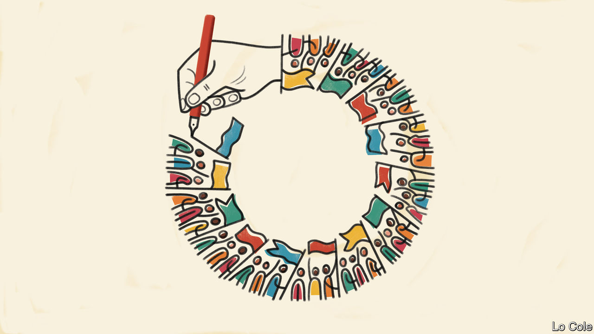

###### Bello

# The lessons of the 1930s and 1980s for Latin America 

##### Past economic slumps brought upheaval and regime change 

 

> Jun 27th 2020 

THE COVID-19 pandemic has still not peaked in Latin America, and it is likely to last for several more months. Apart from the toll in human lives, the virus and the efforts to fight it through lockdowns have hammered economies and forced tens of millions of Latin Americans into poverty. The IMF expects the economy of the region (including the Caribbean) to contract by 9.4% this year, with only a moderate recovery next. Harder to divine are the political implications of this hardship. But if history is a guide, they will be great.

Latin America has seen slumps on this scale only twice in the past century. The first was triggered by the Wall Street crash of 1929. By 1932, many of the region’s economies had shrunk by 20% (and 40% in the case of Chile and Cuba). Export earnings and investment collapsed. In most cases recovery came only in 1933. The second slump was in the 1980s, when a string of countries defaulted on their foreign debts after international interest rates soared. For Latin America as a whole, GDP per person shrank by almost a tenth between 1981 and 1983. Recovery was much slower than in the 1930s. The 1980s became known as the “lost decade”.


Both these periods saw political upheaval. Between 1930 and 1933 the armed forces pushed aside civilian governments and took power in eight Latin American countries. In Chile the reverse happened: a popular uprising overthrew the government of General Carlos Ibáñez in 1931. Over the next 18 months Chile suffered nine successive governments, two general strikes and several coups before settling down under civilian rule for the next 40 years. The 1980s saw the opposite trend. Dictatorships, which had prevailed in the region, yielded to elected democratic governments in eight countries between 1982 and 1989.

Covid-19 struck Latin America as it was already suffering political strains because of several years of slow economic growth and popular discontent over corruption and poor public services. This discontent manifested itself in the defeat of incumbent parties in many recent elections, the rise to power of populist outsiders in Brazil and Mexico in 2018 and a wave of street protests last year, notably in Ecuador, Chile and Bolivia.

The immediate effect of the pandemic has been to strengthen presidents in several countries. The public has generally applauded rulers who have tried to save lives with lockdowns. And these lockdowns have made it harder for opponents to fight back, either in the streets or in hampered legislatures. When the pandemic ebbs but its economic consequences linger, anger is likely to resurface and may be directed at governments. “Rally-round-the-flag is a very short-term effect; in a couple of years people won’t connect the economic crisis with the virus,” says Daniela Campello, the co-author of a forthcoming book on the links between economic volatility and political instability in South America. “It’s hard to see any kind of [political] equilibrium or maintenance of the status quo.”

What political direction will popular anger take? One answer might be that it will breed more populism. That is possible, but it may not apply where populism is the status quo. And populists tend to have a hard time when money is short. Optimists think that the overriding lesson of covid-19 is that democratic governments, armed with science and openness, are doing a better job than populists, and that voters will reward them. That may be so in richer parts of the world. In Latin America opposition to incumbents, whether populists or democrats, is more likely to be the trend.

If the 1930s and the 1980s are any guide, the current slump may prompt regime change. After three mainly democratic decades, the risk is of a return to authoritarian rule. Already some presidents, such as Nayib Bukele in El Salvador and Jeanine Áñez, Bolivia’s interim ruler, have used the pandemic as a pretext to grab extra powers.

The biggest threat is that the army returns as a political actor, as it already has in Brazil under Jair Bolsonaro, Venezuela under Nicolás Maduro and to an extent in Mexico and Bolivia. That is partly because police may struggle to maintain public order in the face of popular anger. It is also because satisfaction with democracy and its institutions, already low in many countries, may fall further, and would-be authoritarians, civilian or military, may spy an opportunity. History need not repeat itself. Nevertheless, Latin America’s democrats will have their work cut out.■

