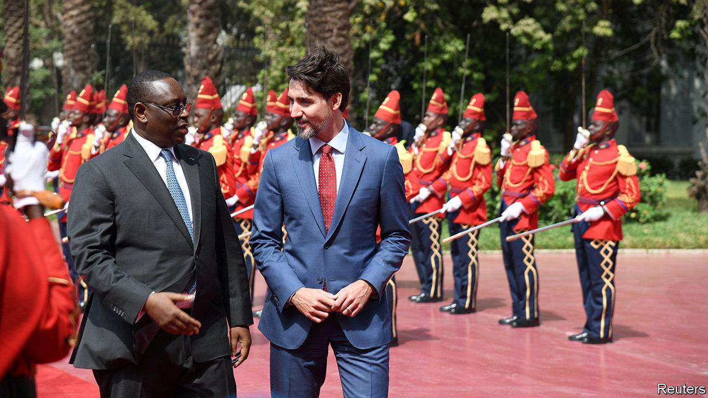

###### When C-pop is not enough

# Why Canada failed to win a seat on the Security Council 

##### The country is less popular than it thinks it is 

 

> Jun 27th 2020 

ANY SERIOUS candidate for one of ten rotating seats on the UN Security Council will have to schmooze. Before the pandemic Canada entertained ambassadors to the UN with a concert in New York by Celine Dion, a French-Canadian singer. Ireland induced U2, a rock band from Dublin, to give its candidacy a plug from the stage. Lacking globally famous pop stars, Norway spent Nkr2m ($210,000) on a travelling exhibition promoting its “contribution to African liberation”.

They were competing for two seats on the UN’s main decision-making body, which has five permanent members with vetoes, including the United States and China. On June 17th UN member states chose Norway and Ireland. Their two-year terms begin in January 2021. Canada, which has more people and a larger economy than both put together, fell 20 votes short of Ireland in the secret ballot.


This was humiliating for Justin Trudeau, Canada’s Liberal prime minister, who had campaigned for a seat for four years. “Canada is back,” he declared after taking office in 2015. “More like back of the line,” foes in Parliament now retort. This is Canada’s second recent Security Council loss. In 2010 the Conservative government of Stephen Harper was edged out by Portugal.

Canada has plenty of multilateral credentials. Lester Pearson, a future prime minister, won the Nobel peace prize in 1957 for initiating the first armed UN peacekeeping operation to resolve the Suez crisis. A successor, Paul Martin, was the architect of the G20 group of rich and emerging economies. Canada hosted the conference that in 1987 produced the Montreal protocol, which protects the ozone layer. In 2003 Kofi Annan, the UN secretary-general, called it “perhaps the single most successful international agreement to date”.

Yet a gap has emerged between how Canada sees itself and how the world sees it, observes Bessma Momani of the University of Waterloo. Canada has recently contributed less to UN peacekeeping missions and given less aid to developing countries than its European rivals. It had 34 active peacekeepers at the end of May; Ireland, with an eighth of its population, had 466. Canada’s development assistance last year amounted to 0.27% of gross national income, well short of the UN’s target for rich countries of 0.7%. Norway gave more than 1%. Canadians’ perception of their country as a model global citizen may be coloured by “historical memory”, says Ms Momani.

Mr Trudeau was late to build relations with African leaders, who have more than 50 votes at the UN. His whirlwind tour of the continent in February, which included promises of aid and a stop at the headquarters of the African Union in Addis Ababa, smacked of opportunism.

More bad news followed the Security Council disappointment. On June 19th China announced that Michael Kovrig and Michael Spavor, Canadian citizens, have been charged with spying. China detained them in December 2018 after Canada, acting on an extradition request from the United States, arrested Meng Wanzhou, the chief financial officer of Huawei, a Chinese telecoms giant. The new memoir by John Bolton, President Donald Trump’s former national security adviser, confirms that Mr Trump dislikes the Canadian prime minister. Mr Trump called him a “behind-your-back guy”. Canada, to paraphrase the lyrics of an early hit for Ms Dion, is searching for a hand that it can hold.■

