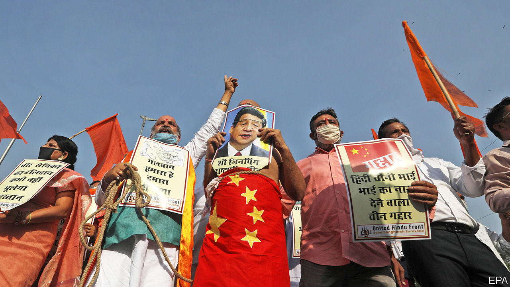

###### Hit them where it hurts us

# India has few good ways to punish China for its Himalayan land-grab 

##### Most economic sanctions would harm India, too 

 

> Jul 4th 2020 

“NOW THE Chinese will know that, when we want to act, we shall act as we wish, without warning,” thundered Arnab Goswami, jabbing a finger towards the camera. “We shall move in stealth, and attack when necessary!” Judging from the triumphalism of this host on Republic TV, a jingoistic private channel, one might have guessed that the Indian army was at the gates of the Forbidden City. But the daring blow he trumpeted was in fact a limp ministerial decree, announcing a ban on TikTok, a popular video-sharing platform, and 58 other smartphone apps deemed to have links with China.

India’s ban was officially billed as a defensive measure, meant to protect citizens from possible data-mining by “elements hostile to national security”. Few Indians doubt that its real intent is retaliatory. Since June 15th, when some 20 Indian soldiers died during an unarmed clash with Chinese troops at a remote spot on the countries’ ill-defined border, Narendra Modi, India’s prime minister, has faced political pressure to hit back at China. Considering that Indians have downloaded TikTok more than 600m times, and that several other targeted Chinese apps also had huge followings, few can have missed the government’s action. Mr Modi has “done something” for all to see to avenge the slain soldiers—although he has also snuffed out an astonishingly popular pastime overnight (see ).


The feebleness of India’s response underlines the difficulty of its position on the cusp of what Jabin Jacob of Shiv Nadar University in Delhi describes as an emerging cold war between the Asian giants. Since the spring China has massively reinforced its troops in its Himalayan border regions. In these barren, high-altitude areas, the “Line of Actual Control” between India and China has never been formally defined, much less agreed upon, with only seasonal patrols probing claimed territorial limits. China has abruptly changed that by creating reinforced, permanent-looking positions at as many as seven strategic spots, all situated just inside what India considers its territory. Last month’s bloodshed, which caused an unknown number of Chinese casualties, occurred when Indian troops tried to dismantle one of these.

Militarily, India faces a fait accompli. China’s new positions give its forces a strategic advantage, making it difficult for Indian troops to hit back. Taunting Chinese soldiers have even inscribed a giant map of China on one patch of newly grabbed terrain. India could imitate China’s tactics and create its own new forward positions, but such tit-for-tat moves could simply go on at mounting cost over many years, with China’s bigger budgets and superior infrastructure putting it in a better position to dig in.

Hence the temptation for India to try to hurt China in other ways. The ban on popular apps represents a pinprick for an economy that is nearly five times the size of India’s. True, India is TikTok’s biggest foreign market by far, but the app’s earnings in India are relatively paltry.

Mr Jacob says the app ban is better understood as part of a more strategically considered pushback against China’s growing influence. The irritants to India include a persistent trade deficit of around $50bn and the inroads Chinese diplomacy has made in small, neighbouring states that India considers its own satellites.

Even before the recent border tensions, India had begun quietly raising barriers to Chinese capital. New rules imposed in April require central government vetting of all direct investments by Chinese firms. In May the authorities began mulling stricter oversight of trades linked to China in the stock- and bond markets. Since the troubles in June, Indian customs officers have been scrutinising shipments from China much more closely. On July 1st two big air-freight firms, FedEx and DHL, both announced they would cease carrying goods from China to India because of delays in customs clearance. Some of those delays may become permanent: the government is consulting with Indian businesses over a list of more than 1,000 Chinese-made items on which it intends to raise tariffs.

Such economic nationalism goes down well in some quarters. Prafulla Ketkar, the editor of a journal considered a mouthpiece for India’s biggest Hindu-nationalist group, sees the beginning of a “holy war” against an “expansionist monster”. But much of India’s shopping list from China consists of vital inputs for its own factories, including more than two-thirds of the active ingredients for India’s booming drugs industry, nearly all the compressors used by its air-conditioner manufacturers and most of the cheap solar panels that have allowed India to make impressive strides in clean energy. Chinese venture-capital firms have injected some $8bn into Indian start-ups. That flow will now dry up. Even worse, by showing such readiness to wield economic cudgels, Mr Modi sends a signal not only to China but also to other investors looking for a steady, reliable place to do business. ■

