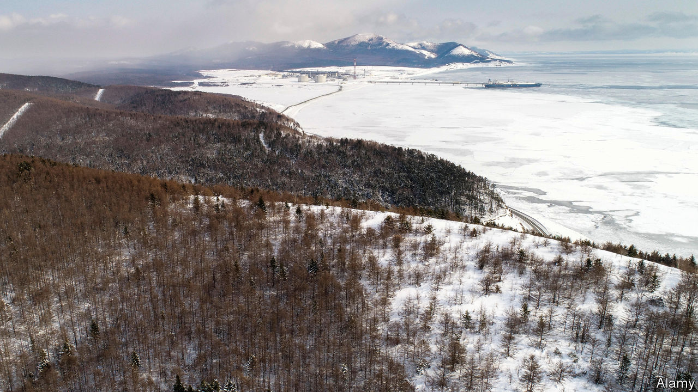

###### Home Entertainment

# Chekhov’s trip to Sakhalin puts lockdown in perspective 

##### When he crossed the strait to the island prison colony, the writer felt he was entering hell 

 

> Jul 4th 2020 

ALONG THE Siberian highway, between Tyumen and Tomsk, Anton Chekhov stayed the night in a coach driver’s cabin. Two months earlier a gentlewoman had stopped there with her newborn boy. Suspecting that he was illegitimate, and childless herself, the driver’s wife offered to take him in. The lady left him with the couple while she decided—and then vanished. Was he theirs or not? “Please help, for God’s sake!” the driver implored as his wife, besotted with the baby, fled the room in tears.

It was May 1890 and Chekhov was on his way to Sakhalin, an island north of Japan which was then a huge Russian penal colony. For the stir-crazy, his trip is a consoling reminder of travel’s hazards. Chekhov nearly perished in a collision with a mail troika and might have drowned in a flood. Notionally it was spring, but on the approach to Tomsk there was deep snow. And the terrible rutted roads, the oceans of mud, the endless taiga, the maddening mosquitoes…When at last he crossed the Tatar Strait to Sakhalin it was ablaze with forest fires. He felt he was entering hell.


Unlike some writers who trekked across Siberia, Chekhov went voluntarily. The journey took almost three months, and he spent as long again on the island. His aim was to survey the prisoners and publicise their conditions—which make the confinement of lockdown look like paradise.

On Sakhalin, chains clanked incessantly and the floggings gave Chekhov nightmares. Virtually all the women, convict or free, had been forced into prostitution. Bears scooped salmon from the rivers, but the human food was terrible. And the boozing! The bedbugs! Like covid-era readers taking their licensed strolls, many inmates were able to roam around, but they could never see their loved ones. They made doomed bids to escape, often butchering each other in the process, desperate to cross the strait and breathe the air of freedom before they died.

Today, two museums are devoted to Chekhov on Sakhalin, which is dominated by giant energy projects. The island left a mark on him, too. It coloured his view of authority and redoubled his commitment to describe life as it was, compassionately but without illusions. Just before he set out, his play “The Wood Demon” had flopped. Afterwards he wrote many of his finest stories, as well as “The Seagull”, “Three Sisters” and “The Cherry Orchard”.

Even in “Sakhalin Island”, his account of the expedition, the artist in Chekhov keeps elbowing aside the social reformer, and amid the demographic details that he amassed are a trove of exquisite vignettes. After confessing to killing her child a prisoner wept bitterly, but then (in Brian Reeve’s translation) “wiped her eyes and asked, ‘Fancy buyin’ a nice little bit o’ pickled cabbage?’” Despite lashings and stints in a punishment cell, an old con had refused to work; in the end the guards gave up, and he strolled around, singing. Murdered in a bakery, a cruel official “fell into the kneading trough and stained the dough with blood”. Alas, you never find out what happened to the gentlewoman’s baby. ■

Editor’s note: Some of our covid-19 coverage is free for readers of The Economist Today, our daily . For more stories and our pandemic tracker, see our 

