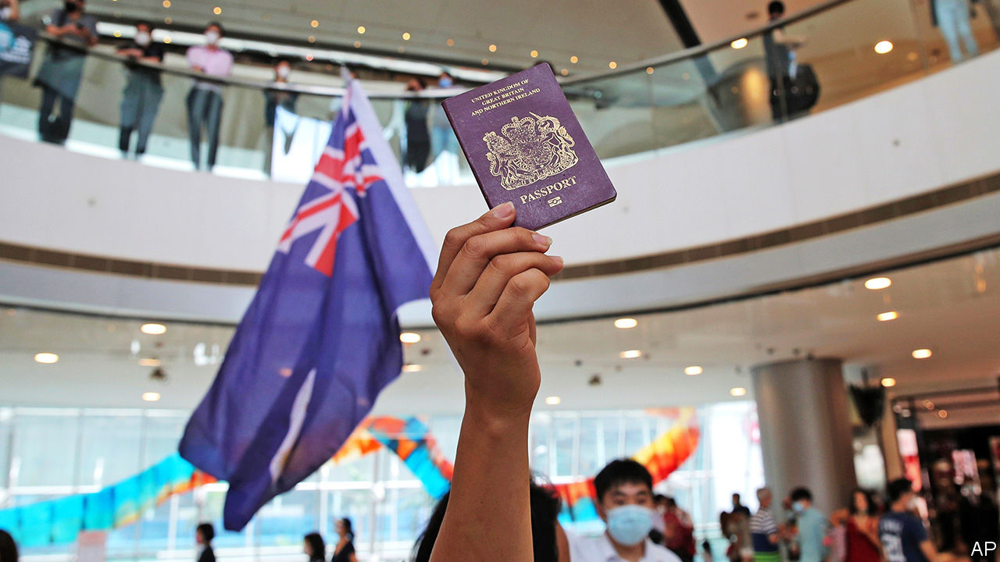

###### Getting off the fence

# Britain gives 3m Hong Kongers the right to live and work 

##### The offer will annoy China 

 

> Jul 2nd 2020 

AT MIDNIGHT ON July 1st 1997 Hong Kong passed from British to Chinese hands, starting a new era under the “one country, two systems” policy. It allowed the territory to retain a high degree of autonomy from Beijing. The arrangement was meant to stay in place for 50 years.

On June 30th 2020, after less than half the agreed amount of time had passed, that era looked closer than ever to a premature end. China’s rubber-stamp parliament passed a sweeping new security law designed to chill dissent and stifle protests (see ).


The law had been widely anticipated. So had Britain’s response, announced on July 1st. The 3m-odd British Nationals (Overseas) (BNO)—Hong Kongers born in the territory before 1997—as well as their dependents will gain the right to live and work in Britain for five years, after which they can apply for citizenship. The government indicates that those who take up the offer will not need a job before arriving, and will not be subject to a salary threshold. It is the most generous opening of British borders to foreign workers since new EU citizens were welcomed in 2004.

Dominic Raab, the foreign secretary, characterised the decision as a response to China’s failure to live up to its promises. “But we,” he said, “will not look the other way on Hong Kong, and we will not duck our historic responsibilities to its people.” Some of that may even be true. An official involved with cabinet meetings on the topic said he was struck by the vehemence with which ministers argued that this was a point of principle on which Britain had a moral obligation to act. Priti Patel, the home secretary, is no friend of migrants but she understands Britain’s responsibility to holders of its passports. Her family was among those who migrated to Britain from Uganda in the 1960s and 1970s.

Unlike the Ugandan Asians, who arrived in large numbers after a hard-fought battle, only a small number of eligible Hong Kongers are likely to turn up. Even if they leave Hong Kong, they may have other berths: Australia’s prime minister, Scott Morrison, said on July 2nd that his country was “very actively” considering welcoming them. Nonetheless, the offer itself will have an impact both at home and abroad.

Domestically, it allows the Conservatives to argue that they are not the migrant-bashing party they are made out to be, and that Brexit truly is about a “global Britain”. At the grassroots of the party, Hong Kongers are seen—for better or worse—as the “good” kind of migrant: honest, hard-working and entrepreneurial. Most Brits who have heard of the plans approve of them, and Hong Kongers are unlikely to compete for fish-packing jobs in Grimsby.

But the bigger impact will be on Britain’s foreign relations. China had warned Britain against offering Hong Kongers any additional rights. This week, before the details of the offer were out, a Chinese official said that any such move was surely a “slap in the face” for his country. China is Britain’s third-biggest trading partner, after the EU and America. Its students flock to British universities. Huawei, a telecoms giant, recently announced plans for a £1bn ($1.2bn) research centre in Cambridge.

Yet the government is increasingly wary of Chinese investment and under pressure from America to kick out Huawei from its telecoms infrastructure. Hours after Mr Raab’s announcement it emerged that Britain had granted asylum to Simon Cheng, a BNO who worked for the British consulate in Hong Kong. He said he had been tortured in China last year. The China Research Group, a caucus of Tories whose name is meant to echo the European Research Group that led the Eurosceptic movement in Parliament, is gaining adherents.

Downing Street still talks of “a strong and constructive relationship with China in many areas” but with the caveat that “this relationship does not come at any price”. Boris Johnson insists that “I’m not going to get drawn into Sinophobia because I’m not a Sinophobe.” That may well be so. But there is a dawning realisation in government that it can no longer sit on the fence in its approach to China.■

