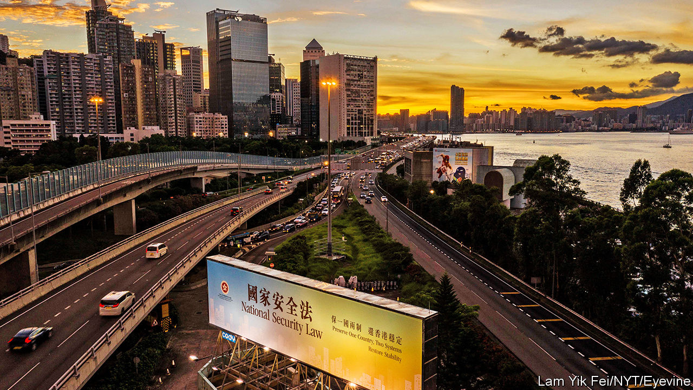

###### The evening of its days

# A new national-security bill to intimidate Hong Kong 

##### It is harsher than the gloomiest predictions 

 

> Jul 2nd 2020 

A  SENIOR CHINESE official called it a “birthday gift” for Hong Kong. It was a chilling choice of words for the biggest blow to the territory’s freedoms since Britain handed it back to China in 1997. Close to midnight on June 30th, on the eve of official celebrations of the handover’s anniversary, China imposed a draconian national-security bill on Hong Kong. It gives the government in Beijing sweeping power to crush dissent in the territory using its own secret police and even its own courts.

The new law relates to crimes involving secession, subversion, terrorism and collusion with foreign forces. Hong Kong’s post-handover constitution, the Basic Law, had required the territory to pass its own legislation concerning such offences. But local opposition had stymied the government’s efforts to do so. Unrest during the past year, which Chinese officials call an attempted “colour revolution”, caused the Communist Party to lose patience. In May it announced it would do the job itself.


The law was drafted in secret by legislators in Beijing—not even Hong Kong’s government was shown its contents until it was passed by China’s rubber-stamp parliament. Mercifully, it cannot be used to charge people for things they did before June 30th, or so officials say. But otherwise it is even more intimidating than most people in Hong Kong had expected.

The bill could result in far more serious charges being laid against protesters should they engage in activities that were common during the recent upheaval. Vandalising public transport could now be treated as terrorism. Breaking into the legislature or throwing eggs at the central government’s liaison office, as demonstrators did last year, could be considered subversive. Calling for Hong Kong’s independence, as some protesters have, could invoke a charge of secession. Encouraging foreign countries to impose sanctions on China could result in prosecution for collusion. The maximum sentence for all four of these categories of crime is life in prison.

To oversee the clampdown, the central government will open a new “Office for Safeguarding National Security”. It will be the first open operation in Hong Kong involving the mainland’s civilian security forces. A separate policymaking “Committee for Safeguarding National Security” will also be set up, led by the territory’s chief executive, Carrie Lam. It will include an “adviser” appointed by the central government. Trials involving the new law will be presided over by judges hand-picked by the government. The justice secretary may allow them to dispense with juries and hear cases in secret.

Ms Lam said the new law would target only “an extremely small minority of people”. To many Hong Kongers, that is no comfort. In “complex” or “serious” cases the bill allows the mainland’s security agencies to take charge. They will not be subject to Hong Kong law. They may even take suspects to the mainland for trial. There they could face execution.

It is not only the large numbers of young black-clad protesters at the forefront of the recent unrest who need worry. The law could be applied to a wide range of peaceful activity. For example, taking part in anything “unlawful” aimed at undermining China’s communist system could be considered subversive. That could be construed to mean any anti-government rally that goes ahead without police permission. A person who “conspires” with anyone abroad to provoke “hatred” in Hong Kong towards the local or central government could be accused of collusion. The power to interpret these terms will rest with China’s legislature. The law may affect a wide range of other freedoms. It calls for stronger “regulation” of schools, universities, social organisations, the media and the internet.

It will also apply to people abroad. That may mean that if considered suspects in any of these crimes they could face arrest, should they visit Hong Kong. The bill implies that foreign firms in Hong Kong could be punished should they help a country apply sanctions against China. America is mulling some. On July 1st its House of Representatives passed a bill calling for sanctions against banks that do business with Chinese officials deemed responsible for human-rights abuses in Hong Kong. The legislation is likely to be submitted to the Senate in a few days.

Hong Kong is already feeling the chill. Just before the law was passed, Joshua Wong disbanded his party, Demosisto, which had supported self-determination for Hong Kong. “Yellow” cafés favoured by protesters began removing pro-democracy messages from their windows. Some activists closed their Twitter accounts.

Despite a police ban on protests on July 1st, and the risk of breaking the new law, thousands of people still gathered to protest. Elderly women handed out posters saying “Heaven will destroy” the Communist Party. But the number of demonstrators was far smaller than at many of last year’s protests. The police arrested 370 participants. At least ten were accused of violating the security bill, including a man caught with a pro-independence flag.

China will try to make sure that Hong Kong continues to prosper, not least by pumping up its stockmarket. Shut out of American stockmarkets amid Sino-American tensions, Chinese firms are increasingly turning to Hong Kong’s exchange to list. The share index rose by more than 2.8% on July 2nd, the first day of trading after the law was published. But the territory’s political future is bleak. The local government says it has spent $6.29m to retain a public-relations company to help a “Relaunch Hong Kong” campaign. Its choice was Consulum, a firm that has tried to help Saudi Arabia improve its authoritarian image. It will have its work cut out in Hong Kong. ■

