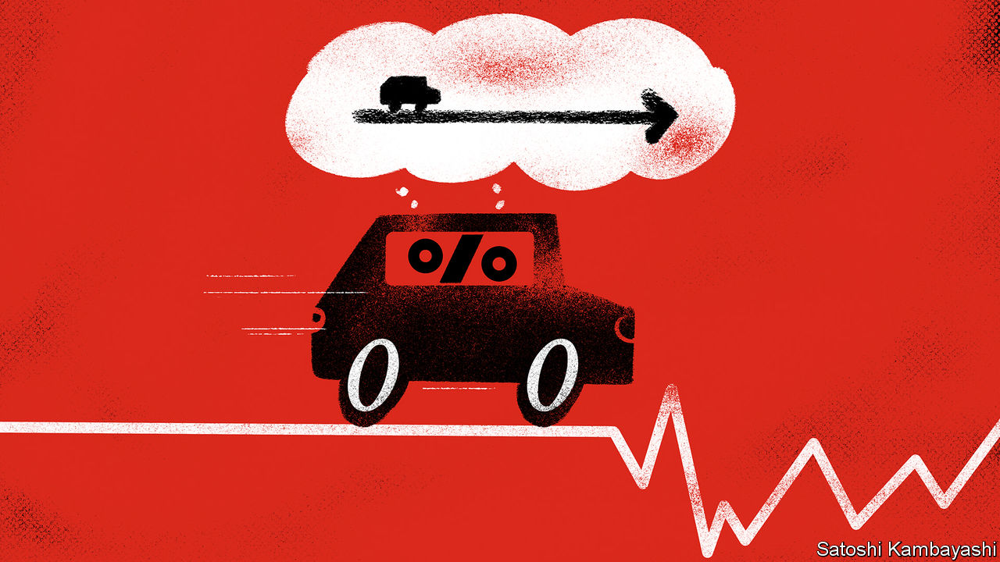

###### Buttonwood

# Why zero interest rates might lead to currency volatility 

##### There is little scope for them to adjust to economic trouble. So something else must 

 

> Jul 4th 2020 

A   GENERATION OF English cricket fans know the Aussies are loth to surrender a lead. For much of the past two decades, Australia has been a high interest-rate economy. But not any more. In March the Reserve Bank of Australia (RBA) cut its benchmark cash rate to 0.25%. That is the lowest interest rates have ever gone, and as low as they are likely to go. To signal its intentions that rates will stay put, the RBA has pledged to fix three-year-bond yields at 0.25%.

The Australian case is telling. Near-zero interest rates are the norm in rich countries. Very low interest rates are common elsewhere, too. Indeed, among the more prosperous sort of emerging market, only Indonesia, Mexico, Russia and the inflation-prone Turkey have short-term interest rates above 4%. Rock-bottom rates have gone global to a much greater extent than after the financial crisis of 2007-09. And a lot of central banks, like the RBA, are committing themselves to keeping rates low.


It is natural to think that if interest rates are glued to their effective lower bound, exchange rates will be similarly stuck. An axiom of foreign-exchange analysis is that shifts in policy rates, or in expectations of policy rates, drive currencies up and down. Yet a zero-rate world might plausibly imply more currency volatility. There is little scope for interest rates to adjust to economic trouble. So something else must. The exchange rate is the likeliest candidate.

To understand why, start with the idea that trade and capital flows are mirror images. Say a country runs a current-account deficit worth $10bn each year. To fund this, it borrows $10bn from abroad. The higher its short-term interest rates compared with other countries, the more it attracts such funds. But short-term borrowing is not the only way for a country to finance a current-account deficit. It could instead sell some of its assets—property or shares, say, or even whole businesses—to foreigners. It is useful to think of the exchange rate as the shadow price of these assets. The currency finds a level that keeps the current and capital accounts in balance.

Now put our hypothetical country in a zero-interest-rate world. Assume its exports are split between raw materials and manufacturing goods. And imagine an economic shock that lowers the demand for commodities. Our country’s exchange rate would fall, helping boost demand for its manufactures. Were interest rates positive, the central bank could cut them to fire up domestic spending and make up for the shortfall of raw-material exports. But at zero interest rates, this is not possible. A consequence is that the exchange rate will need to do more of the work of ginning up an economy, notes Steve Englander of Standard Chartered, a bank.* A plausible outcome of widespread low rates, then, is currency volatility. If the exchange rate is the only game in town, the more closed your economy is, the more it has to fall. In a more open economy, the currency would fall less.

What else might attenuate currency volatility? Fiscal policy might seem an obvious influence. The more a government spends in response to a shock, the less stimulus is needed by other means, including by currency depreciation. Rich countries have more fiscal space than they ever imagined, says Kit Juckes of Société Générale, a bank. But they must employ it in a way that is useful. Getting the timing and effectiveness of fiscal stimulus right is tricky. An ill-judged or ill-disciplined fiscal stimulus would be a poor substitute for an interest-rate cut. Fiscal policy might then add to currency volatility, not detract from it.

Which brings us back to capital flows. A key influence on currency volatility is the attractiveness, or otherwise, of a country’s asset markets. The broader the range of assets on offer and the easier they are to buy or sell, the less the currency needs to fall to entice foreign buyers. Conversely, the tighter a country’s restrictions on cross-border asset sales, the more volatile its currency is likely to be. Put simply, if you lack the sort of assets—and growth story—that foreigners can buy into, your currency is at more risk in a zero-rate world.

The lesson is that fixing policy rates does not mean that capital and trade flows are set in stone, too. If central-bank rates cannot adjust to changing economic circumstances, then something else must. So do not be surprised if the new era of globalised zero-interest-rate policy leads to currency instability.

*“If policy rates are zero, what drives FX?” June 17th, 2020.

