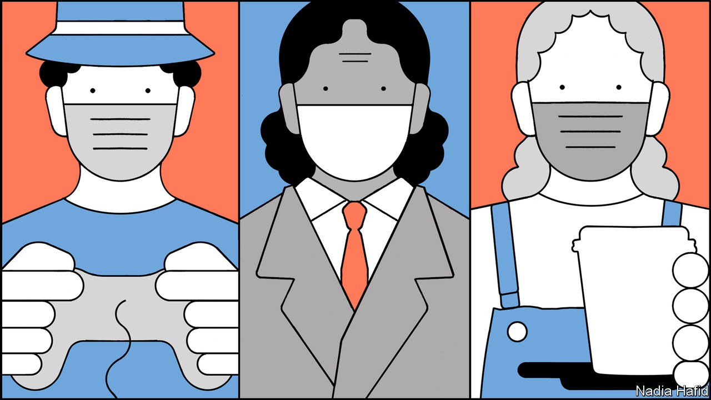
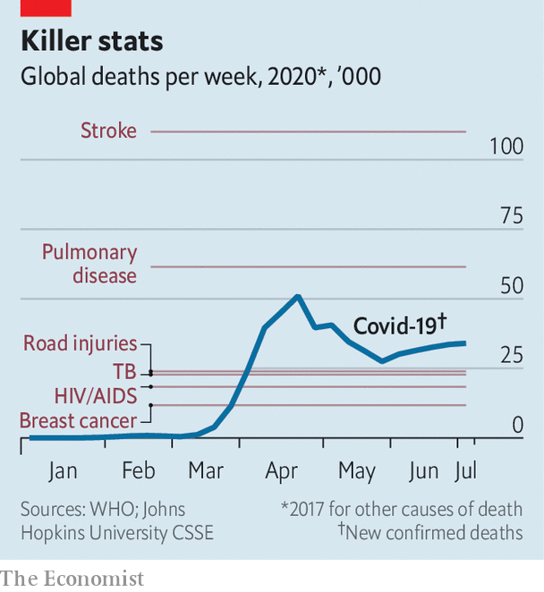
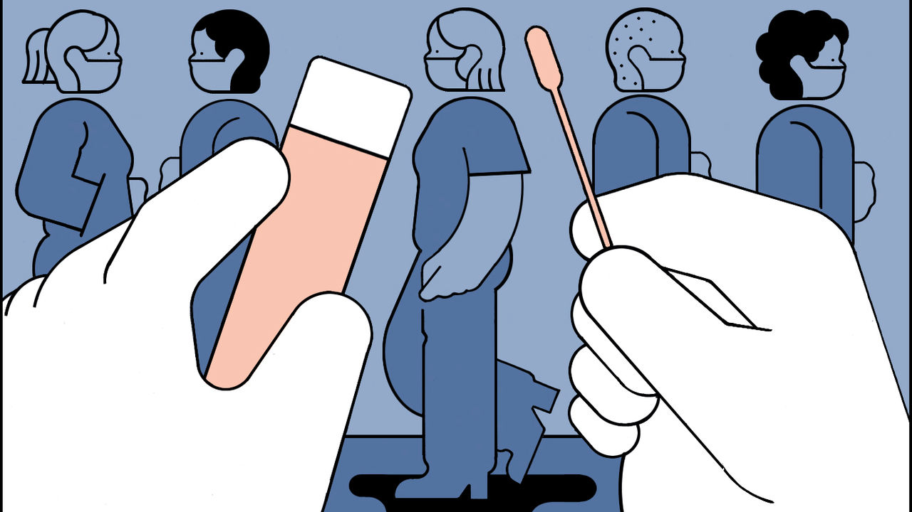

###### The new normal

# Covid-19 is here to stay. The world is working out how to live with it 

##### People will have to change their behaviour to prevent second waves of the virus 

 

> Jul 4th 2020 

Editor’s note: Some of our covid-19 coverage is free for readers of The Economist Today, our daily . For more stories and our pandemic tracker, see our 

YOU MAY BE exhausted but the covid-19 pandemic is barely getting started. Six months after Chinese scientists notified the World Health Organisation (WHO) of a new virus that caused deadly pneumonia, covid-19—as the disease was later dubbed—has spread to almost every country around the world and killed more than 500,000 people. In London, Madrid and New York deaths this year have been more than twice what they usually are in the same months. It took more than three months for global cases to reach a million; the last million came in less than a week.

Yet even in the countries with the worst outbreaks, just 5-15% of people have been infected. They may be immune to future infections, at least for a while, but with most of the population still susceptible, getting back to life as usual is impossible. The disease would again grow rapidly. Hospitals would soon be overwhelmed. A recent study published in the Lancet, a medical journal, estimates that about 4.5% of people infected by covid-19 globally are likely to become so ill they require hospitalisation. By comparison, less than 8% of Americans have to stay overnight in hospital in any normal year.


A vaccine is the best way out of this. But even the most determined optimists reckon it will be at least January 2021 until one becomes widely available. In the meantime, the world is preparing to cope with covid-19 in the long term. As countries loosen restrictions and open borders, cases are starting to rise again. If left unchecked, they will swell into new waves of infection. All-encompassing national lockdowns would wreck economies. So countries are looking for middle-ground measures that will prevent the disease from overwhelming hospitals while loosening some of the heaviest restrictions. Used together, these measures will probably ward off new waves of infections. Whether governments will choose to implement them—or have the means to do so—and whether people will follow new rules is less certain.

The priority is to shield from infection those who are most likely to become gravely ill. That becomes difficult if large numbers of people are becoming infected. To prevent the virus from spreading uncontrollably, governments are relying on a combination of three key measures: testing and quarantine; changes in behaviour that reduce transmission (which include social distancing, the wearing of masks and handwashing); and targeted lockdowns of outbreak hotspots—a practice known as a “circuit-breaker” that has been popular in East Asian countries thus far and is now being embraced elsewhere.

Whether countries that have got a grip on covid-19 experience new waves of the disease will depend on how people behave and how quickly authorities can detect an increase in cases, says Andrea Ammon of the European Centre for Disease Prevention and Control (ECDC). If authorities can quickly identify new outbreaks, they will be better able to prevent them from spreading. That means any restrictions imposed in response can be more limited. “What we’ve learned about this virus is that we shouldn’t underestimate even a small outbreak. It can easily be the core of bigger transmission,” says Dr Ammon.

Countries facing their first waves of covid-19 were caught off guard. One of the biggest tragedies was the failure to protect the residents of care homes. They have accounted for about 40% of covid-19 deaths in America and in several other Western countries. Governments are determined to avoid a repeat of this debacle. Infection-prevention measures at care homes are being ramped up, including more testing and greater use of masks by staff and visitors.

Besides the elderly, it is now apparent that people with certain health conditions—including obesity, diabetes and heart disease—are particularly vulnerable. Estimates suggest that 22% of people globally have at least one underlying condition that puts them at high risk if they are infected. In America 38% of adults fall into this category because of their age or health problems; nearly half are of working age.

What are the odds?

Ensuring people understand how to assess their own risk—especially in the event of an outbreak in their area—is crucial. In March Britain’s National Health Service sent letters to some 2.2m people deemed to be at particularly high risk, telling them to avoid going out when the outbreak was at its worst. In future doctors and patient organisations will be more closely involved, advising vulnerable people and their families on how to balance reducing their risk of contracting covid-19 with their need for some degree of social life.

In the early days of the pandemic, almost all countries tried to “test, trace and isolate” those infected in an effort to quarantine them and break chains of transmission. But many governments, such as Britain’s, abandoned this approach when case numbers grew rapidly and they did not have enough testing capacity and staff to do the job. Panicked countries in Europe and elsewhere imposed national lockdowns in an effort to prevent hospitals from becoming overwhelmed.

But the places that did best in the first months of the pandemic are those that never stopped contact-tracing, says David Heymann of the London School of Hygiene and Tropical Medicine. They include countries as varied as South Korea, Denmark, Germany, Vietnam, Uruguay and Rwanda. Many European countries and some American states used their initial lockdowns to expand their testing and contact-tracing systems and build apps that could make it possible to carry out the task more efficiently if there is a second wave.

These improved systems have responded with varying degrees of success. In Spain the health ministry believes it is still only detecting around a third of all cases (which does, however, mark an improvement on its rates of about 10% at the start of the country’s epidemic). Of these, 40% have no known link to other infected people. Public-health professionals say the system needs more staff if it is to function effectively. Contact-tracers in some states in America are reaching fewer than half of those testing positive for covid-19. Apps that notify users about a close contact with an infected person have often proved disappointing. The one in France was downloaded by fewer than 2m people and notified only 14 of them that they had come into close contact with someone infected with covid-19 in the first three weeks.

Some of the governments that scaled up their contact-tracing systems significantly during the outbreak, such as Britain, chose to run them centrally. That proved to be a mistake. Success rates in obtaining details of contacts and getting in touch with people have turned out to be higher when the task is done by local health departments or community organisations. Persuading someone who has just tested positive for covid-19 to hand over the phone numbers of friends, family and co-workers is hard. They are more likely to co-operate if the call requesting such information comes from someone with the dulcet tones of a local.

“Every epidemic is local,” says Madhukar Pai, an epidemiologist at McGill University in Canada, “so a combination of local leadership, local data to track what is happening, and a local army of community health workers and volunteers is absolutely critical to get it under control.” In countries as large as India, he says, the success of different places in keeping covid-19 at bay will vary. Cases of covid-19 in India and deaths from the disease are rising precipitously. But Dharavi, a slum in Mumbai where 850,000 people are packed into 2.5 sq km and as many as 80 people share each toilet, has tamed an outbreak that began in April. Authorities there set up clinics to check people’s temperatures. Health-care workers went door-to-door to screen people for symptoms and moved those who were infected to nearby schools and sports grounds which had been converted to quarantine centres. In the first half of June the slum had only six deaths from the disease, compared with 71 in April and May.

 


The process of tracing the contacts of those infected with covid-19 has been less smooth in Europe and America. As a result, other measures to curb transmission are even more vital. These include encouraging people to wear face-masks and keep their distance from others (social distancing). Turning these things into social norms, however, has been tricky for a variety of reasons. For one, the official advice on masks in America and Britain, among other countries, changed over time. People were initially discouraged from wearing them, partly for fear that they would run down the scarce supplies for health workers. In America masks are now officially recommended but have become a political statement, with some supporters of President Donald Trump, who refuses to wear a mask, following his lead.

Thanks to studies of outbreaks around the world, it is becoming clearer where social distancing matters most. Covid-19 thrives on close contact. Four things are now known to exacerbate its spread: being at close quarters for a prolonged period of time, in a large crowd, and taking part in activities that lead people to breathe out forcefully (for example singing, shouting and heavy exercise). In combination these create “super-spreading” conditions. Early in the pandemic, at a choir practice near Seattle, one person infected with covid-19 passed it on to more than half of the 61 people in the room, two of whom died.

Such discoveries are helping officials come up with more targeted rules. Conferences and big events are already banned in many places for the foreseeable future. As Britain emerges from its lockdown, weddings are allowed again–but without singing and with no more than 30 people present. Sweden’s drinking holes are allowing table service only, to prevent punters jamming together at the bar. The future of indoor exercise classes looks wobbly.

The extent to which people will comply with rules about wearing masks and on everyday social distancing will depend on how and from whom they get the message. Dr Ammon of the ECDC says that explaining the risks of covid-19 is a challenge for all public-health authorities because they have never had to do it on such a scale. “But we’ve learned from other settings that you need to win over the influencers in certain groups to convey the message in a credible way.” Precisely who those influencers are will vary. The exhortations of online celebrities will carry more weight with young people. Those of imams and priests may convince religious types. But the messaging must start at the top. “Politicians have to convey the message to people that it’s really up to them to decide what’s happening with this pandemic,” continues Dr Ammon. “And in a way empowering them by saying: ‘What you do actually matters’.”

But in many countries, including America, Brazil, Russia and Iran, politicians have lost the trust of their people by contradicting their experts on basic facts about the pandemic, publishing implausible numbers on covid deaths or propagating conspiracy theories.

Pushing people to change their behaviour swiftly is increasingly important in poorer countries with fast-growing epidemics. In India and South Africa shortages of tests—because of crimped global supply—are already rendering contact-tracing less useful. In South Africa, which has largely abandoned tracing, the buzz-phrase among political leaders now is “from anxiety to agency”. Officials are trying to boost adherence to the most basic things to prevent the spread of covid-19, including wearing masks, now compulsory on public transport and in all shops. President Cyril Ramaphosa made a point of (clumsily) putting one on at the end of a televised speech. “We now need to change the mindset of people,” says Salim Abdool Karim, who chairs South Africa’s medical advisory committee on covid-19. “We need each person to see that they have the ability to change, to influence their own risk. That for me is the biggest challenge.”

The worry in poor countries, says Dr Pai, is that such messages may fail to sink in if people see the disease spreading. Already, he says, there are people who think there is no point in wearing a mask because they will get the virus anyway.

It is hard to predict how behaviour will shift in any particular country. Past experience shapes attitudes. Many experts think that levels of compliance with guidelines about masks, quarantine and social distancing in Asian countries are high because people there have painful memories of the SARS epidemics in 2003-04.

But there are signs that in parts of Europe and America that have come through their first big wave of covid-19 people may comply with new rules that will be in place even as restrictions ease. In France President Emmanuel Macron said that even he was surprised by the extent to which his fellow citizens obeyed new rules. During the first few weeks of their lockdown, the French watched as pale-faced doctors emerged, night after night, from emergency wards into television studios to tell the nation that France was at the base of a ghastly wave. Fear, backed up by hefty fines and strict policing, probably contributed to this collective discipline. Although French cafés, museums, beaches and schools have reopened, the country’s earlier experience may explain why rules such as wearing masks on all public transport, in offices and other shared indoor space, are for the most part still being obeyed.

The mood is similar in Spain, which had one of the worst early outbreaks. During its first wave, the country saw at least 28,000 deaths, according to the health ministry. The number of excess deaths was roughly 50,000 compared with previous years. “We can’t lower our guard,” said Pedro Sánchez, the prime minister, on June 20th, as he lifted a 98-day state of emergency. As they contemplate taking longed-for summer holidays, Spaniards are torn between a desire to return to normal and fear of renewed outbreaks. Most now wear face-masks outside. Madrid’s and several other regional governments have provided some masks free of charge through pharmacies; they are easily obtainable in shops.

But even as people take these precautions, they are desperate for life to return to something like normality. Spaniards generally respect social-distancing norms. But on Thursday and Friday evenings the outside terraces of bars throng with mainly mask-less young people. Beaches are open again, though police move in to break up crowds. In Britain partygoers have already been caught at illegal raves. The police and hospitals are bracing themselves as British pubs prepare to open on July 4th. In Berlin, where masks are mandatory in shops and on public transport, the local government imposed fines for non-compliance when numbers wearing them fell.

Cluster headaches

In many European countries new covid-19 cases have crept up as restrictions have eased. So far cases have appeared in clusters, often linked to parties or other celebrations where people have gathered in large numbers. But the biggest clusters have often been among migrant workers. In Britain, Germany, Spain and Italy migrant workers from Africa and eastern Europe often live in cramped accommodation. A lot of them work in food-packing factories—loud places where workers stand close to one another, often yelling to make themselves heard over the clatter of machinery, creating ideal conditions for the virus to spread. Many are not fluent in the local language and so struggle to understand messages about preventing the spread of covid-19 or to get in touch with doctors if they become ill. Public-health authorities are now more aware of the problem and making greater use of translators.

 


But such outbreaks are being exploited by politicians. On June 29th the leader of Italy’s hard-right Northern League, Matteo Salvini, was forced to abandon a rally at Mondragone near Naples after being drowned out by chanting demonstrators. They were protesting at what they saw as his attempt to capitalise on clashes the previous week between Bulgarian seasonal workers and native Italian residents. Most of the Bulgarians, who gather local harvests, live in a complex of apartment blocks that on June 22nd was returned to lockdown after becoming a hotspot of the virus. Almost 50 residents tested positive and were put into isolation in a nearby hospital. Refusing to accept this renewed confinement, some of the Bulgarians marched through the town, defiantly unmasked, prompting criticism and even attacks by locals. On June 12th, a less visible revolt took place inside a former barracks housing asylum-seekers outside the northern town of Treviso. In both cases, the reason was the same: the immigrants’ fear that they would lose their jobs if they failed to turn up for work.

Such patterns have laid bare one of the gnarliest problems facing all governments. Convincing people to change their behaviour in the ways needed to prevent new waves of covid-19 will rely on people worrying about others as well as themselves. In most places the disease has become one that threatens the elderly, the poor and marginalised minorities. But beating back a virus that has spread around the world with such ferocity will be impossible unless most people play by the rules of the new normal. ■

Editor’s note: Some of our covid-19 coverage is free for readers of The Economist Today, our daily . For more stories and our pandemic tracker, see our 

