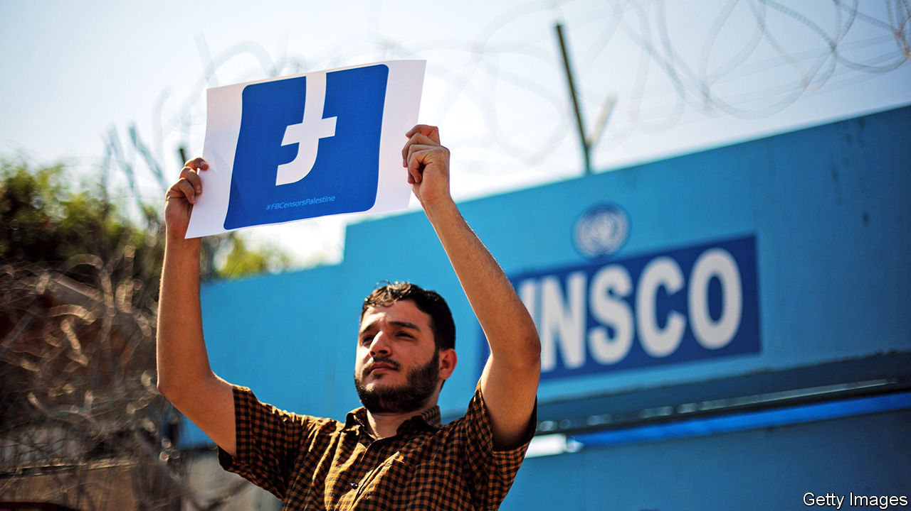

###### With friends like these

# Facebook has been bending to the will of Arab despots 

##### Activists are finding it hard to stay on the right side of the company’s rules 

 

> Jul 4th 2020 

FOR SARIYA AL-BITAR, an architect in Syria’s war-torn city of Idlib, the message was devastating. “Your account has been permanently disabled for not following our Facebook Community Standards,” read the note from the social-media giant. “Unfortunately, we won’t be able to reactivate it for any reason.” Fourteen years of family photos, reminiscences and his diary of Syria’s civil war—along with his list of 30,000 followers—were erased. Mr Bitar had tried to be careful. He had not called dead rebels shahids (martyrs) or posted gore. He suspects Facebook silenced him for commemorating a Syrian football star who, after months of protesting, picked up arms and was killed by the regime of Bashar al-Assad.

In a region ruled by despots, Facebook claims to give “free expression maximum possible range”. That has won it a vast following. The platform has more users in the Gulf states than anywhere else in the world, relative to the population. It is the main source of news for many Arabs. Some even credit it for the Arab spring protests of 2011. But since going public in 2012, Facebook has grown more mindful of the authoritarians who provide it with access, say critics, and less hospitable to activists. In recent months it has culled hundreds of users from Tunisia to Iran and deleted hundreds of thousands of posts. “Many people feel that Facebook is no longer a platform they can use to hold the powerful to account,” says Marwa Fatafta of Access Now, a pressure group. Add to that Facebook’s challenges in America, where it has lost a slew of advertisers over its failure to police hateful content (see ).


Size is part of the problem. Facebook has 2.7bn users, many of whom write in foreign languages. Their posts are vetted for hate speech and incitement. But the firm’s 15,000 content moderators struggle to cope. Most do not know Arabic and its dialects. So the firm relies on automated filters, which make mistakes. They screen flagged words, but cannot detect cultural nuance or satire. Facebook rarely explains why it deletes content. “Despite a huge number of users in the global south, they are largely excluded from the conversation,” says Wafa Ben-Hassine, a Tunisian-American human-rights lawyer.

Facebook is bound by American law, which counts some key players in the Middle East as terrorists. Iran’s Islamic Revolutionary Guard Corps, Hizbullah, Hamas and a raft of other armed Islamist groups are banned. Occasionally American media outlets give members of these groups airtime, but Facebook has a rigid interpretation of the law against aiding and abetting terrorists. More troubling is how it bans people sympathetic to these groups—or removes content that simply refers to them. Even Hizbullah’s opponents spell the militia’s name with a space between each letter to prevent Facebook deleting their posts.

Arab governments have passed laws against cybercrime and online terrorism to cow social-media firms and their users. Facebook “tries to comply” with local codes. It has opened an office in Dubai to liaise with officials in the region. “Digital platforms try as much as they can to collaborate with regulators to avoid the consequences of violating local regulations,” says a Gulf official. Dissidents concur.

Governments use more subtle forms of pressure, too. They have threatened to tax Facebook’s in-country earnings and lean on advertisers. Many also operate electronic armies to bombard Facebook with content, often complaining about opposition groups. A watchdog backed by Israel called Act.IL claims to have 15,000 “online volunteers” from 73 countries keeping an eye on the platform. As a result, say critics, Facebook screens content by Palestinians far more vigorously than posts by Israelis.

In an effort to restore user confidence, the firm recently deleted hundreds of fake accounts promoted by Saudi Arabia, Iran and Egypt. In May it unveiled a new oversight board which will act as its “supreme court”. It will hear appeals and monitor government websites for incitement. “Official terrorist designations will not necessarily be binding on us, especially when they come from authoritarian governments that misuse terrorism to abuse opponents,” says Tawakkol Karman, a Yemeni journalist and Nobel laureate who is one of two board members from the Middle East. More such thinking is needed. ■

