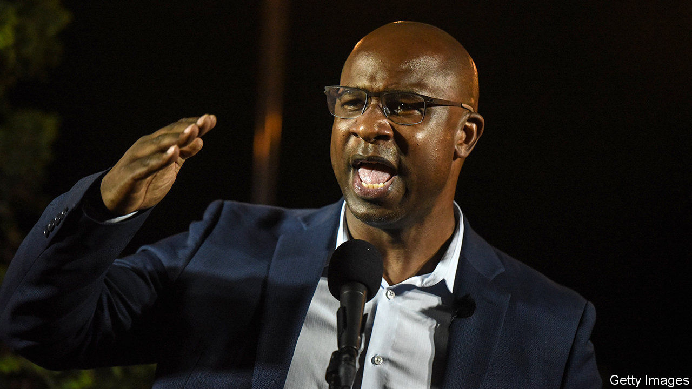

###### Left ahead

# The progressive left celebrates some notable Democratic primary victories 

##### This will not change the make-up of Congress. But it could make Nancy Pelosi’s job a lot harder 

 

> Jul 4th 2020 

“I AM A BLACK MAN in America,” said Jamaal Bowman, a former headmaster, during his victory speech on June 23rd. “At a very young age as a black man in America, you get to learn about death and homicide.” He had just claimed a primary victory over Eliot Engel, who has represented New York’s 16th congressional district for three decades and, as chair of the House Foreign Affairs Committee, is one of the most senior figures in the Democratic Party. Mr Bowman called his upstart success a defeat for a system that “is literally killing us”.

It is also part of a wider shift. In the wake of the coronavirus epidemic and racial-justice protests, self-proclaimed progressives (many of them African-American) are ousting moderate incumbents all over America. “A new generation of leaders is transforming the Democratic Party,” claims Waleed Shahid of Justice Democrats, one of several leftist groups pushing policies such as Medicare for all, a green New Deal and free public universities. The result may not affect the balance of the next Congress, but it could bedevil the job of managing a likely Democratic majority.


Mr Bowman’s message resonated in one of New York’s poorer districts, which is 60% black or Hispanic. A similar message resonated in the nearby 17th district, where Mondaire Jones, a former prosecutor, is leading a crowded primary race. Assuming Mr Jones wins the general election in November, he would become the first gay black congressman. In the 15th district a third left-winger, Ritchie Torres, could become the first gay black Latino in Congress.

Surprisingly, such campaigns are succeeding beyond traditionally liberal New York. Leftists have unseated figures backed by the official Democratic Congressional Campaign Committee in Illinois’s third district, Virginia’s fifth and New Mexico’s third, where a celebrated former CIA agent, Valerie Plame, went down to defeat. Concerns about criminal justice have resulted in a slew of radicals running for posts such as district attorney or sheriff. All these, says Yvette Simpson of Democracy for America, another campaigning group, “are new sorts of candidate, people who never thought they had the right to anything.”

Progressives did not win everywhere, of course. But they showed how far they have come even where they lost. In the contest to become the Democrats’ Senate candidate in Kentucky, a 34-year-old state congressman, Charles Booker, came within a whisker of defeating Amy McGrath, even though she had official party backing, a vast financial advantage and seemed, as a white Marine pilot and fiscal conservative, a better fit for a deeply Republican state than an African-American progressive who supports reparations for slavery. “There’s no question in my mind that Democratic primary voters want to vote for black candidates more than they did several months ago,” says David Wasserman of the non-partisan Cook Political Report.

Upstart organisations matter as much as upstart candidates. Two groups connected with Vermont politicians provide campaign advice and endorsements: Democracy for America, set up by Howard Dean in 2004, and Justice Democrats, founded by staffers from Bernie Sanders’s campaign in 2016. A group called Real Justice focuses on “down-ballot” races, such as for district attorneys. And Colour of Change and Black Lives Matter Global Network provide issue advocacy, grassroots organisation and voter mobilisation.

These organisations, many only a few years old, are rolling in cash and volunteers. Membership in Colour of Change rose from 1.4m to 7m in a few months. “Unprecedented,” says its head, Rashad Robinson. ActBlue, an online platform enabling donors to give money to Democratic causes, raised $40m in 24 hours in early June. Mr Shahid argues that new fundraising and campaigning technology is doing what new tech always does: enables upstart organisations to compete with established groups such as the Democratic Party.

The splurge of cash and volunteers could be a fleeting product of the George Floyd protests. But left-wing groups are benefiting from longer-term trends, too. “Millennials are historically liberal,” says Sean McElwee of Data for Progress, a think-tank; 54% identify with or lean towards Democrats, only 38% do the same for Republicans—compared with 50% and 42% for all registered voters. Public opinion seems to be changing, too. In a recent poll by Monmouth University, 57% of voters said the police are more likely to use excessive force against African-Americans than whites; in 2014, the share was only 33%.

Most of the seats being contested are solidly Democratic, so the make-up of the House may not be affected by progressives’ success. But, as Karlyn Bowman, of the American Enterprise Institute, a think-tank, says, “it may have a big impact on Nancy Pelosi [the speaker] and the management of House Democrats.” “The Squad”—four left-wing Democrats elected in 2018—have proved a small thorn in her side. If more join them, then a strengthened left-wing caucus might be able to force its ideas—defunding the police, say—onto a reluctant leadership. ■

Dig deeper:


