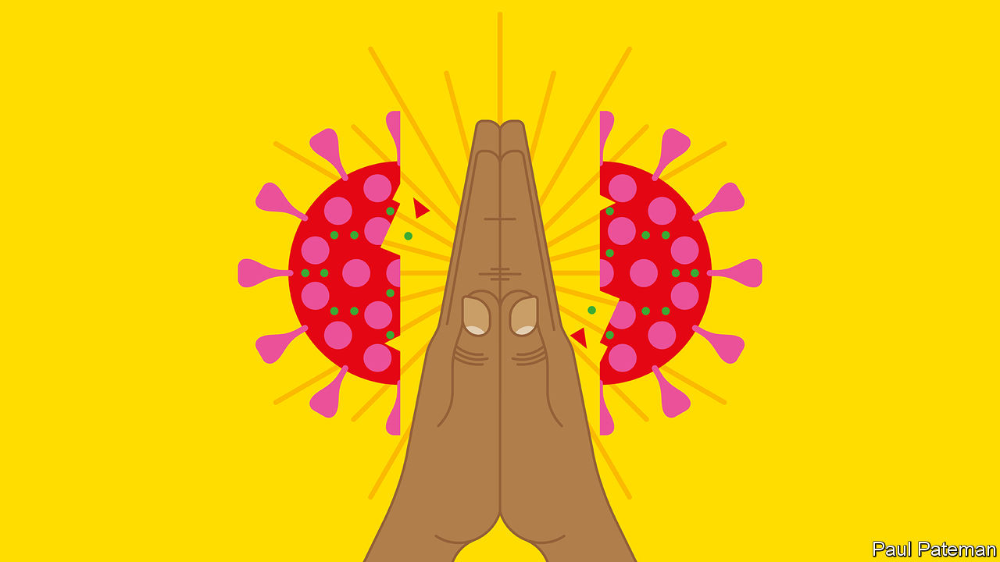

###### Banyan

# Why has the pandemic spared the Buddhist parts of South-East Asia? 

##### Cambodia, Laos, Myanmar, Thailand and Vietnam have had only tiny outbreaks 

 

> Jul 11th 2020 

Editor’s note: Some of our covid-19 coverage is free for readers of The Economist Today, our daily . For more stories and our pandemic tracker, see our 

ONE OF THE bigger riddles of the global pandemic lies in South-East Asia. Despite being close to the source of covid-19, in China, and to one of the current hotspots of the outbreak, India, the partly or largely Buddhist countries of Cambodia, Laos, Myanmar, Thailand and Vietnam have scarcely sneezed.

Vietnam is the standout: with 97m people, it claims no deaths from covid-19. Thailand, with 70m, has seen just 58 fatalities and no local transmission in over 40 days. Impoverished Myanmar claims just six deaths from 317 cases, while Cambodia (141 confirmed cases) and tiny Laos (19 cases) also have no deaths apiece and no local transmission since April. Compare that with the nearby archipelagic nations of Indonesia (some 68,100 cases and 3,400 deaths) and the Philippines (50,400 cases and 1,300 deaths), where the pandemic still rages.


Set aside karmic grace as an explanation, especially given that Vietnam’s communist dictatorship is atheist. Vietnam’s success, indeed, is easiest to explain. The country has a suspicion of its big northern neighbour, China, rooted in millennia of historical interaction. At the start of the year it instinctively distrusted China’s reassurances about the disease and even launched cyber-attacks to get better information on the epidemic’s course. It closed its border and used authoritarian powers to lock down the population and trace and isolate cases. That, in essence, is what China’s communist authorities were also doing.

Few governments have both the overweening power and effective health systems needed to emulate China and Vietnam, but Thailand, a sham democracy overseen by generals, perhaps comes closest. The quality of its health care makes Thailand a popular destination for medical tourism. Moreover, the government was quick to set up a vigorous covid-fighting task-force.

Thailand’s success comes despite close ties with China. Plenty of people-to-people exchanges might have been expected to spread infection. But that has not happened in Laos, which is too small to resist China’s blandishments, Myanmar, which is awash with Chinese traders and smugglers, or Cambodia, whose strongman, Hun Sen, is the region’s biggest cheerleader for China. Chinese construction is reshaping these countries, which all came under pressure not to close borders with China even as the pandemic spread. Mr Hun Sen pointedly travelled to Beijing in February, at the height of the Chinese epidemic. Thailand was welcoming Chinese visitors well into March. Myanmar’s border with China is extremely porous. Why did visitors from China not seed more South-East Asian outbreaks?

One widespread suspicion is that they did, but these were not reported. Testing is severely limited in Cambodia, Laos and Myanmar. Yet, says Frank Smithuis of Medical Action Myanmar, a charity with several clinics around the country, if there had been large-scale transmission, his organisation would have noticed. It is not possible, he says, to hide a covid-19 outbreak—especially in Myanmar, the world’s “gossip country number one”. Experts in Cambodia, Thailand and Vietnam see no evidence of widespread transmission, such as people showing up at hospitals.

Even the poorest countries adopted measures that must have helped check the spread of the coronavirus. Thitinan Pongsudhirak of Chulalongkorn University in Bangkok reports that migrant workers returning from Thailand to their villages in Myanmar often had to quarantine for 14 days in a shack outside their village. Other factors that may have helped, say health experts, include high numbers of people living in the countryside rather than in crowded cities; people more likely to live with fans and open windows than air-conditioning; the relative youth of the region; and a pre-existing proclivity for masks. There may be a religious element, too. The wai, a Buddhist greeting of palms pressed together, helps with social distancing.

The question now is whether South-East Asia’s Buddhist successes can weather second or third waves. Perhaps, Mr Thitinan suggests, low transmission from China was not the miracle some divine—the giant neighbour, after all, quickly got on top of its epidemic. Now, transmission routes are changing. Across Asia, infections are being imported from all round the world, seeding local transmission, most recently in Hong Kong. The crowds this week in South-East Asian temples celebrating the start of Buddhist lent are a reminder of how easy it is to let covid guards fall.

