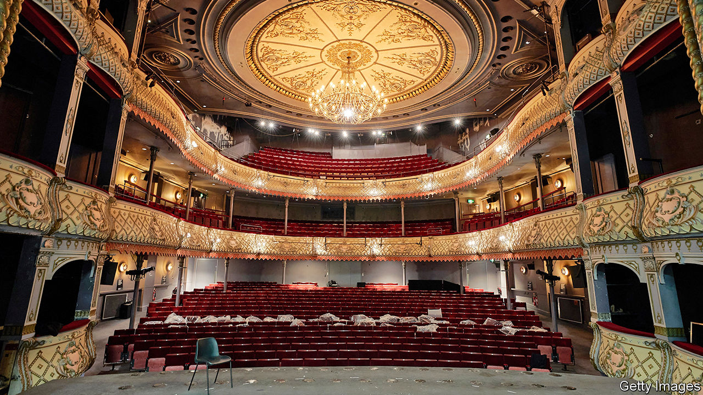

###### Paying for the arts

# A bailout for Britain’s theatres 

##### It won’t mean that the show goes on 

 

> Jul 11th 2020 

THE STAGE is still set. The most recent production at Northern Stage, a theatre on Newcastle University’s campus, was in technical rehearsals when Britain went into lockdown. Props from the show are strewn across the stage. At the back of the auditorium, a bag of popcorn and a bottle of Lucozade lie on a table, as if the crew expected to return at any moment. “This show is ‘Arriving’,” explains Kate Denby, the venue’s executive director. Indeed.

Britain’s performers are in a pause that even Samuel Beckett might think a tad lengthy. Spotlights went off on March 16th and few believe they will be on again soon. The country’s theatres are the liveliest in the world, with more than 5,000 productions a year that generate £1.3bn ($1.64bn) or so in box-office revenue alone. But, as ticket sales dried up, about two-thirds of theatres risked going bust by Christmas. Newcastle’s neoclassical Theatre Royal is making half of its 100 permanent staff redundant; most of the rest will be put on retainers. Only a dozen are at work, says Philip Bernays, its chief executive. “The box office staff are refunding, refunding and refunding. That’s all we do now.”


Ironically, the most commercially successful places are hardest hit, because they rely wholly on box-office revenue. Northern Stage, for instance, has continued to receive its regular grant from Arts Council England (ACE), which makes up two-fifths of its income. The Theatre Royal, a charity that stages crowd-pleasing musicals and blockbuster plays, has lost everything.

So the government’s rescue package for the arts, announced on July 5th, drew much applause. Details remain sketchy, but its support for English venues will total £1.15bn. Left-leaning luvvies are adjusting to a world in which their principal benefactor is a Tory government. Theatres went ahead with a plan to light up their facades in red to highlight their plight on July 6th, despite the unexpected windfall. Mr Bernays chuckles that Tory blue would not be “a good idea in Newcastle”.

Even so, it may not be enough to keep the lights on. As Annabel Turpin of ARC, a venue in Stockton-on-Tees, puts it, much depends on whether the money is treated as “a bail-out or a stimulus”. Organisations like hers, which are small and relatively nimble, can stage productions at short notice to respond to the changing risk posed by covid-19. In the meantime, she will pay performers to work with children in care, the elderly and asylum-seekers.

But many of the most renowned venues, including theatres in London’s West End, are likely to use the money for mothballing, not productions. They need to sell tickets for about four in five seats for every performance just to break even. That is incompatible with social-distancing rules, even if the government lifts its ban on live performances. The Theatre Royal worked out it could seat only 221 people two metres apart from each other or 370 with a one-metre gap; it needs an audience of 1,000 a night to break even. Charities like the National Theatre would be keen to go ahead with some productions anyway, using their grant in effect to subsidise loss-making performances. Commercial producers are unlikely to take the risk. Cameron Mackintosh, an impresario, has cancelled his shows until next year.

The Royal Albert Hall is a venue for hire, so if loss-making concerts were staged there now some of the taxpayers’ money would go into promoters’ pockets. Craig Hassall, the chief executive, says he would find that hard to stomach. “With social distancing, irrespective of the support package, we can’t open our venues. That’s the West End, regional theatres, concert halls.”

Britain’s theatre world looks enviously to South Korea, where “The Phantom of the Opera” is still playing with measures to mitigate infection risks but without social distancing. Andrew Lloyd Webber, who owns seven London theatres, wants the British government to allow something similar. Unless it does, the bail-out is good news for theatres, less so for theatre. ■

Editor’s note: Some of our covid-19 coverage is free for readers of The Economist Today, our daily . For more stories and our pandemic tracker, see our 

