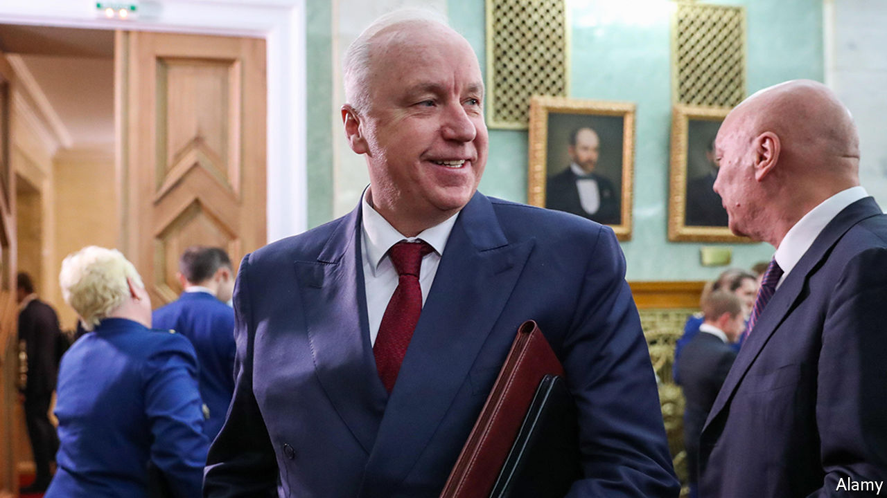

###### From red carpet to blacklist

# Brexit Britain gets its own Magnitsky sanctions 

##### New measures allow the precise targeting of human-rights violators 

 

> Jul 11th 2020 

IN LIFE, SERGEI MAGNITSKY was a thorn in the side of Russia’s kleptocrats. The Russian lawyer paid the heaviest price for uncovering institutionalised tax fraud: he was tortured and died in prison. In death, he haunts them still. America already has a “Magnitsky Act”, aimed at people responsible for gross human-rights violations. On July 6th, the Foreign Office announced its own “Magnitsky” sanctions against 47 individuals and two entities. They went into effect on the same day.

Among those named are 25 Russians whom the government identifies as having contributed to Magnitsky’s mistreatment, including Alexander Bastrykin, head of Russia’s domestic investigative agency and an ally of Vladimir Putin. Another 20 are Saudi Arabian officials involved in the killing of Jamal Khashoggi, a journalist, in Istanbul in 2018. Two Burmese generals and two North Korean government departments round off the list. The government has the right to freeze the assets of those on the list and ban them from entering the country. Those named will no longer, as Mr Raab put it in Parliament, “be free to waltz into this country to buy up property on the King’s Road, or do their Christmas shopping in Knightsbridge, or frankly to siphon dirty money through British banks or financial institutions”.


Britain’s sanctions regime has until now worked through the UN or EU. Brexit allows the country to fashion its own rules. Indeed, the first piece of Brexit-related legislation passed by Parliament was the Sanctions and Anti-Money Laundering Act, says Maya Lester, a sanctions lawyer at Brick Court Chambers. It gives Britain the power to impose, change or lift sanctions independently. A Magnitsky clause was added after Russian agents poisoned five people in Salisbury in 2018.

There is some debate about whether Britain could have set up Magnitsky sanctions while in the EU. That the Baltic countries have done so suggests it could. But similar efforts at the European level, which would require unanimous support, have foundered. It “demonstrates [Britain’s] desire to go out on their own”, says Adam M. Smith, a lawyer and former sanctions official in the Obama administration. He characterises the move as “unilateral in style and multilateral in approach and impact”. Magnitsky legislation is a fulfilment of a manifesto pledge and Mr Raab, who has been calling for such an act since 2012, has achieved a rare political feat: delivering something he genuinely believes in.

What impact the sanctions will have is debatable. According to Andrew Wood, a former British ambassador to Russia, the measure does at least have an “emotive effect”, in the sense that people who would like to do business in Britain or have their children live there might feel more vulnerable. But there is “astonishingly little evidence” that their countries “will realise the errors of their ways and somehow change their own policies”, says Mark Galeotti, a Russia expert at the Royal United Services Institute, a security think-tank.

A likelier effect is a further chilling of relations between Britain and Russia, which finds Magnitsky sanctions particularly irksome. (Lifting the American ones was the focus of a pre-election meeting between Russian lobbyists and Donald Trump’s campaign team.) Russia has promised to retaliate. But, as Jamison Firestone, a London-based lawyer who was Magnitsky’s boss in Russia, puts it, “at some point you have to stop worrying about how things go down in Moscow.”■

