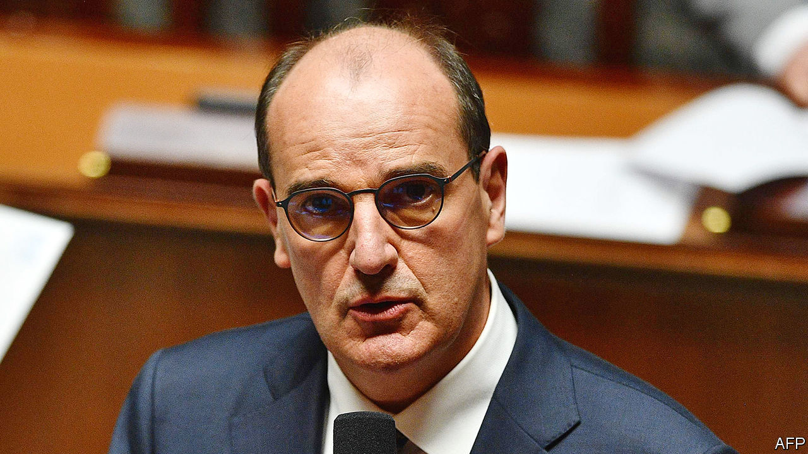
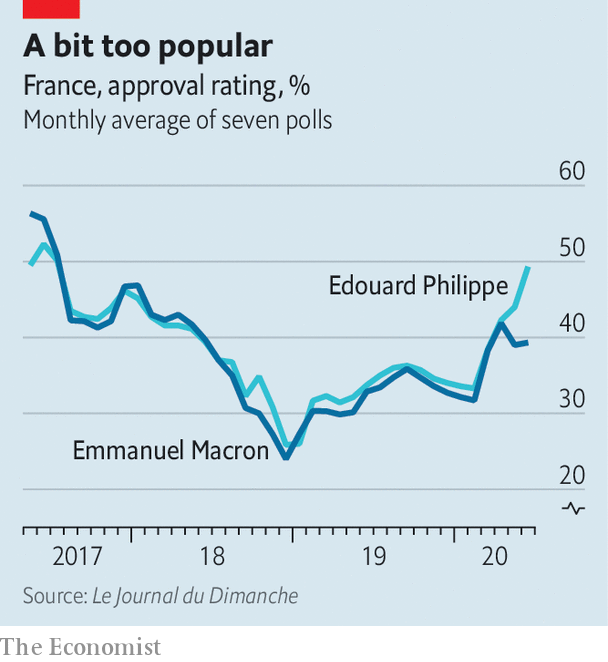

###### L’inconnu

# An unknown prime minister reinforces Macron’s centralised presidency 

##### That may be half the point 

 

> Jul 11th 2020 

IT HAS LONG been a constitutional perk for a French president to treat the country’s prime minister as a shock-absorber: useful for cushioning damage, replaceable when worn out. Under the Fifth Republic, only one president, Nicolas Sarkozy, has governed with the same prime minister for his entire term. It is more unusual, however, to get rid of a prime minister who is popular—and swap him for another that nobody has heard of. Yet that is what Emmanuel Macron did on July 3rd, when he replaced Edouard Philippe with Jean Castex.

For weeks Mr Macron had let it be known that he was working on a “new course” for after lockdown. When his party failed to win a single big city at recent local elections, while the Greens scooped up town halls in places that once voted for him, many observers expected a left-leaning or greener government. So it was to general surprise that Mr Macron replaced one centre-right figure (and graduate of the elite Ecole Nationale d’Administration) with another. A career civil servant, and mayor of a village in the Pyrenees, Mr Castex was until recently the official in charge of France’s exit from lockdown.


Up to a point, it made sense for Mr Macron to seek a change. The next presidential election is in 2022. To wait another year would be to run into early campaigning. Mr Philippe was elected mayor of Le Havre at local elections on June 28th, offering him a dignified exit. The pair had differences, most recently over the pace of déconfinement. But Mr Philippe, say friends, remains loyal. “He will put all his energy into making sure the president is re-elected in 2022,” said Gilles Boyer, his close friend and a member of the European Parliament.

 


Yet the appointment of the 55-year-old Mr Castex, who worked at the Elysée under Mr Sarkozy, does not look much like the “reinvention” that Mr Macron promised. It is neither a shift to the left or the Greens, nor to a new generation. The new government, unveiled on July 6th, is broadly the same as the outgoing one. Occupants of the top posts—Bruno Le Maire at finance, Jean-Yves Le Drian at the foreign ministry, Florence Parly at defence—all kept their jobs.

Besides unexpected appointments to the justice ministry (Eric Dupond-Moretti, an outspoken criminal lawyer) and culture (Roselyne Bachelot, a minister under Mr Sarkozy), the main change is the arrival of Gérald Darmanin as interior minister. Yet another Sarkozy ally, he is Mr Macron’s outgoing budget minister, and—to the consternation of feminist campaigners—has a rape charge hanging over him, which he has denied. The chief nod to the Greens was the appointment of Barbara Pompili, an ex-Green converted to Mr Macron’s party, to the environment ministry.

Those around Mr Macron insist that the new team does represent renewal. Mr Castex, they say, blends knowledge of how to operate the Paris administrative machine with local links to la France profonde. He has a reputation for efficiency at a time when Mr Macron is frustrated with France’s bureaucracy. Mr Castex, with his south-west twang, was re-elected mayor of the village of Prades (population 6,000), and returns there often at the weekend. This might help to shift the perception that Mr Macron’s team is disconnected from the regions. It could also be a nod towards more decentralised decision-making, which the president says he wants in the wake of covid-19 and the gilets jaunes protests.

Yet it is hard to avoid the conclusion that, far from a change of direction, the reshuffle is an acknowledgment that Mr Macron runs everything himself. “The real prime minister”, says one Macronista, “is Macron.” Unlike Mr Philippe, Mr Castex has no national political base. He is said to be no pushover, but nobody doubts where decision-making will lie. “What emerges is a president who has taken stock of what the constitution offers him and is saying, ‘well in that case I might as well centre everything on myself’,” says Chloé Morin, of the Fondation Jean-Jaurès, a think-tank. “Macron locks down Matignon”, declared Libération, a left-leaning daily, referring to the prime minister’s office.

If Mr Macron is now more in charge than ever, this suggests broad policy continuity. That may not be bad news. Before covid-19, France was starting to see the benefits of early tax cuts and reforms to the labour market and training, with new businesses, jobs and apprenticeships. Despite his falling popularity, Mr Macron says he will not go back on these changes, and is expected to revive his contested pension reform, albeit reworked. Yet the economy could shrink by 11% this year, joblessness will rise, and covid-19 is still about. Getting the right balance between the desire for a more caring, greener and safer France, and the need for greater efficiency, will be perilous. The autumn, as Mr Macron himself put it, will be “very tough”. ■

