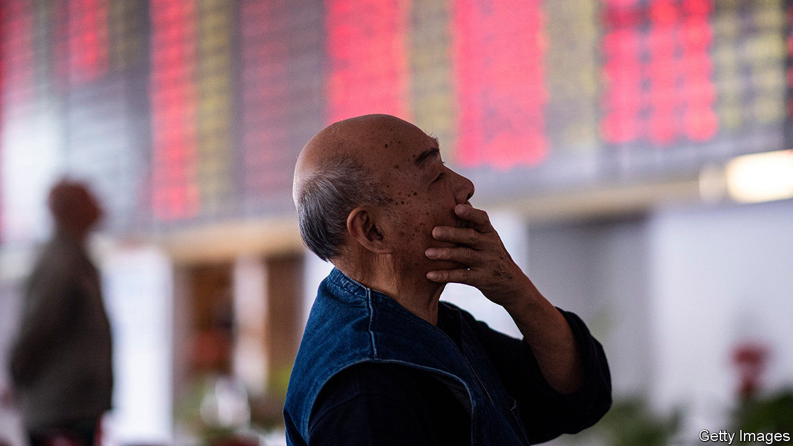
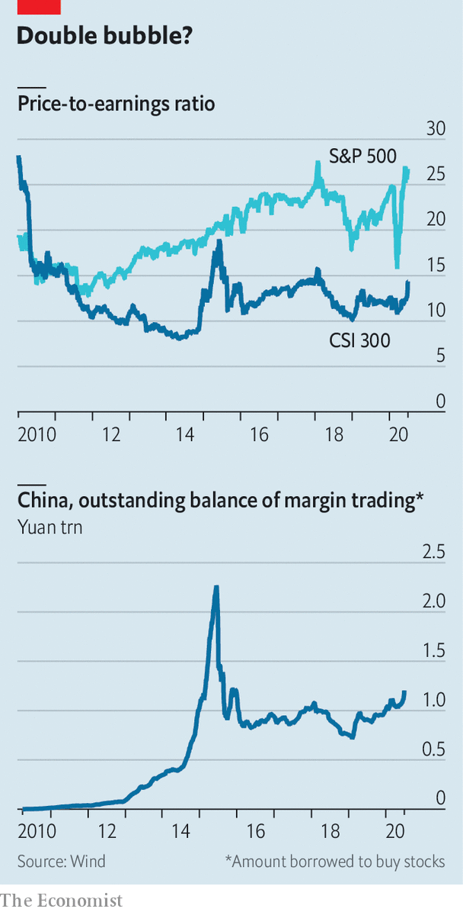

###### A bull market returns

# Stockmarket mania comes to China again. Can it last this time? 

##### There are grounds for optimism but also signs of irrational exuberance 

 

> Jul 7th 2020 

IN CHINESE STOCKMARKET mythology, the rarest of beasts is the slow bull. The past couple of decades have brought two fast bulls: vertiginous surges in share prices, neither lasting more than a year. Those soon led to fast bears when stocks crashed and, eventually, to slow bears as the descent became more gradual. Most of the time there have been what might be termed long worms as the market moved sideways, such that the CSI 300 index, a gauge of China’s biggest stocks, has averaged the same level over the past five years that it first reached back in 2007. The slow bull—a steady, almost dependable, rise year after year, well known to investors in America—has remained elusive.

China’s indomitable punters now hope that a trundling taurus has at last arrived. Stocks have jumped by 16% so far in July and they are up by nearly 40% from their low in March. That might sound like another fast, doomed bull run. But some believe this one will be more enduring than those of the past.


For starters, China appears to be in much better economic shape than other large economies. Because investors must allocate their funds somewhere, there is always a comparative element to stockmarket performance. China is the only big economy forecast to grow this year, and is also expected to record the strongest rebound next year, according to projections published by the IMF at the end of June. There are grave concerns about the toll that the coronavirus might take in America during the flu season in the autumn. By contrast, China has shown every intention of smothering renewed outbreaks. That has given people and businesses greater certainty about the path ahead.

 


Market dynamics also seem to be helping. Even after the rally, valuations in China are reasonable. The CSI 300 trades at 14 times the value of company earnings, far below the 27-times multiple of the S&amp;P 500, America’s most-watched share index (see chart). Foreign investors have more ways to enter China’s previously walled-off market; many are compelled to do so, because its shares are now included in key indices tracked by institutions. During the first three trading days of July, 44bn yuan ($6bn) flowed into Chinese equities via accounts in Hong Kong, a record high for any three-day period.

Although more investors have started buying shares with borrowed money, the outstanding balance of such margin trading is just over half the peak it reached five years ago, during China’s most recent manic run. It is now easier for companies to list shares on the mainland, so new offerings should help absorb some of the cash rushing into the stockmarket. “This lays the foundation for a slow-bull market that could last for ten or 20 years,” says Chang Shishan of Kangzhuang, an asset-management firm.

Nevertheless, it is hard to shake the feeling that the optimists might once again be getting ahead of themselves. The outlook for profitability, which ultimately should determine share prices, is still grim. Over the first five months of 2020, industrial profits were down by 19% compared with a year earlier.

Most worrying is the way that the Chinese media are swinging into cheerleading mode. If past episodes are anything to go by, this is one of the telltale signs of irrational exuberance. “The clicking of the bull’s hooves is a beautiful sound for our post-virus era,” declared a front-page editorial in the China Securities Journal, a state-run newspaper, on July 6th. The Shanghai Securities, its sister publication, was less poetic but more direct in an article that was posted online on July 3rd: “Hahahahaha! It looks more and more like a bull market!” Healthy bulls need only a diet of grass. Injecting them with steroids is an invitation to trouble. ■

