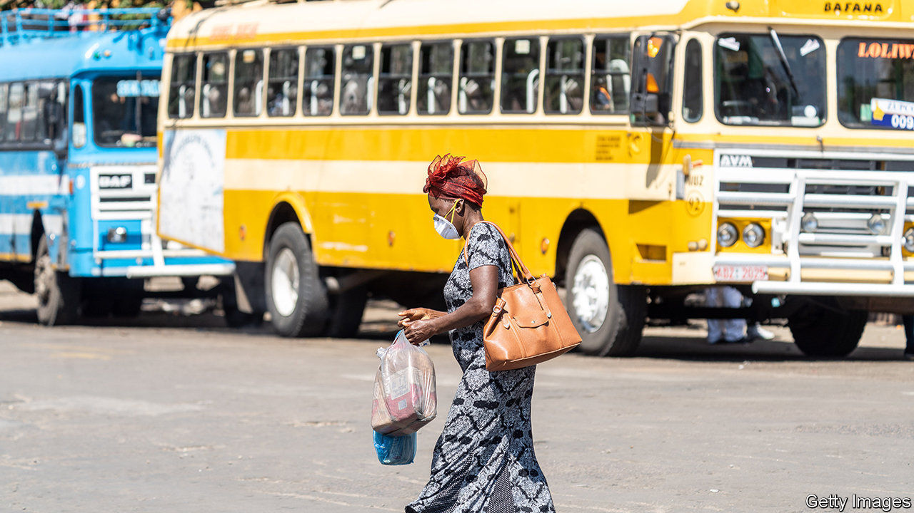

###### For a few dollars more

# Zimbabwe’s worst economic crisis in more than a decade 

##### Its rulers blame covid-19. But they are largely at fault 

 

> Jul 11th 2020 

“TEACHERS ARE starving,” says Tsitsi, who works at a school in a township in Harare, Zimbabwe’s capital. Like nurses, soldiers and bureaucrats, teachers have seen their real incomes evaporate as annualised inflation approaches 1,000%. Their monthly pay, which they receive in Zimbabwe dollars, is worth about $30.

Covid-19 has hurt Zimbabwe. Trade is gummed up. Tourists are unable to go on safari or feel the spray of Victoria Falls. But contrary to the claims of those in charge, the pandemic is not why the economy is in its worst state since the hyperinflation of 2008-9. The reason is the regime itself.


This time there are no 100trn-dollar notes. But there is a familiar lack of faith in the currency, following years of printing money and fiddling with multiple exchange rates. Money is meant to be a store of value and a unit of account. Neither attribute applies to the Zimbabwe dollar. A few years ago the government was claiming that the value of its various forms of local currency was equivalent to an American greenback. Today it is worth about one cent. Businesses want to be paid in American dollars. Nurses and teachers are demanding likewise. Zimbabwe is, in effect, re-dollarising.

The authorities are trying to stop this. On June 26th, in an effort to reduce demand for real dollars, the government said it would ban some mobile-money transactions and shut down the stock exchange. The central bank has introduced a single weekly auction for banks and firms to bid for its scarce supply of foreign exchange.

How long that supply will last is unclear. Zimbabwe seizes a portion of the foreign earnings of exporters and in May it agreed to a $500m loan from Afreximbank, a pan-African lender, using platinum production as collateral. But the economy remains, in the words of one financier, “a giant Ponzi scheme”.

Under President Emmerson Mnangagwa, who took over from Robert Mugabe after a coup in 2017, there was supposed to be “a new dispensation”. He has even suggested that white farmers whose land was stolen by Mugabe would receive compensation. But his regime has, like Mugabe’s before it, killed, arrested and abused protesters. Largely as a result of this, Western governments have rejected its pleas for help from the IMF and World Bank.

As the economy shrinks, fighting over the spoils may become more vicious. Many in the army feel they have not received sufficient rewards for the risks they took in toppling Mugabe. Some resent the role of Kudakwashe Tagwirei, a businessman close to the president, whose firms have won many government contracts.

Mr Mnangagwa has stuffed ministries and his office with allies, many of whom hail from his home region. Some have been accused of graft, including, most recently, the health minister, Obediah Moyo, who allegedly agreed to a deal that included $28 face-masks. (Mr Mnangagwa’s son, Collins, whom local journalists have linked to the deal, has denied any involvement.)

In a sign of the heated atmosphere in Harare, on June 10th security officials held a press conference in which they assured reporters that there was no imminent effort to depose Mr Mnangagwa. “For the avoidance of doubt, there is no coup in the making,” said Kazembe Kazembe, the home-affairs minister. Since few people had sensed one in the first place, the event simply increased speculation.

Zimbabwe has long proved adept at finding new depths to plumb. But the difficulty for the regime is that, in the midst of a pandemic, ordinary Zimbabweans have fewer ways to survive. An indefinite lockdown makes it hard to “engage in any side hustles”, like raising chickens, says Tsitsi, the teacher. Then there is a bitter irony: though schools will reopen on July 28th, many teachers will not be able to afford the fees. “We will be teaching other people’s kids while ours stay home,” she says. ■

