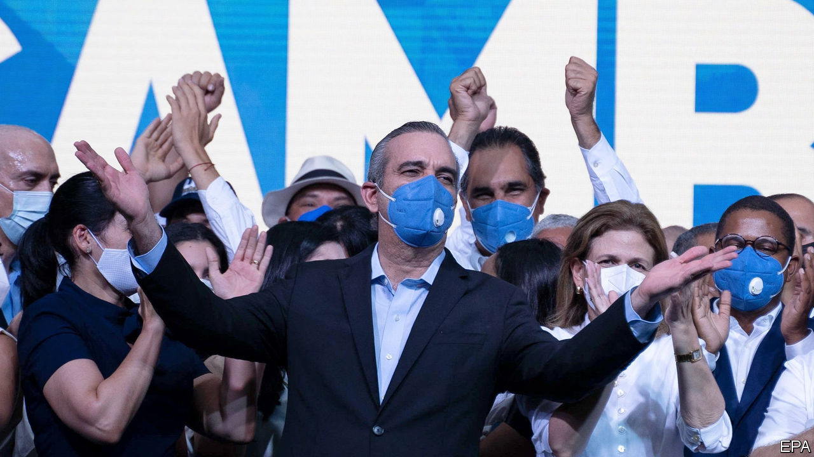

###### A rare power shift

# The Dominican Republic changes its ruling party 

##### The new president has a solid mandate, but the pandemic and a severe recession will hobble him 

 

> Jul 8th 2020 

FOR A WHILE the Dominican Republic seemed doomed to a year of electoral chaos. Local elections in February were cancelled halfway through polling day because new voting machines malfunctioned. (A manual re-run in March succeeded.) A general election was due in May but covid-19 forced a two-month delay. To postpone it further would have required a constitutional change. When it went ahead on July 5th, chaos gave way to clarity. More than half of voters picked Luis Abinader, a businessman, to be president. That avoided a run-off. Early results suggest his Modern Revolutionary Party (PRM) will have majorities in both houses of Congress.

Mr Abinader’s victory unseats the Dominican Liberation Party (PLD), which has ruled for 20 of the past 24 years. Although power transfers in the country are rare, they do not necessarily bring change. Dominican politics is characterised by consensus on business-friendly centrism, and a propensity for corruption, clientelism and infighting that weakens, but does not prevent, its implementation. Mr Abinader must fight those old plagues while tackling the new one, which threatens to do lasting damage to the economy.


The outgoing president, Danilo Medina, is unpopular but accomplished a lot. The murder rate fell from 22 per 100,000 people in 2012, when he took office, to below ten in 2019. Mr Medina doubled education spending to 4% of GDP, complying with a law passed in 1997. He made school days longer and offered free school lunches. Over the past decade the economy of the Dominican Republic, which has 11m people, was the fastest-growing in Latin America. At his first inauguration Mr Medina promised to cut the official poverty rate in half to below 20%. He succeeded.

He stumbled in his second term. Odebrecht, a Brazilian construction firm that bribed officials across Latin America, found eager takers in the Dominican Republic. The $92m it paid there between 2001 and 2014 was exceeded only in Brazil and Venezuela. Mr Medina’s government investigated predecessors’ misdeeds but not its own. The two most recent attorneys-general sat on the PLD’s governing body.

Mr Medina tried and failed to change the constitution so he could run for a third term. That worsened a decade-long spat with Leonel Fernández, a former president who belonged to the PLD and hoped to be its candidate again. Mr Fernández ran this month for a rival party, helping to doom the candidacy of Gonzalo Castillo, a businessman who is Mr Medina’s political heir.

Mr Abinader, who studied management in the United States, is “slightly boring”, says Leiv Marsteintredet, a professor at the University of Bergen in Norway. His campaign was low-profile, partly because he contracted covid-19 and self-isolated.

The pandemic will do more damage to the new president’s programme of government. “Our first priority is formal employment,” says his manifesto. It pledges that his government will create 150,000 formal jobs a year. About that many jobs are created now, but just 30% are relatively high-paying formal ones, says Roberto Álvarez, an adviser to Mr Abinader. Some of the new jobs are to come from 15,000 hotel rooms that Mr Abinader hopes will appear along the beaches. He has also promised to balance the budget, which had a deficit last year of 2.2% of GDP. With the economy expected to contract by 6.5% this year, he will meet none of those goals soon.

Mr Abinader will be in a stronger position to fight the twin plagues of corruption and covid-19. A majority in Congress, if the PRM wins one, might reduce the need for grubby dealmaking with other parties. Mr Abinader has promised to pick an independent-minded attorney-general and provide more money to the office. New covid-19 cases are rising rapidly, in part because the country loosened its lockdown in the approach to the election. The current government may tighten it again, even before Mr Abinader takes office on August 16th. The Dominican Republic overcame electoral chaos. Vanquishing the virus and the recession will be harder.■

