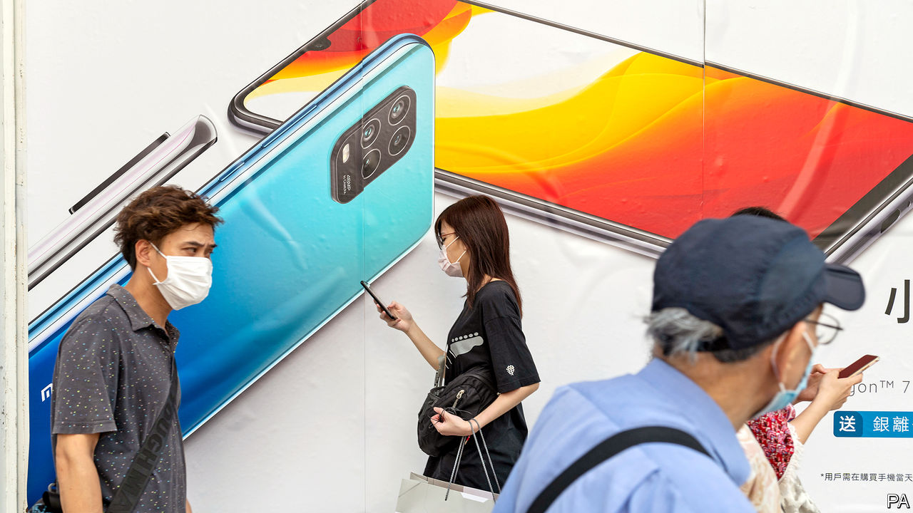

###### 

# Business this week 

#####  

 

> Jul 11th 2020 

Google, Facebook, Microsoft and Twitter have all suspended processing requests for user data from the government of Hong Kong while they consider the implications of the draconian new national-security law imposed on the territory by the government in mainland China. None has a big business presence in China. See .

A hostile environment

Sina, which in 2000 became the first Chinese internet company to list on the Nasdaq, received an offer from Charles Chao, its chairman and CEO, to take it private. That prompted speculation about the possibility of other Chinese tech firms exiting American stockmarkets to escape any forthcoming regulatory clampdown that targets Chinese firms.


United Airlines sent out notices to 36,000 employees warning that their jobs could be at risk when federal support for the aviation industry stops. The list includes 2,250 pilots. The hopes of airlines for a small improvement in travel have been dashed by the new surge of covid-19 cases in America, which now top 3m.

A judge dismissed a lawsuit from General Motors which had accused Fiat Chrysler Automobiles of collaborating with union leaders to drive up wages at GM in order to force the company into a merger. The judge said GM had failed to prove it was a victim.

Uber struck a deal to buy Postmates, America’s fourth-biggest food-delivery service. At $2.65bn, it is a bite-size transaction compared with the recent takeover of Grubhub, which Uber had wanted to acquire; Just Eat Takeaway snapped it up instead for $7.3bn. Postmates, which has a strong presence in Los Angeles, Phoenix and San Diego, will still operate as a separate app from Uber Eats.

Rishi Sunak, Britain’s finance minister, announced more measures to help the pandemic-hit economy. Companies that bring back furloughed workers during the three months starting with November will be given a £1,000 ($1,260) bonus for each job saved. Stamp duty, the main tax on buying homes, will be suspended until March for purchases of less than £500,000, a boost to the housing market and its many associated services. Help was also dished out to restaurants and eateries: during August the government will subsidise each diner to the tune of £10 from Mondays to Wednesdays. See .

Turkey’s stock exchange banned six foreign banks, including Barclays, Credit Suisse and Goldman Sachs, from betting against Turkish share prices. The country’s market regulator had only just lifted short-selling restrictions on the biggest companies. Turkey’s latest action fits a pattern of interfering in markets, such as temporarily excluding three foreign banks from trading in the lira earlier this year.

António Horta-Osório said he would step down as chief executive of Lloyds Banking Group, one of Britain’s biggest banks, next June. Mr Horta-Osório took up the job in 2011, and has been praised for steering Lloyds out of public ownership in the aftermath of the financial crisis. It returned fully to private ownership in 2017, when the government sold its remaining shares.

Intesa Sanpaolo, Italy’s second-biggest bank, formally launched a takeover offer for  ubi Banca, the fifth-biggest, despite being rejected by UBI’s board.

Dominion Energy agreed to sell its gas transmission and storage assets to an affiliate of Berkshire Hathaway for $9.7bn. Dominion is investing heavily in clean energy in order to reach a target of net zero carbon and methane emissions by 2050. For Warren Buffett, Berkshire’s boss, it is another big bet on fossil fuels, following the $10bn funding he put towards Occidental’s takeover of Anadarko last year.

Russia’s environmental watchdog imposed a record penalty on Nornickel (also known as Norilsk Nickel) for a fuel spill in May that released 21,000 tonnes of diesel into rivers and subsoil near the city of Norilsk, located above the Arctic Circle. The fine, equivalent to $2.1bn, represents a third of the nickel-and-palladium producer’s net profit last year. It “disputes the amount of damage caused to the environment” resulting from the incident.

Brooks Brothers, founded in 1818 and the oldest retailer of men’s clothing in America, filed for bankruptcy protection. Privately owned, Brooks has outfitted American presidents and been a purveyor of the finest sartorial elegance to countless businessmen, and, continuously from 1976, businesswomen. Even before the pandemic its business had to contend with the fashion for more casual office attire among executives.

Maybe if they made a onesie

The popularity of loungewear and loose pants during the lockdown is possibly one reason why Levi Strauss suffered a 62% slump in quarterly sales. The maker of tight jeans is slashing 15% of its staff.

