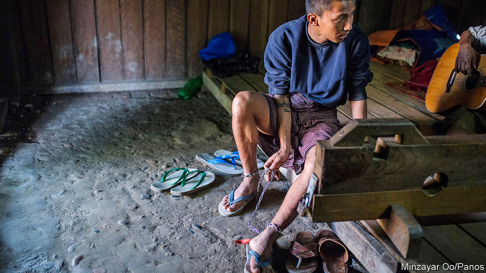
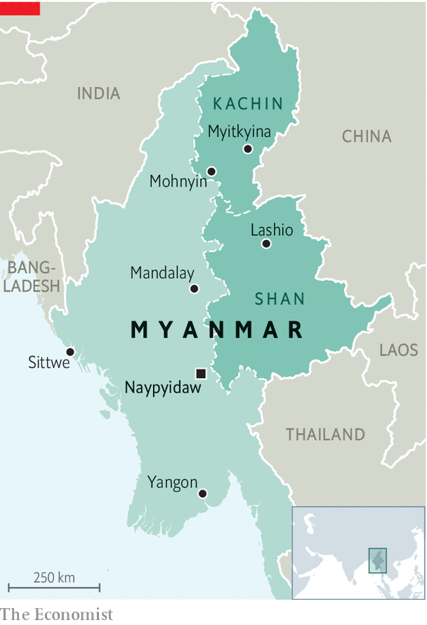

###### Myanmar vice

# Illegal drugs have become deeply rooted in Burmese society 

##### Vigilantes say they have no alternative but to take the matter into their own hands 

 

> Jul 18th 2020 

UNDER COVER of darkness, one night in 2017, Seng Naw and some 150 like-minded men revved up their trucks and drove a couple of miles from the town of Mohnyin in Kachin state, in remote northern Myanmar. Where the rice paddies give way to forest and mountains they found something that resembled a “festival”, according to Mr Seng Naw: scores of youths lolling about, high on heroin and methamphetamine sold to them by several dealers on the scene. It was 4am or thereabouts, by which time Mr Seng Naw knew the junkies would be too far gone to put up a fight, though some of his crew had brought clubs just in case. They rounded up the group—96 users and four dealers—packed them into the trucks and deposited them at the town’s police station.

That was Mr Seng Naw’s biggest haul. He is vice-president of the Mohnyin branch of Pat Jasan, a vigilante group trying to stamp out drugs. It was founded in 2014 by several prominent Kachins, a largely Christian ethnic group, who were dismayed by the havoc drugs had brought to their community. In Mohnyin, Mr Seng Naw says, people would regularly use drugs in public: on streets, in paddyfields, at university, even in a cemetery. As the number of addicts in Kachin state soared, so did violent crime, says Hpala Lum Hkao, a Baptist pastor and Pat Jasan’s secretary-general. The government could not, or would not, tackle the crisis. So they decided to pat jasan—“sweep and clean”.


There are no reliable data on the number of addicts in Myanmar, but the Transnational Institute, an international research outfit, believes the problem is severe. The official tally of “injecting drug users” has risen steadily over the past decade, to 93,000. But in the past five years methamphetamine, which is typically heated and the fumes inhaled, has supplanted heroin as a “drug of concern”, according to the government. It is cheap and readily available. Mai Kaung Saing, a journalist who reports on northern Shan state, which borders Kachin state (see map), estimates that 30% of the local population uses drugs, primarily heroin and meth. The problem is national. “Every family has been affected by drug-use issues,” says Tom Kramer of the Transnational Institute.

 


The surge in addiction is a symptom of the country’s central role in the drug trade. For decades assorted militias, some almost completely autonomous and others at war with the government, have controlled much of Myanmar’s border regions, especially in Shan and Kachin states. Many of the gunmen, and some of the soldiers sent to fight them, are involved in the drug trade. In the 1970s and 1980s Myanmar became the world’s biggest source of opium and heroin, and remains the second-biggest producer today. In 2018 sales of illegal opiates accounted for 1-2% of its GDP, according to the UN.

Since the 1990s Myanmar has also been producing meth which, like heroin, was initially intended for export. Gradually, however, as supply has increased and prices have declined, a domestic market has emerged. In Lashio, a city in northern Shan state, four yaba (meth) tablets can be bought for about $0.75. Many users find meth helps them work long hours or in arduous conditions, as truck drivers or miners; others are young and bored.

The International Crisis Group, an NGO based in Brussels, reckons the drug trade contributes more than any other industry to Shan state’s economy. In eastern and northern Shan state, “people get paid in yaba, they trade in yaba,” says David Mathieson, an analyst. So when vigilante groups like Pat Jasan cracked down in 2015 and 2016, it depressed the local economy. 

The authorities have little incentive to tackle the trade. Police rarely pursue drug-traffickers. Sometimes they are users and dealers themselves: members of Pat Jasan have on several occasions inadvertently arrested officers, says Mr Hpala Lum Hkao. Sometimes they are simply too scared to arrest anyone but small-time dealers, says Mr Mai Kaung Saing. Some of the militias in drug-producing areas are even more deeply steeped in the trade, either providing protection to drug rings or running them themselves.

Kachins like Mr Seng Naw have refused to stand idle as their community becomes hooked. Pat Jasan, which claims to have 10,000 volunteers at its beck and call, is the biggest, most organised vigilante group in Myanmar, and has “a lot of energy”, according to Mr Kramer. It says it has destroyed 3,000-4,000 hectares of poppy fields, launched numerous campaigns to educate people about the harms of drugs, and arrested dealers and users, some of whom have ended up in their “rehabilitation” centres. Mr Hpala Lum Hkao says the group has opened 77 in total, though some have since closed down. Treatment consists of prayer, physical activity and the odd bath to dull the pain of withdrawal. Addicts there against their will are sometimes placed in stocks or shackled for the first few days, to ensure they do not escape. 

This punitive approach to treating addiction is the norm in Myanmar, says Mr Kramer, even though it is highly ineffective: around 80% of those forced into treatment will relapse. Even Mr Hpala Lum Hkao concedes that once the inmates have been released from Pat Jasan’s centres, they frequently fall back into their old habits. Some officials are coming round to the idea that there are more humane and effective methods of treating addiction, says Mr Kramer. But curing addiction in Myanmar will take more than an evidence-based approach to treatment. It will involve ending the long civil war in Kachin and Shan states and stemming the flood of drugs. Until then, Messrs Hpala Lum Hkao and Seng Naw will remain on high alert. ■

