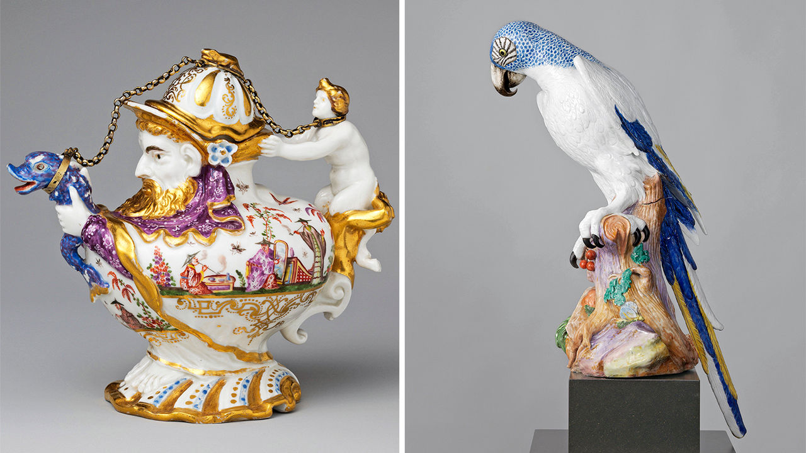

###### Shifting plates

# An enlightening history of German porcelain 

##### It is both a precious industry and a fragile one 

 

> Jul 16th 2020 

Porcelain: A History from the Heart of Europe. By Suzanne Marchand. Princeton University Press; 544 pages; $35 and £30.

IT SOUNDS LIKE a fairy-tale. A visionary alchemist, arrested by a tyrannical ruler, is put to work turning scraps into riches. Yet for a few years in the early 18th century Johann Friedrich Böttger was a genuine Rumpelstiltskin. Seized by Augustus the Strong, elector of Saxony, after he crossed Prussia’s frontier, Böttger was imprisoned and ordered to conjure up treasure—and, in a sense, he did. He didn’t make gold, but Böttger was the first European to create something almost as precious: porcelain.


As Suzanne Marchand shows in her meticulous new book, porcelain has been integral to German life since its reinvention in Saxony in 1708 (the Chinese perfected the craft centuries earlier). It was initially a plaything for princes, as Böttger’s incarceration suggests; Augustus and his rivals sponsored state-run factories for what one called the “splendour and prestige” of their realms. From that beginning, Ms Marchand traces porcelain’s role in German history, examining its uses from Romantic busts of Goethe to Nazi egg cups.

“Porcelain” is about more than culture. Because the commodity was prized and produced over centuries, the author uses it to explore wider economic changes. Ultimately it became thoroughly industrialised—porcelain’s use in false teeth and telegraph insulator tubes leads Ms Marchand to call it the plastic of its day—but the path to modernity meandered. Several early factories, including the famous one at Meissen, were just converted palaces or monasteries, run by courtiers in powdered wigs. Some idiosyncrasies survived into the 20th century: though they hated all things aristocratic, East German officials brought back classic rococo figurines after Marxist alternatives proved unsellable.

Despite its winding economic narrative (and piles of manufacturing statistics), “Porcelain” is rarely a grind. Ms Marchand writes wittily about subjects from bourgeois views on tableware to Weimar advertising, veering away from tea sets and vases when she spies an interesting vignette. “Fox tossing”, she relates, was a popular pastime for 18th-century courtiers (the animals were hurled into the air until they died). King Frederick the Great of Prussia recruited hundreds of invalids from a state hospital literally to sniff out illegal coffee-roasters in Berlin and Potsdam.

The porcelain-makers themselves were often as fascinating as Böttger. After running away from home to become a cowboy, for instance, Philipp Rosenthal made a fortune in porcelain—before being ruined by the Nazis. Ordinary workers led colourful lives too. One report of 1796 describes how employees at a firm in Fürstenberg drank schnapps at work or skived off to go hunting. Their successors in the 1940s spent their time dodging Allied bombs and repairing shattered windows.

Today German porcelain-makers face different threats. Chinese imports are undercutting them. Tastes have evolved: polystyrene cups have long replaced elegant coffee sets in many situations. Between 2006 and 2014 alone 190 German porcelain firms closed. Soon, writes Ms Marchand, production may return entirely to East Asia, where porcelain was first invented. The story that began with Böttger could become just another fairy-tale. ■

