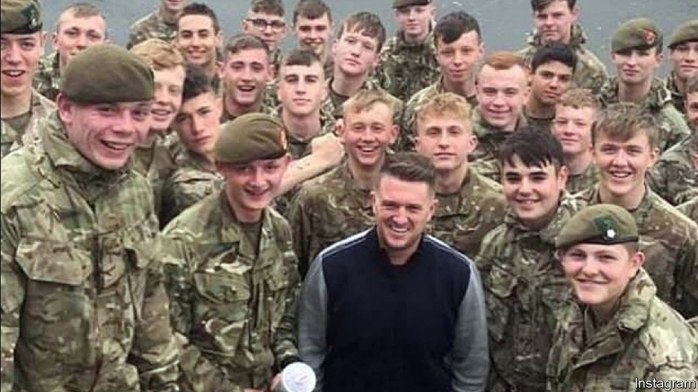

###### The armed forces

# Black Lives Matter and the British army’s culture war 

##### Officers and squaddies march to a different tune 

 

> Jul 18th 2020 

“I  ALWAYS GET asked to be a suicide bomber” in training exercises, reveals a British soldier of North African descent. The role has its perks: spending an afternoon far away from barked orders, waiting to ambush a passing patrol. But with his fellow troops eagerly wrapping a rag around his head, he found it hard to ignore the profiling. “I wouldn’t term it abuse, I would term it racial ignorance on a staggering scale. It’s a group of people who are naturally attracted to a particular political ideology, and don’t want to engage with political correctness.”

The army’s job is to fight the queen’s enemies, and the fact that they have often been of a different colour to her is embedded in its culture. A non-white reservist says friends ask him why he “wants to fight a white man’s war”. Once a year his regiment sits down to watch “Zulu”, a film about a bloody battle between British soldiers and African tribesmen. He says that the atmosphere isn’t racist, but “you can see how there might be some negative connotations amongst the junior ranks.”


Nicola Williams, the Service Complaints Ombudsman, said in December 2019 that “incidents of racism are occurring with increasing and depressing frequency.” The army is trying to change this, and says of instances of racism The Economist put to it, such as the one above, “There is no place for racism in the military and anyone behaving in this way can expect to be disciplined or dismissed.” Last month, General Sir Nick Carter, the head of the armed forces, wrote to every soldier to say that the army supports Black Lives Matter (BLM). A few weeks later, central command waived the usual rule that politics is off-limits by letting troops attend BLM protests.

Senior staff hope that supporting BLM will send a positive signal. The young cohort from which the army recruits is more ethnically diverse than the population as a whole. Black and minority ethnic (BME) troops make up 8.8% of the 145,000-strong armed forces, which is in line with the population, but that includes 3,760 Gurkhas, around 1,300 Fijians and other non-white troops recruited from Britain’s former colonies. So it needs to improve its image among BME people to keep its numbers up.

This new approach also reflects the increasingly liberal views of senior staff in the armed forces. A growing professionalism has raised entry and training standards while making promotion more meritocratic. Once a cadet at Sandhurst, Britain’s officer-training academy, was a bit like Prince Harry: an Old Etonian, with deep family ties to the army, who was rather dim and prone to using racial slurs (as the young prince did as a Sandhurst cadet in 2009). Nowadays cadets are more likely to share the prince’s current views on race. The public-school contingent has been reduced to under half of Sandhurst’s intake. Socially mobile graduates now dominate.

Private soldiers still tend to come from low-income families in white working-class towns where social attitudes are more conservative. A BME soldier describes fellow squaddies as having a “hillbillies in the Deep South who voted for Donald Trump mentality”. A lance corporal was jailed in 2018 for joining National Action, a fascist group. Later that year a group of soldiers caused outrage after posing for photographs with Tommy Robinson, a far-right activist. Some of the counter-protests to BLM were organised by veterans who claimed to be guarding war memorials from potential vandalism. A black reservist says, “I’ve been surprised with the amount of people who have come out with the ‘All Lives Matter’ mantra, and then actually having to sit down with NCOs [non-commissioned officers] and explain the whole situation to them.”

The shared conservatism which once helped officers and troops to overcome class distinctions has now gone. There is a growing division in attitudes between commissioned officers, who see liberal reforms as necessary, and squaddies, who think political correctness is destroying the army’s esprit de corps and undermining its professionalism. “I’ve had officers try and tell me about white privilege,” sighs one soldier. “That doesn’t go down well with a bunch of blokes from the north.”

Not all officers have moved in line with senior staff. Some allowed troops to attend counter-protests. But under new regulations officers who aren’t seen to encourage diversity will not be promoted. Anthony King, chair of war studies at Warwick university, thinks that in their drive to support diversity officers might sometimes be seen to promote women and ethnic minorities who had failed to meet the army’s own rigorous standards. “Independently of any committed racism or sexism on the part of the soldiers, this is bound to generate a reaction,” he cautions. A former squaddie says he left the army last year when a female officer was promoted despite failing fitness tests. According to a spokesman, “All fitness courses require the same challenges for both men and women—all staff being promoted are expected to pass the relevant tests.” The squaddie is unimpressed. “The army is just for shit cunts and liberals now,” he says. ■

